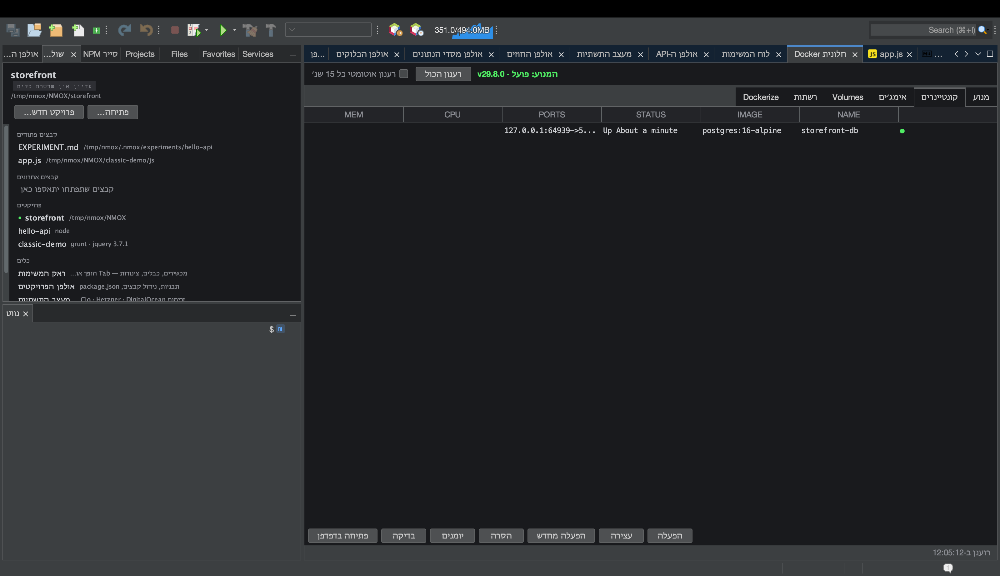

# מדריך: חלונית Docker

<!-- languages -->
[English](docker-panel.md) · [Español](docker-panel.es.md) · [Français](docker-panel.fr.md) · [Deutsch](docker-panel.de.md) · [Русский](docker-panel.ru.md) · [Українська](docker-panel.uk.md) · [Polski](docker-panel.pl.md) · [Português (Brasil)](docker-panel.pt.md) · [Bahasa Indonesia](docker-panel.id.md) · [Filipino](docker-panel.tl.md) · [Tiếng Việt](docker-panel.vi.md) · [简体中文](docker-panel.zh.md) · [हिन्दी](docker-panel.hi.md) · **עברית** · [العربية](docker-panel.ar.md)
<!-- /languages -->

חלונית Docker היא משטח בקרה למנוע ה‑Docker המקומי שלכם — קונטיינרים, אימג׳ים, volumes ורשתות — ובנוסף הלשונית **Dockerize**, שיוצרת Dockerfile לייצור עבור הפרויקט שלכם. המקבילה שלה בראק היא המכשיר **HARBOR**.

## לפני שמתחילים

ודאו ש‑Docker רץ מקומית (`docker version` אמור להצליח; `כלים ◂ אבחון הסביבה…` יאשר זאת).

## צעדים

1. **פתחו את החלונית.** לחצו `⌘8`, או לחצו על **חלונית Docker** בעמודה כלים של חלון ברוכים הבאים. הסקירה **מנוע** מראה אם ה‑daemon פועל.

2. **בחנו קונטיינרים.** הלשונית **קונטיינרים** מונה את מה שרץ — שמות, אימג׳ים, פורטים, מצב. גם ל**אימג׳ים**, ל‑**Volumes** ול**רשתות** יש לשונית משלהם.

3. **הכינו פרויקט ל‑Docker.** פתחו את הלשונית **Dockerize** כשהראק מכוון לפרויקט. היא יוצרת `Dockerfile` לייצור, ‎`.dockerignore` וקובץ `compose` שמותאמים לשרשרת הכלים שלכם (Node בבנייה רב־שלבית, PHP ‏`php-fpm` עם sidecar של nginx וכו׳) — ולעולם אינה דורסת קבצים קיימים (כשקובץ כבר קיים, היא כותבת לידו קובץ ‎`.suggested`).

4. **קבלו הצעה לחיבור למסד נתונים.** אם רץ קונטיינר של מסד נתונים, אולפן מסדי הנתונים מציע עבורו חיבור באופן אוטומטי — מסיק לפי שם האימג׳ ואחר כך לפי הפורט, פעם אחת לכל קונטיינר.

## מה למדתם

- החלונית היא עטיפה אסינכרונית אמיתית מעל ה‑CLI של `docker`; daemon תקוע מדווח, ולא מקפיא את החלונית.
- Dockerize מכיר את שרשרת הכלים, והוא אידמפוטנטי.

## הלאה

- הוסיפו את **HARBOR** לראק כדי לקבל PANEL/PRUNE/REFRESH מלוח קדמי.
- התחברו למסד נתונים שרץ בקונטיינר ב[אולפן מסדי הנתונים](db-studio.he.md).
