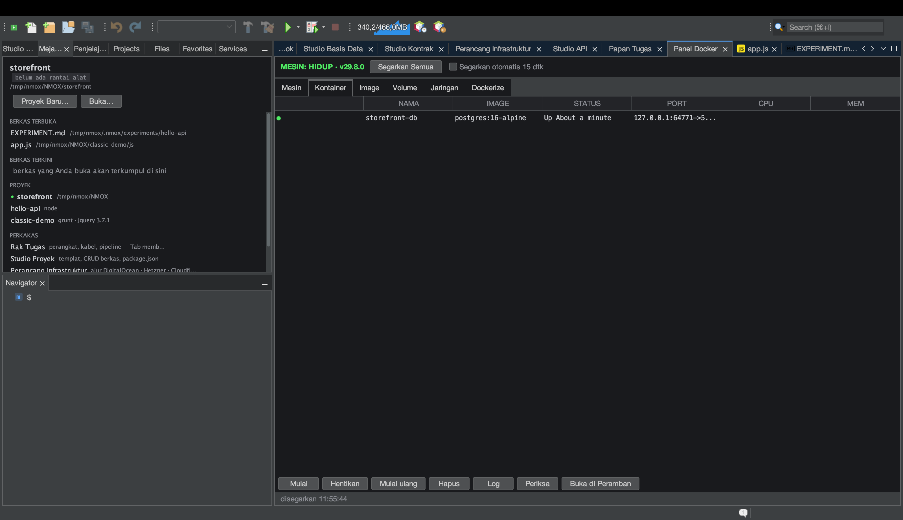

# Tutorial: Panel Docker

<!-- languages -->
[English](docker-panel.md) · [Español](docker-panel.es.md) · [Français](docker-panel.fr.md) · [Deutsch](docker-panel.de.md) · [Русский](docker-panel.ru.md) · [Українська](docker-panel.uk.md) · [Polski](docker-panel.pl.md) · [Português (Brasil)](docker-panel.pt.md) · **Bahasa Indonesia** · [Filipino](docker-panel.tl.md) · [Tiếng Việt](docker-panel.vi.md) · [简体中文](docker-panel.zh.md) · [हिन्दी](docker-panel.hi.md) · [עברית](docker-panel.he.md) · [العربية](docker-panel.ar.md)
<!-- /languages -->

Panel Docker adalah panel kendali untuk mesin Docker lokal Anda —
kontainer, image, volume, jaringan — ditambah tab **Dockerize** yang
membuat Dockerfile kelas produksi untuk proyek Anda. Pasangannya di rak
adalah perangkat **HARBOR**.

## Sebelum mulai

Pastikan Docker berjalan di mesin lokal (`docker version` harus berhasil;
`Alat ▸ Dokter Lingkungan…` akan memastikannya).

## Langkah-langkah

1. **Buka panelnya.** Tekan `⌘8`, atau klik **Panel Docker** di kolom
   PERKAKAS halaman Selamat Datang. Ikhtisar **Mesin** menunjukkan apakah daemon hidup.

2. **Periksa kontainer.** Tab **Kontainer** mendaftar apa yang berjalan —
   nama, image, porta, status. **Image**, **Volume**, dan **Jaringan**
   masing-masing punya tabnya sendiri.

3. **Dockerize sebuah proyek.** Buka tab **Dockerize** dengan sebuah proyek
   dibidik. Ia membuat `Dockerfile` produksi, `.dockerignore`, dan berkas
   `compose` yang disesuaikan dengan rantai perkakas Anda (Node multi-tahap,
   PHP `php-fpm` + sidecar nginx, dan seterusnya) — tanpa pernah menimpa berkas
   yang sudah ada (ia menulis saudara `.suggested` bila berkasnya ada).

4. **Tawaran sambungan basis data.** Bila ada kontainer basis data yang berjalan,
   Studio Basis Data otomatis menawarkan sambungan untuknya — disimpulkan dari
   nama image lalu porta, sekali per kontainer.

## Yang baru saja Anda pelajari

- Panel ini adalah pembungkus asinkron sungguhan atas CLI `docker`; daemon yang
  macet dilaporkan, bukan membuat IDE menggantung.
- Dockerize mengenali rantai perkakas dan idempoten.

## Berikutnya

- Pasang **HARBOR** di rak untuk PANEL/PRUNE/REFRESH dari panel depan.
- Sambungkan ke basis data dalam kontainer di [Studio Basis Data](db-studio.id.md).
