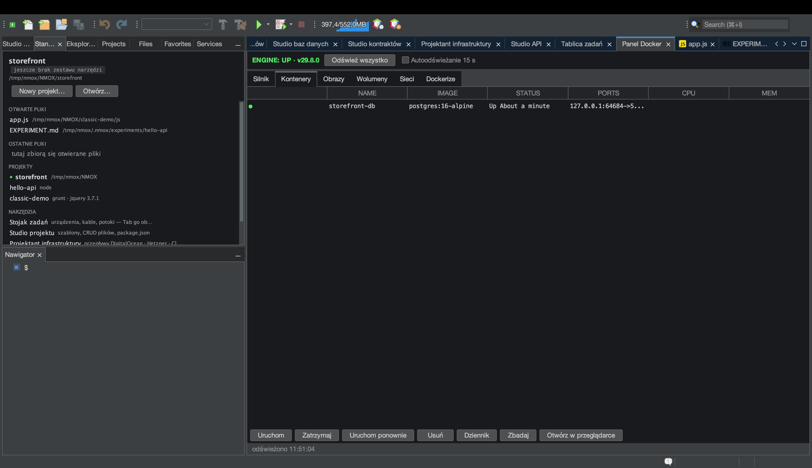

# Samouczek: Panel Docker

<!-- languages -->
[English](docker-panel.md) · [Español](docker-panel.es.md) · [Français](docker-panel.fr.md) · [Deutsch](docker-panel.de.md) · [Русский](docker-panel.ru.md) · [Українська](docker-panel.uk.md) · **Polski** · [Português (Brasil)](docker-panel.pt.md) · [Bahasa Indonesia](docker-panel.id.md) · [Filipino](docker-panel.tl.md) · [Tiếng Việt](docker-panel.vi.md) · [简体中文](docker-panel.zh.md) · [हिन्दी](docker-panel.hi.md) · [עברית](docker-panel.he.md) · [العربية](docker-panel.ar.md)
<!-- /languages -->

Panel Docker to pulpit sterowniczy lokalnego silnika Dockera — kontenery,
obrazy, wolumeny, sieci — a do tego karta **Dockerize**, która tworzy
produkcyjny Dockerfile dla twojego projektu. Jego odpowiednikiem na
stojaku jest urządzenie **HARBOR**.

## Zanim zaczniesz

Uruchom lokalnie Dockera (`docker version` powinno się udać;
potwierdzi to `Narzędzia ▸ Diagnostyka środowiska…`).

## Kroki

1. **Otwórz panel.** Naciśnij `⌘8` albo kliknij **Panel Docker**
   w kolumnie NARZĘDZIA na stronie Witamy. Przegląd **Silnik** pokazuje,
   czy demon działa.

2. **Obejrzyj kontenery.** Karta **Kontenery** wymienia, co działa —
   nazwy, obrazy, porty, stan. **Obrazy**, **Wolumeny** i **Sieci** mają
   własne karty.

3. **Zdockeryzuj projekt.** Z wycelowanym projektem otwórz kartę
   **Dockerize**. Tworzy ona produkcyjny `Dockerfile`, `.dockerignore`
   i plik `compose` dopasowane do twojego łańcucha narzędzi (wieloetapowy
   Node, PHP `php-fpm` z nginksem obok itd.) — nigdy nie nadpisując
   istniejących plików (gdy plik już jest, zapisuje obok `.suggested`).

4. **Połączenie z bazą na tacy.** Jeśli działa kontener bazy danych,
   Studio baz danych samo proponuje połączenie z nim — najpierw po nazwie
   obrazu, potem po porcie, raz na kontener.

## Czego się właśnie nauczyłeś

- Panel to prawdziwa asynchroniczna nakładka na CLI `docker`; zawieszony
  demon zostaje zgłoszony, a panel się nie zawiesza.
- Dockerize zna łańcuch narzędzi i jest idempotentny.

## Dalej

- Wstaw **HARBOR** na stojak, żeby mieć PANEL/PRUNE/REFRESH na płycie
  czołowej.
- Połącz się z bazą w kontenerze w [Studiu baz danych](db-studio.pl.md).
