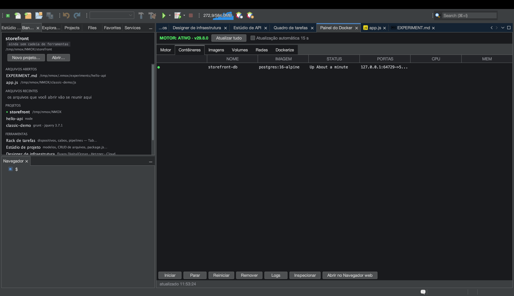

# Tutorial: o Painel do Docker

<!-- languages -->
[English](docker-panel.md) · [Español](docker-panel.es.md) · [Français](docker-panel.fr.md) · [Deutsch](docker-panel.de.md) · [Русский](docker-panel.ru.md) · [Українська](docker-panel.uk.md) · [Polski](docker-panel.pl.md) · **Português (Brasil)** · [Bahasa Indonesia](docker-panel.id.md) · [Filipino](docker-panel.tl.md) · [Tiếng Việt](docker-panel.vi.md) · [简体中文](docker-panel.zh.md) · [हिन्दी](docker-panel.hi.md) · [עברית](docker-panel.he.md) · [العربية](docker-panel.ar.md)
<!-- /languages -->

O Painel do Docker é uma superfície de controle para o seu motor Docker
local — contêineres, imagens, volumes, redes — mais uma aba **Dockerize**
que gera um Dockerfile de produção para o seu projeto. O equivalente dele
no rack é o dispositivo **HARBOR**.

## Antes de começar

Tenha o Docker rodando localmente (`docker version` deve funcionar;
`Ferramentas ▸ Doutor do ambiente…` confirma).

## Passos

1. **Abra o painel.** Aperte `⌘8`, ou clique em **Painel do Docker** na
   coluna FERRAMENTAS da página Bem-vindo. A visão geral **Motor** mostra
   se o daemon está no ar.

2. **Inspecione os contêineres.** A aba **Contêineres** lista o que está
   rodando — nomes, imagens, portas, estado. **Imagens**, **Volumes** e
   **Redes** têm cada uma a sua aba.

3. **Dockerize um projeto.** Abra a aba **Dockerize** com um projeto
   apontado. Ela gera um `Dockerfile` de produção, um `.dockerignore` e um
   arquivo `compose` sob medida para a sua cadeia de ferramentas (Node em
   vários estágios, PHP `php-fpm` + nginx ao lado etc.) — sem nunca
   sobrescrever arquivos existentes (quando um já existe, ela escreve um
   irmão `.suggested`).

4. **Receba a oferta de conexão.** Se um contêiner de banco de dados
   estiver rodando, o Estúdio de banco de dados oferece sozinho uma conexão
   para ele — deduzida pelo nome da imagem e depois pela porta, uma vez por
   contêiner.

## O que você aprendeu

- O painel é um invólucro assíncrono de verdade sobre a CLI `docker`; um
  daemon travado é relatado, não trava a IDE.
- O Dockerize conhece a cadeia de ferramentas e é idempotente.

## Próximos passos

- Monte o **HARBOR** no rack para ter PANEL/PRUNE/REFRESH num painel frontal.
- Conecte a um banco de dados em contêiner no
  [Estúdio de banco de dados](db-studio.pt.md).
