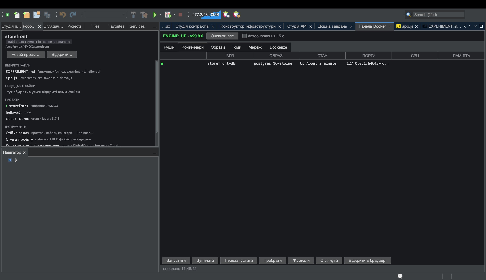

# Урок: Панель Docker

<!-- languages -->
[English](docker-panel.md) · [Español](docker-panel.es.md) · [Français](docker-panel.fr.md) · [Deutsch](docker-panel.de.md) · [Русский](docker-panel.ru.md) · **Українська** · [Polski](docker-panel.pl.md) · [Português (Brasil)](docker-panel.pt.md) · [Bahasa Indonesia](docker-panel.id.md) · [Filipino](docker-panel.tl.md) · [Tiếng Việt](docker-panel.vi.md) · [简体中文](docker-panel.zh.md) · [हिन्दी](docker-panel.hi.md) · [עברית](docker-panel.he.md) · [العربية](docker-panel.ar.md)
<!-- /languages -->

Панель Docker — пульт керування локальним рушієм Docker: контейнери,
образи, томи, мережі — плюс вкладка **Dockerize**, що створює промисловий
Dockerfile для вашого проєкту. Її двійник у стійці — прилад **HARBOR**.

## Перед початком

Запустіть Docker локально (`docker version` має спрацювати;
`Інструменти ▸ Діагностика середовища…` це підтвердить).

## Кроки

1. **Відкрийте панель.** Натисніть `⌘8` або клацніть **Панель Docker** у
   стовпці ІНСТРУМЕНТИ сторінки вітання. Огляд **Рушій** показує, чи працює демон.

2. **Перегляньте контейнери.** Вкладка **Контейнери** перелічує, що
   працює, — назви, образи, порти, стан. **Образи**, **Томи** й
   **Мережі** мають власні вкладки.

3. **Загорніть проєкт у Docker.** Відкрийте вкладку **Dockerize**, коли
   проєкт націлено. Вона створює промисловий `Dockerfile`, `.dockerignore`
   і файл `compose`, підігнані під ваш інструментарій (багатоетапний Node,
   PHP `php-fpm` + nginx поряд тощо), — і ніколи не затирає наявних файлів
   (якщо файл уже є, поряд з’являється `.suggested`).

4. **Отримайте підключення до БД.** Якщо працює контейнер бази даних,
   Студія баз даних сама пропонує до нього підключення — рушій визначається
   за назвою образу, потім за портом, по разу на контейнер.

## Що ви щойно дізналися

- Панель — справжня асинхронна обгортка над CLI `docker`: про завислий
  демон вона повідомляє, а не зависає сама.
- Dockerize знає ваш інструментарій і ідемпотентний.

## Далі

- Поставте **HARBOR** у стійку, щоб мати PANEL/PRUNE/REFRESH на лицьовій панелі.
- Підключіться до бази даних у контейнері в [Студії баз даних](db-studio.uk.md).
