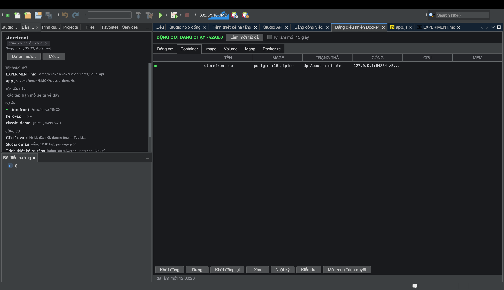

# Hướng dẫn: Bảng điều khiển Docker

<!-- languages -->
[English](docker-panel.md) · [Español](docker-panel.es.md) · [Français](docker-panel.fr.md) · [Deutsch](docker-panel.de.md) · [Русский](docker-panel.ru.md) · [Українська](docker-panel.uk.md) · [Polski](docker-panel.pl.md) · [Português (Brasil)](docker-panel.pt.md) · [Bahasa Indonesia](docker-panel.id.md) · [Filipino](docker-panel.tl.md) · **Tiếng Việt** · [简体中文](docker-panel.zh.md) · [हिन्दी](docker-panel.hi.md) · [עברית](docker-panel.he.md) · [العربية](docker-panel.ar.md)
<!-- /languages -->

Bảng điều khiển Docker là mặt điều khiển cho Docker engine trên máy bạn —
container, image, volume, mạng — cộng thêm thẻ **Dockerize** sinh ra một
Dockerfile dùng cho môi trường sản xuất của dự án. Bản sao của nó trên giá
là thiết bị **HARBOR**.

## Trước khi bắt đầu

Hãy để Docker chạy trên máy (`docker version` phải thành công;
`Công cụ ▸ Trình chẩn đoán môi trường…` sẽ xác nhận).

## Các bước

1. **Mở bảng điều khiển.** Nhấn `⌘8`, hoặc nhấp **Bảng điều khiển Docker**
   trong cột CÔNG CỤ của trang Chào mừng. Phần tổng quan **Động cơ** cho biết
   daemon có đang chạy không.

2. **Xem các container.** Thẻ **Container** liệt kê những gì đang chạy —
   tên, image, cổng, trạng thái. **Image**, **Volume** và **Mạng** mỗi thứ có
   thẻ riêng.

3. **Dockerize một dự án.** Mở thẻ **Dockerize** khi đang nhắm một dự án.
   Nó sinh ra một `Dockerfile` cho môi trường sản xuất, một `.dockerignore` và
   một tệp `compose` hợp với bộ công cụ của bạn (Node nhiều giai đoạn, PHP
   `php-fpm` kèm nginx đi cạnh, v.v.) — không bao giờ ghi đè tệp đã có (khi
   tệp đã tồn tại, nó ghi một tệp `.suggested` bên cạnh).

4. **Mời một kết nối cơ sở dữ liệu.** Nếu có một container cơ sở dữ liệu
   đang chạy, Studio cơ sở dữ liệu tự động mời một kết nối tới nó — suy ra từ
   tên image rồi tới cổng, mỗi container một lần.

## Bạn vừa học được gì

- Bảng điều khiển là một lớp bọc bất đồng bộ thật sự quanh CLI `docker`;
  một daemon bị treo sẽ được báo ra, chứ không làm treo theo.
- Dockerize hiểu bộ công cụ và chạy lại bao nhiêu lần cũng cho cùng kết quả.

## Tiếp theo

- Gắn **HARBOR** lên giá để có PANEL/PRUNE/REFRESH ngay trên mặt máy.
- Kết nối tới một cơ sở dữ liệu chạy trong container ở
  [Studio cơ sở dữ liệu](db-studio.vi.md).
