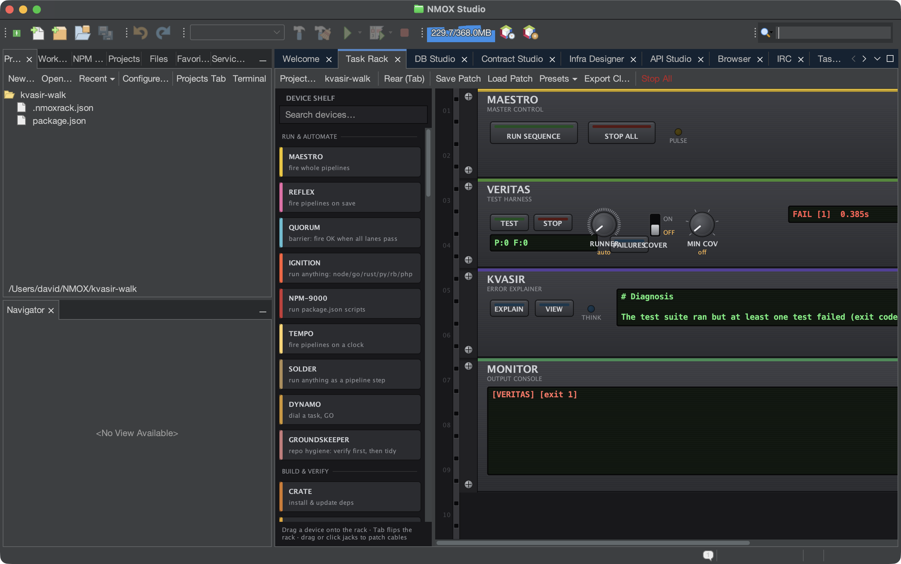

# Tutorial: Explain anything with KVASIR

KVASIR started as a rack device that explains failed runs. It now
reaches four places — the rack, the editor, API Studio, and DB Studio —
and every face follows the same three laws: **you see exactly what
would leave your machine before anything does**, **each surface earns
its own consent** (saying yes to build errors never authorizes sending
code or SQL), and **secrets can't ride along by construction** (the
disclosure is assembled by the studio that owns the data, with
credential headers dropped and passwords never in reach).

## Before you start

One Anthropic API key covers all four faces: set it with **KEY…** on
the KVASIR faceplate (it goes to your OS keychain), or export
`ANTHROPIC_API_KEY`. No key, no call — every face says so honestly.

## The four faces

1. **A failed run (the rack).** Mount KVASIR, run something that
   fails, press **EXPLAIN**. What's sent: the command, exit code, and
   up to five sampled error lines. See [the KVASIR
   tutorial](kvasir.md) for the full walk, including the cable that
   auto-explains a VERITAS failure hands-free.

2. **Your code (the editor).** Select code in any language →
   right-click → **Ask KVASIR About Selection…** and type a question.
   What's sent: the capped selection, file name, and language —
   nothing else from your project. This face has its *own* consent
   gate, because the failure-flow consent explicitly promises source
   never leaves the machine.

3. **An API response (API Studio).** After a send, press **Explain
   with KVASIR…**. What's sent: method, URL with query values masked,
   status, headers with credentials dropped-and-counted, and a capped
   body. Useful the moment a 401 or an odd CORS header shows up.

4. **A database error (DB Studio).** A failed statement grows an
   **Explain…** button under its error message. What's sent: the SQL
   you ran — *including its literal values, and the consent line says
   so*, because the error is usually about a literal — plus the error
   message and engine kind. Never the connection, password, or rows.

Every face opens a conversation window: ask follow-ups, and the model
sees the full history of that exchange (capped at ten exchanges, said
in the transcript). The **Fast/Deep** choice (Haiku/Sonnet) is
remembered, and fixed per conversation so the transcript never lies
about who answered.

## Try it in two minutes

DB Studio is the quickest face to demo: open ⌥⌘7, make a SQLite
connection, run `SELECT * FROM user;` against a database whose table
is `users`, and press **Explain…** on the error. Read the consent
dialog before accepting — it's the product's promise, in one sentence.

## What you just learned

- Four surfaces, one seam: each studio assembles its own disclosure
  and the consent dialog quotes it verbatim.
- Declining is honored silently and completely — no window, no call.
- A result belongs to the workspace that produced it: switching
  projects clears responses and result tabs, so Explain can never
  disclose a previous project's data.
