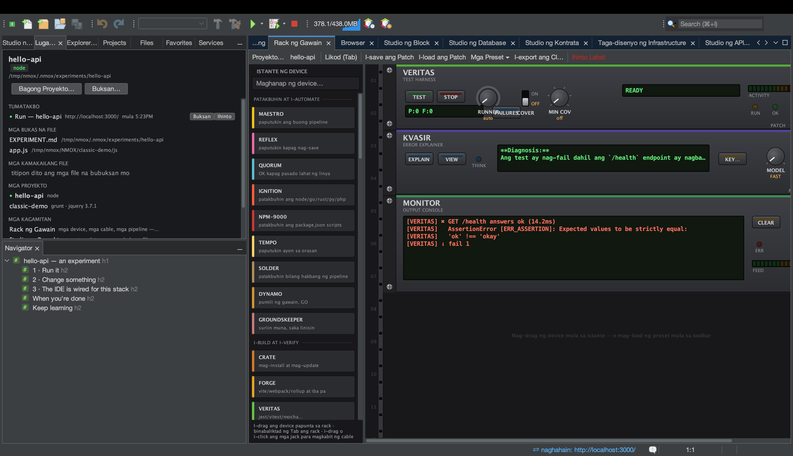

# Tutorial: Ipaliwanag ang anuman gamit ang KVASIR

<!-- languages -->
[English](explain-anything.md) · [Español](explain-anything.es.md) · [Français](explain-anything.fr.md) · [Deutsch](explain-anything.de.md) · [Русский](explain-anything.ru.md) · [Українська](explain-anything.uk.md) · [Polski](explain-anything.pl.md) · [Português (Brasil)](explain-anything.pt.md) · [Bahasa Indonesia](explain-anything.id.md) · **Filipino** · [Tiếng Việt](explain-anything.vi.md) · [简体中文](explain-anything.zh.md) · [हिन्दी](explain-anything.hi.md) · [עברית](explain-anything.he.md) · [العربية](explain-anything.ar.md)
<!-- /languages -->

Nagsimula ang KVASIR bilang device sa rack na nagpapaliwanag ng mga
nabigong pagtakbo. Ngayon naaabot nito ang apat na lugar — ang rack, ang
editor, ang Studio ng API, at ang Studio ng Database — at sinusunod ng
bawat mukha ang parehong tatlong batas: **nakikita mo nang eksakto ang
umaalis sa iyong makina bago may umalis**, **may sarili nitong pahintulot
ang bawat lugar** (ang pagpayag para sa mga error ng build ay hindi
kailanman nagpapahintulot na magpadala ng code o SQL), at **ayon sa
pagkakagawa, hindi makakasakay ang mga lihim** (binubuo ang pagbubunyag ng
studio na nagmamay-ari ng data, inaalis ang mga header ng credential, at
hindi kailanman naaabot ang mga password).

## Bago magsimula

Iisang key ang para sa apat na mukha — mula sa alinmang provider na iyong
pinili: Claude (Anthropic), ChatGPT (OpenAI) o Gemini (Google). Pindutin ang
**KEY…** sa faceplate ng KVASIR para piliin ang provider at iimbak ang key
nito sa keychain ng iyong OS, o i-export ang `ANTHROPIC_API_KEY`,
`OPENAI_API_KEY` o `GEMINI_API_KEY`. Walang key, walang call — tapat na
sinasabi ito ng bawat mukha.

## Ang apat na mukha

1. **Isang nabigong pagtakbo (ang rack).** Ilagay ang KVASIR, magpatakbo
   ng bagay na nabibigo, pindutin ang **EXPLAIN**. Ipinapadala: ang
   command, exit code, at hanggang limang halimbawang linya ng error.
   Tingnan ang [tutorial ng KVASIR](kvasir.tl.md) para sa buong gabay,
   kasama ang cable na kusang nagpapaliwanag ng pagkabigo ng VERITAS nang
   walang kamay.

2. **Ang iyong code (ang editor).** Pumili ng code sa anumang wika →
   i-right-click → **Magtanong sa KVASIR Tungkol sa Napili…** at itipa ang
   tanong. Ipinapadala: ang napiling bahagi na may hangganan, ang pangalan
   ng file, at ang wika — walang iba mula sa iyong proyekto. May *sarili*
   nitong tarangkahan ng pahintulot ang mukhang ito, dahil tahasang
   ipinapangako ng pahintulot para sa mga pagkabigo na hindi kailanman
   umaalis sa makina ang source.

3. **Isang API response (Studio ng API).** Matapos ang padala, pindutin ang
   **Ipaliwanag…**. Ipinapadala: method, URL na nakatago ang mga halaga ng
   query, status, mga header na inalis at binilang ang mga credential, at
   body na may hangganan. Kapaki-pakinabang sa sandaling lumitaw ang 401 o
   kakaibang CORS header.

4. **Isang error ng database (Studio ng Database).** Tumutubo ang pindutang
   **Ipaliwanag…** sa ilalim ng mensahe ng error ng nabigong statement.
   Ipinapadala: ang SQL na pinatakbo mo — *kasama ang mga literal na halaga
   nito, at sinasabi ito ng linya ng pahintulot*, dahil karaniwang tungkol
   sa isang literal ang error — pati ang mensahe ng error at ang uri ng
   engine. Hindi kailanman ang koneksyon, password, o mga hilera.

Nagbubukas ng window ng usapan ang bawat mukha: magtanong ng mga karugtong,
at nakikita ng model ang buong kasaysayan ng palitang iyon (hangganang
sampung palitan, sinasabi sa transcript). Inaalala ang pili na **Fast/Deep**
(ang mabilis at malakas na model ng piniling provider), at nakapirmi kada usapan para hindi kailanman magsinungaling
ang transcript tungkol sa kung sino ang sumagot.

## Subukan sa loob ng dalawang minuto

Ang Studio ng Database ang pinakamabilis na mukha para ipakita: buksan ang
⌥⌘7, gumawa ng koneksyon sa SQLite, patakbuhin ang `SELECT * FROM user;` sa
database na ang table ay `users`, at pindutin ang **Ipaliwanag…** sa error.
Basahin ang dialog ng pahintulot bago pumayag — iyon ang pangako ng
produkto, sa iisang pangungusap.

## Ang iyong natutunan

- Apat na lugar, iisang tahian: binubuo ng bawat studio ang sarili nitong
  pagbubunyag, at sinisipi ito nang literal ng dialog ng pahintulot.
- Iginagalang nang tahimik at lubos ang pagtanggi — walang window, walang
  call.
- Pag-aari ng workspace na lumikha rito ang isang resulta: ang paglipat ng
  proyekto ay nililinis ang mga response at tab ng resulta, kaya hindi
  kailanman maibubunyag ng Ipaliwanag ang data ng nakaraang proyekto.
