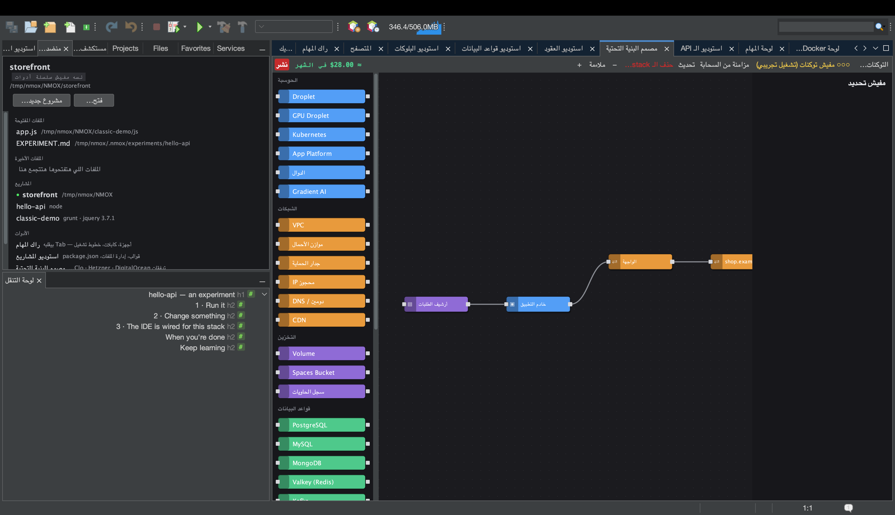

# درس: مصمم البنية التحتية

<!-- languages -->
[English](infra-designer.md) · [Español](infra-designer.es.md) · [Français](infra-designer.fr.md) · [Deutsch](infra-designer.de.md) · [Русский](infra-designer.ru.md) · [Українська](infra-designer.uk.md) · [Polski](infra-designer.pl.md) · [Português (Brasil)](infra-designer.pt.md) · [Bahasa Indonesia](infra-designer.id.md) · [Filipino](infra-designer.tl.md) · [Tiếng Việt](infra-designer.vi.md) · [简体中文](infra-designer.zh.md) · [हिन्दी](infra-designer.hi.md) · [עברית](infra-designer.he.md) · **العربية**
<!-- /languages -->

مصمم البنية التحتية مساحة رسم على طريقة Node-RED للبنية التحتية
السحابية. بتسحبوا عُقد (droplets، وجدران حماية، وسجلات DNS…)، وتوصّلوها
ببعض، وتنشروا على DigitalOcean أو Hetzner أو Cloudflare — والتكلفة
قدامكم قبل ما تصرفوا أي حاجة. الدرس ده بيبني خطة وبيجرّبها تجريبيًا،
فمفيش فلوس بتتحرك.

## افتحوه

`⌥⌘9`، أو تبويب **مصمم البنية التحتية**.

## الخطوات

1. **حطوا سيرفر.** اسحبوا عقدة **Droplet** من اللوحة على مساحة الرسم.
   لوحة الخصائص اللي جنبها بتخليكم تحددوا المنطقة، والحجم، والإيمدج.
   تقدير التكلفة بيتحدّث وانتوا بتختاروا.

2. **ضيفوا جدار حماية.** اسحبوا عقدة **جدار الحماية** ووصّلوها بالـ
   droplet بالسحب بين المنافذ بتاعتهم. حطوا قاعدة للدخول (مثلًا اسمحوا
   بـ 22 و443).

3. **ضيفوا cloud-init (اختياري).** في حقل `user_data` بتاع الـ droplet،
   الزقوا سكريبت cloud-init قصير — بيشتغل في أول إقلاع.

4. **جرّبوا النشر تجريبيًا.** دوسوا زرار **نشر** الأحمر. من غير توكن سحابة
   كل حاجة بتفضل **تشغيل تجريبي**: بتشوفوا خطة الـ API بالترتيب بالظبط
   (إنشاء جدار الحماية، إنشاء الـ droplet، التوصيل…) والتكلفة، بس مفيش
   حاجة بتتعمل. سجل النشر بيعرض كل خطوة.

5. **شغّلوه بجد (لما تكونوا جاهزين).** ضيفوا توكن المزوّد من زرار **التوكنات…**
   (أو الخيارات ◂ الراك والسحابة؛ بيتخزن في سلسلة مفاتيح النظام)، و**نشر** بينفّذ الخطة بجد، وبيحل
   المراجع بين العُقد (الـ IP بتاع الـ droplet بيروح لسجل الـ DNS) أول ما
   الموارد تقوم.

## اللي اتعلمتوه

- مساحة الرسم رسم بياني حقيقي للاعتماديات؛ المخطِّط بيرتّب نداءات الـ API
  وبيمرّر الـ ids والـ IPs بين الخطوات.
- مربعات الحوار الخطيرة (مسح ستاك/مورد، والنشر) زرار Enter فيها
  افتراضيًا على الاختيار **الآمن** — دوسة من غير تفكير متقدرش تمسح مورد
  عليه فلوس.
- الموارد الحية تقدروا **تزامنوها** راجعة وتعملوا تحديث للانحرافات؛
  والخطة بتتحفظ في ‎`.nmoxinfra.json`.

## بعد كده

- انسخوا أمر SSH بتاع عقدة من مساحة الرسم على طول.
- سحابات متعددة: نفس مساحة الرسم بتشغّل DO وHetzner وCloudflare.
