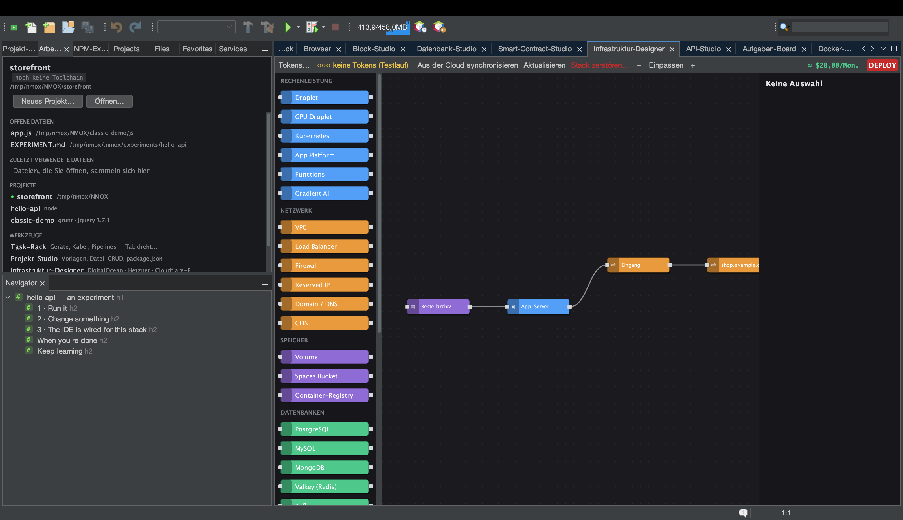

# Tutorial: Infrastruktur-Designer

<!-- languages -->
[English](infra-designer.md) · [Español](infra-designer.es.md) · [Français](infra-designer.fr.md) · **Deutsch** · [Русский](infra-designer.ru.md) · [Українська](infra-designer.uk.md) · [Polski](infra-designer.pl.md) · [Português (Brasil)](infra-designer.pt.md) · [Bahasa Indonesia](infra-designer.id.md) · [Filipino](infra-designer.tl.md) · [Tiếng Việt](infra-designer.vi.md) · [简体中文](infra-designer.zh.md) · [हिन्दी](infra-designer.hi.md) · [עברית](infra-designer.he.md) · [العربية](infra-designer.ar.md)
<!-- /languages -->

Der Infrastruktur-Designer ist eine Arbeitsfläche nach Art von Node-RED
für Cloud-Infrastruktur. Sie ziehen Knoten (Droplets, Firewalls,
DNS-Einträge…) auf die Fläche, verbinden sie und rollen auf DigitalOcean,
Hetzner oder Cloudflare aus — mit den Kosten vor Augen, bevor Sie
irgendetwas ausgeben. Dieses Tutorial baut einen Plan und spielt ihn
probeweise durch, es fließt also kein Geld.

## Öffnen

`⌥⌘9`, oder der Tab **Infrastruktur-Designer**.

## Schritte

1. **Setzen Sie einen Server.** Ziehen Sie einen **Droplet**-Knoten aus der
   Palette auf die Fläche. Im Eigenschaftsblatt rechts wählen Sie Region,
   Größe und Image. Eine laufende Kostenschätzung aktualisiert sich mit
   jeder Wahl.

2. **Fügen Sie eine Firewall hinzu.** Ziehen Sie einen **Firewall**-Knoten
   herein und verbinden Sie ihn mit dem Droplet, indem Sie zwischen ihren
   Anschlüssen ziehen. Legen Sie eine eingehende Regel fest (etwa 22 und 443
   erlauben).

3. **Fügen Sie cloud-init hinzu (optional).** Fügen Sie in das Feld
   `user_data` des Droplets ein kurzes cloud-init-Skript ein — es läuft beim
   ersten Start.

4. **Spielen Sie das Ausrollen probeweise durch.** Drücken Sie den roten
   Knopf **DEPLOY**. Ohne Cloud-Token bleibt alles ein **Probelauf**: Sie
   sehen den genauen, geordneten API-Plan (Firewall anlegen, Droplet
   anlegen, anhängen…) und die Kosten, aber nichts wird angelegt. Das
   Ausroll-Protokoll zeigt jeden Schritt.

5. **Gehen Sie live (wenn Sie so weit sind).** Hinterlegen Sie über
   **Tokens…** (oder Optionen ▸ Rack & Cloud) ein Anbieter-Token
   (gespeichert im Schlüsselbund des Systems),
   und DEPLOY führt den Plan wirklich aus; Verweise zwischen Knoten werden
   aufgelöst, sobald die Ressourcen stehen (die IP eines Droplets fließt in
   den DNS-Eintrag).

## Was Sie gerade gelernt haben

- Die Fläche ist ein echter Abhängigkeitsgraph; der Planer ordnet die
  API-Aufrufe und reicht IDs und IPs zwischen den Schritten weiter.
- Zerstörerische Dialoge (Stapel/Ressource zerstören, Ausrollen) legen die
  Eingabetaste auf den **sicheren** Knopf — ein reflexhafter Tastendruck
  kann keine abgerechnete Ressource löschen.
- Laufende Ressourcen lassen sich zurück **abgleichen** und auf
  Abweichungen auffrischen; der Plan bleibt in `.nmoxinfra.json` erhalten.

## Weiter

- Kopieren Sie den SSH-Befehl eines Knotens direkt von der Fläche.
- Multi-Cloud: Dieselbe Fläche steuert DO, Hetzner und Cloudflare.
