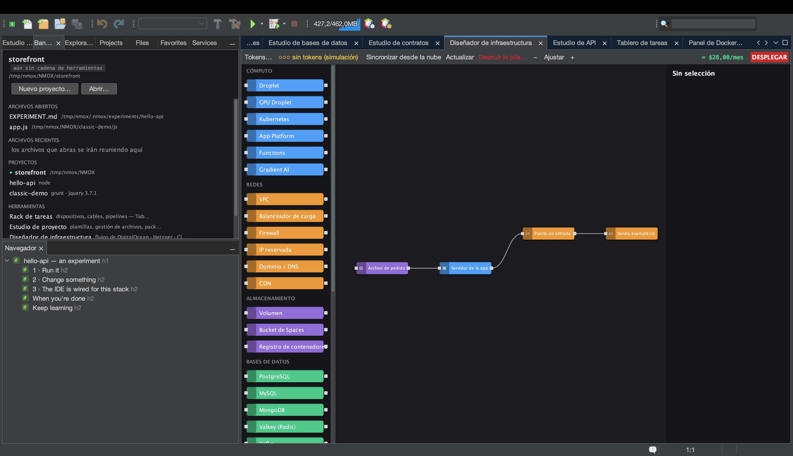

# Tutorial: el Diseñador de infraestructura

<!-- languages -->
[English](infra-designer.md) · **Español** · [Français](infra-designer.fr.md) · [Deutsch](infra-designer.de.md) · [Русский](infra-designer.ru.md) · [Українська](infra-designer.uk.md) · [Polski](infra-designer.pl.md) · [Português (Brasil)](infra-designer.pt.md) · [Bahasa Indonesia](infra-designer.id.md) · [Filipino](infra-designer.tl.md) · [Tiếng Việt](infra-designer.vi.md) · [简体中文](infra-designer.zh.md) · [हिन्दी](infra-designer.hi.md) · [עברית](infra-designer.he.md) · [العربية](infra-designer.ar.md)
<!-- /languages -->

El Diseñador de infraestructura es un lienzo al estilo de Node-RED para
infraestructura en la nube. Arrastras nodos (droplets, firewalls,
registros DNS…), los cableas y despliegas en DigitalOcean, Hetzner o
Cloudflare, con el coste delante antes de gastar nada. Este tutorial
monta un plan y lo simula, así que no se mueve ni un céntimo.

## Ábrelo

`⌥⌘9`, o la pestaña **Diseñador de infraestructura**.

## Pasos

1. **Suelta un servidor.** Arrastra un nodo **Droplet** desde la paleta
   al lienzo. La hoja de propiedades de la derecha te deja elegir región,
   tamaño e imagen. Una estimación de coste se actualiza según eliges.

2. **Añade un firewall.** Arrastra un nodo **Firewall** y cabléalo al
   droplet arrastrando entre sus puertos. Pon una regla de entrada (por
   ejemplo, permitir 22 y 443).

3. **Añade cloud-init (opcional).** En el campo `user_data` del droplet,
   pega un script cloud-init corto: se ejecuta en el primer arranque.

4. **Simula el despliegue.** Pulsa el botón rojo **DESPLEGAR**. Sin token
   de nube todo queda en **simulación**: ves el plan exacto y ordenado de
   llamadas a la API (crear el firewall, crear el droplet, asociar…) y el
   coste, pero no se crea nada. El registro del despliegue muestra cada
   paso.

5. **Pasa a producción (cuando quieras).** Añade un token del proveedor
   con **Tokens…** (u Opciones ▸ Rack y nube; se guarda en el llavero
   del sistema operativo) y
   DESPLEGAR ejecuta el plan de verdad, resolviendo las referencias entre
   nodos (la IP de un droplet llega al registro DNS) a medida que los
   recursos se levantan.

## Lo que acabas de aprender

- El lienzo es un grafo de dependencias real; el planificador ordena las
  llamadas a la API y pasa los ids y las IP de un paso al siguiente.
- Los diálogos destructivos (destruir la pila o un recurso, desplegar)
  ponen la tecla Entrar en el botón **seguro**: una pulsación refleja no
  puede borrar un recurso que se factura.
- Los recursos vivos se pueden **sincronizar** de vuelta y refrescar para
  ver las diferencias; el plan se guarda en `.nmoxinfra.json`.

## Siguiente

- Copia el comando SSH de un nodo directamente desde el lienzo.
- Multinube: el mismo lienzo maneja DO, Hetzner y Cloudflare.
