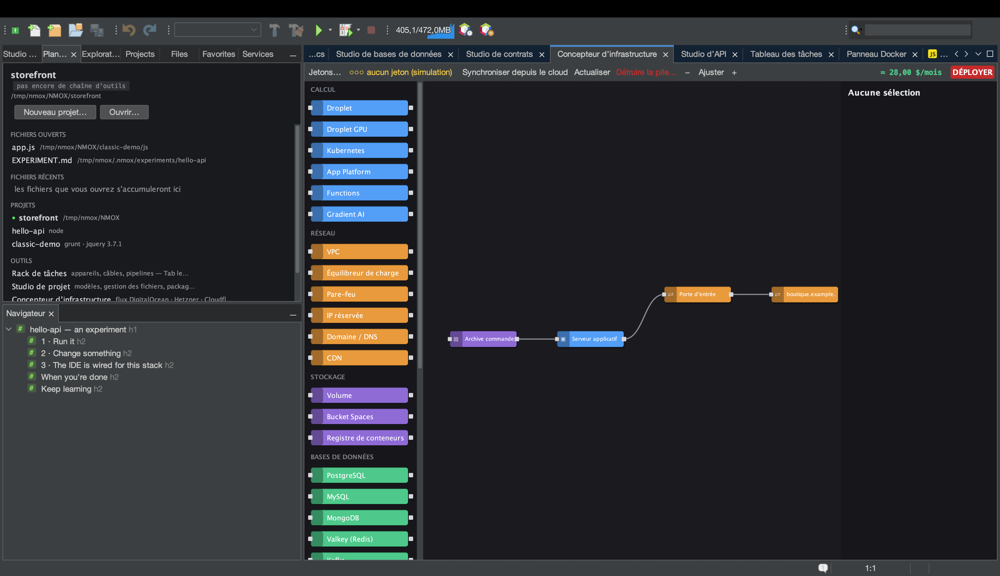

# Tutoriel : le Concepteur d’infrastructure

<!-- languages -->
[English](infra-designer.md) · [Español](infra-designer.es.md) · **Français** · [Deutsch](infra-designer.de.md) · [Русский](infra-designer.ru.md) · [Українська](infra-designer.uk.md) · [Polski](infra-designer.pl.md) · [Português (Brasil)](infra-designer.pt.md) · [Bahasa Indonesia](infra-designer.id.md) · [Filipino](infra-designer.tl.md) · [Tiếng Việt](infra-designer.vi.md) · [简体中文](infra-designer.zh.md) · [हिन्दी](infra-designer.hi.md) · [עברית](infra-designer.he.md) · [العربية](infra-designer.ar.md)
<!-- /languages -->

Le Concepteur d’infrastructure est une toile à la Node-RED pour
l’infrastructure dans le nuage. Vous faites glisser des nœuds (droplets,
pare-feu, enregistrements DNS…), vous les câblez et vous déployez sur
DigitalOcean, Hetzner ou Cloudflare — avec le coût sous les yeux avant de
dépenser quoi que ce soit. Ce tutoriel construit un plan et le simule :
aucun argent ne bouge.

## L’ouvrir

`⌥⌘9`, ou l’onglet **Concepteur d’infrastructure**.

## Étapes

1. **Posez un serveur.** Faites glisser un nœud **Droplet** de la palette
   sur la toile. La feuille de propriétés à droite permet de régler la
   région, la taille et l’image. Une estimation du coût se met à jour au
   fil de vos choix.

2. **Ajoutez un pare-feu.** Faites glisser un nœud **Pare-feu** et
   câblez-le au droplet en tirant entre leurs ports. Définissez une règle
   entrante (par exemple, autoriser 22 et 443).

3. **Ajoutez cloud-init (facultatif).** Dans le champ `user_data` du
   droplet, collez un court script cloud-init — il s’exécute au premier
   démarrage.

4. **Simulez le déploiement.** Pressez le bouton rouge **DÉPLOYER**. Sans
   jeton de nuage, tout reste une **simulation** : vous voyez le plan
   d’appels d’API exact et ordonné (créer le pare-feu, créer le droplet,
   attacher…) et le coût, mais rien n’est créé. Le journal de déploiement
   montre chaque étape.

5. **Passez en réel (quand vous êtes prêt).** Ajoutez un jeton de
   fournisseur avec **Jetons…** (ou Options ▸ Rack et cloud ; stocké dans le
   trousseau du système), et
   DÉPLOYER exécute le plan pour de bon, en résolvant les références entre
   nœuds (l’IP d’un droplet passe dans l’enregistrement DNS) à mesure que
   les ressources apparaissent.

## Ce que vous venez d’apprendre

- La toile est un vrai graphe de dépendances ; le planificateur ordonne
  les appels d’API et fait passer identifiants et IP d’une étape à l’autre.
- Les boîtes de dialogue destructrices (détruire la pile ou la ressource,
  déployer) placent la touche Entrée sur le bouton **sûr** — un appui
  réflexe ne peut pas supprimer une ressource facturée.
- Les ressources vivantes peuvent être **synchronisées** en retour et
  rafraîchies pour voir les écarts ; le plan est conservé dans
  `.nmoxinfra.json`.

## Et ensuite

- Copiez la commande SSH d’un nœud directement depuis la toile.
- Multi-nuage : la même toile pilote DO, Hetzner et Cloudflare.
