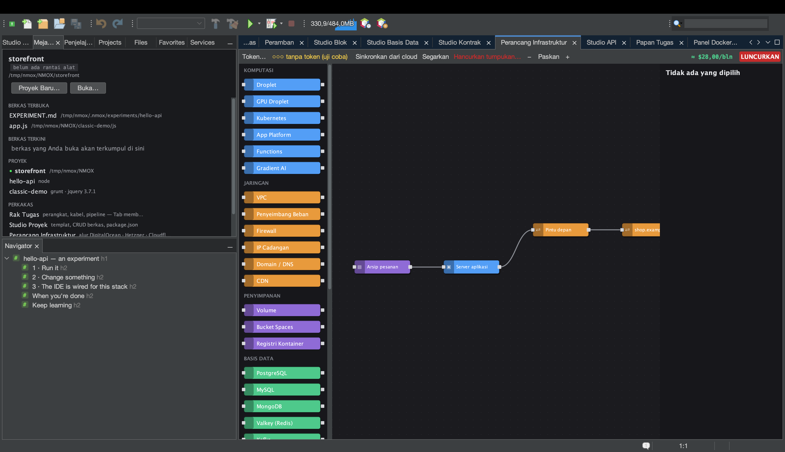

# Tutorial: Perancang Infrastruktur

<!-- languages -->
[English](infra-designer.md) · [Español](infra-designer.es.md) · [Français](infra-designer.fr.md) · [Deutsch](infra-designer.de.md) · [Русский](infra-designer.ru.md) · [Українська](infra-designer.uk.md) · [Polski](infra-designer.pl.md) · [Português (Brasil)](infra-designer.pt.md) · **Bahasa Indonesia** · [Filipino](infra-designer.tl.md) · [Tiếng Việt](infra-designer.vi.md) · [简体中文](infra-designer.zh.md) · [हिन्दी](infra-designer.hi.md) · [עברית](infra-designer.he.md) · [العربية](infra-designer.ar.md)
<!-- /languages -->

Perancang Infrastruktur adalah kanvas ala Node-RED untuk infrastruktur awan. Anda
menyeret simpul (droplet, firewall, catatan DNS…), menyambungkannya, dan
menerapkannya ke DigitalOcean, Hetzner, atau Cloudflare — dengan perkiraan biaya
sebelum Anda membelanjakan apa pun. Tutorial ini menyusun rencana dan mengujinya
tanpa efek, jadi tidak ada uang yang keluar.

## Membukanya

`⌥⌘9`, atau tab **Perancang Infrastruktur**.

## Langkah-langkah

1. **Letakkan sebuah server.** Seret simpul **Droplet** dari palet ke kanvas.
   Lembar properti di kanan memungkinkan Anda memilih wilayah, ukuran, dan image.
   Perkiraan biaya berjalan diperbarui seiring pilihan Anda.

2. **Tambahkan firewall.** Seret simpul **Firewall** dan sambungkan ke droplet
   dengan menyeret di antara portanya. Tetapkan aturan masuk (misalnya izinkan
   22 dan 443).

3. **Tambahkan cloud-init (opsional).** Pada medan `user_data` droplet, tempelkan
   skrip cloud-init pendek — ia berjalan pada boot pertama.

4. **Uji penerapan tanpa efek.** Tekan tombol merah **LUNCURKAN**. Tanpa token awan
   semuanya tetap **uji coba**: Anda melihat rencana API yang persis dan berurutan
   (buat firewall, buat droplet, pasang…) serta biayanya, tetapi tidak ada yang
   dibuat. Log penerapan menampilkan setiap langkah.

5. **Jalankan sungguhan (bila sudah siap).** Tambahkan token penyedia lewat **Token…**
   (atau Opsi ▸ Rack & Awan; disimpan di gantungan kunci sistem operasi), dan LUNCURKAN mengeksekusi
   rencananya sungguhan, menyelesaikan rujukan antarsimpul (IP droplet mengalir ke
   catatan DNS) seiring sumber daya bermunculan.

## Yang baru saja Anda pelajari

- Kanvas ini adalah graf dependensi sungguhan; perencana mengurutkan panggilan API
  dan meneruskan id/IP antarlangkah.
- Dialog yang merusak (Hancurkan tumpukan/sumber daya, Luncurkan) mengarahkan tombol
  Enter ke tombol yang **aman** — tekanan refleks tidak bisa menghapus sumber daya
  yang ditagih.
- Sumber daya yang hidup bisa **diselaraskan** kembali dan disegarkan selisihnya;
  rencananya tersimpan di `.nmoxinfra.json`.

## Berikutnya

- Salin perintah SSH sebuah simpul langsung dari kanvas.
- Multi-awan: kanvas yang sama menggerakkan DO, Hetzner, dan Cloudflare.
