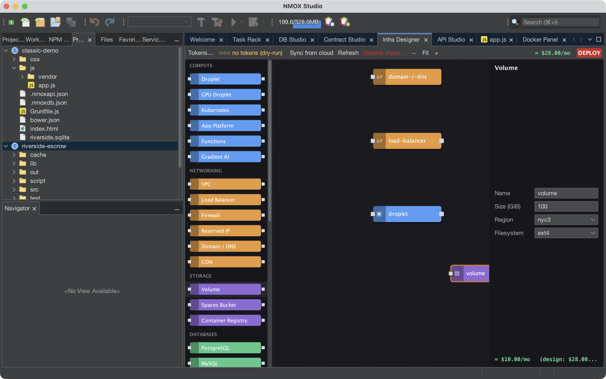

# Tutorial: Infra Designer

Infra Designer is a Node-RED-style canvas for cloud infrastructure. You
drag nodes (droplets, firewalls, DNS records…), wire them, and deploy to
DigitalOcean, Hetzner, or Cloudflare — with cost framing before you spend
anything. This tutorial builds a plan and dry-runs it, so no money moves.

## Open it

`⌥⌘9`, or the **Infra** tab.

## Steps

1. **Drop a server.** Drag a **Droplet** node from the palette onto the
   canvas. The property sheet on the right lets you set region, size, and
   image. A running cost estimate updates as you choose.

2. **Add a firewall.** Drag a **Firewall** node and wire it to the
   droplet by dragging between their ports. Set an inbound rule (e.g.
   allow 22 and 443).

3. **Add cloud-init (optional).** On the droplet's `user_data` field,
   paste a short cloud-init script — it runs on first boot.

4. **Dry-run the deploy.** Press the red **DEPLOY** button. Without a
   cloud token everything stays a **dry run**: you see the exact ordered
   API plan (create firewall, create droplet, attach…) and the cost, but
   nothing is created. The deploy log shows each step.

5. **Go live (when you're ready).** Add a provider token under
   `Options` (stored in the OS keychain), and DEPLOY executes the plan
   for real, resolving cross-node references (a droplet's IP flows into
   the DNS record) as resources come up.

## What you just learned

- The canvas is a real dependency graph; the planner orders the API
  calls and threads ids/IPs between steps.
- Destructive dialogs (Destroy Stack/Resource, Deploy) default their
  Enter key to the **safe** button — a reflexive keypress can't delete a
  billed resource.
- Live resources can be **synced** back and drift-refreshed; the plan
  persists in `.nmoxinfra.json`.

## Next

- Copy a node's SSH command straight from the canvas.
- Multi-cloud: the same canvas drives DO, Hetzner, and Cloudflare.
