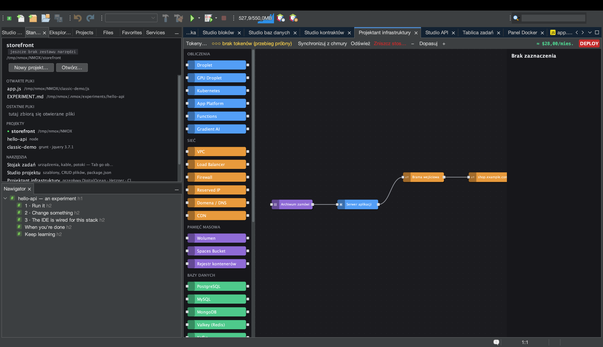

# Samouczek: Projektant infrastruktury

<!-- languages -->
[English](infra-designer.md) · [Español](infra-designer.es.md) · [Français](infra-designer.fr.md) · [Deutsch](infra-designer.de.md) · [Русский](infra-designer.ru.md) · [Українська](infra-designer.uk.md) · **Polski** · [Português (Brasil)](infra-designer.pt.md) · [Bahasa Indonesia](infra-designer.id.md) · [Filipino](infra-designer.tl.md) · [Tiếng Việt](infra-designer.vi.md) · [简体中文](infra-designer.zh.md) · [हिन्दी](infra-designer.hi.md) · [עברית](infra-designer.he.md) · [العربية](infra-designer.ar.md)
<!-- /languages -->

Projektant infrastruktury to płótno w stylu Node-RED dla infrastruktury
chmurowej. Przeciągasz węzły (droplety, firewalle, rekordy DNS…), łączysz
je i wdrażasz do DigitalOcean, Hetznera albo Cloudflare — z kosztem przed
oczami, zanim cokolwiek wydasz. Ten samouczek buduje plan i robi próbne
wdrożenie, więc nie ruszy żaden grosz.

## Otwieranie

`⌥⌘9` albo karta **Projektant infrastruktury**.

## Kroki

1. **Upuść serwer.** Przeciągnij węzeł **Droplet** z palety na płótno.
   Arkusz właściwości po prawej pozwala ustawić region, rozmiar i obraz.
   Szacowany koszt aktualizuje się na bieżąco, w miarę jak wybierasz.

2. **Dodaj firewall.** Przeciągnij węzeł **Firewall** i połącz go
   z dropletem, przeciągając między ich portami. Ustaw regułę przychodzącą
   (np. zezwól na 22 i 443).

3. **Dodaj cloud-init (opcjonalnie).** W polu `user_data` dropletu wklej
   krótki skrypt cloud-init — wykona się przy pierwszym starcie.

4. **Zrób próbne wdrożenie.** Naciśnij czerwony przycisk **DEPLOY**. Bez
   tokenu chmury wszystko zostaje **próbą**: widzisz dokładny,
   uporządkowany plan wywołań API (utwórz firewall, utwórz droplet,
   podepnij…) i koszt, ale nic nie powstaje. Dziennik wdrożenia pokazuje
   każdy krok.

5. **Wdróż naprawdę (gdy będziesz gotów).** Dodaj token dostawcy
   przyciskiem **Tokeny…** (albo w Opcje ▸ Stojak i chmura; trafia do pęku
   kluczy systemu), a DEPLOY wykona plan
   naprawdę, rozwiązując odwołania między węzłami (IP dropletu wpływa do
   rekordu DNS) w miarę, jak zasoby wstają.

## Czego się właśnie nauczyłeś

- Płótno to prawdziwy graf zależności; planista porządkuje wywołania API
  i przekazuje identyfikatory oraz adresy IP między krokami.
- Niszczące okna dialogowe (zniszczenie stosu lub zasobu, wdrożenie)
  mają pod Enterem domyślnie przycisk **bezpieczny** — odruchowe
  naciśnięcie klawisza nie usunie płatnego zasobu.
- Żywe zasoby można **zsynchronizować** z powrotem i odświeżyć pod kątem
  rozbieżności; plan zapisuje się w `.nmoxinfra.json`.

## Dalej

- Skopiuj polecenie SSH węzła prosto z płótna.
- Wiele chmur: to samo płótno steruje DO, Hetznerem i Cloudflare.
