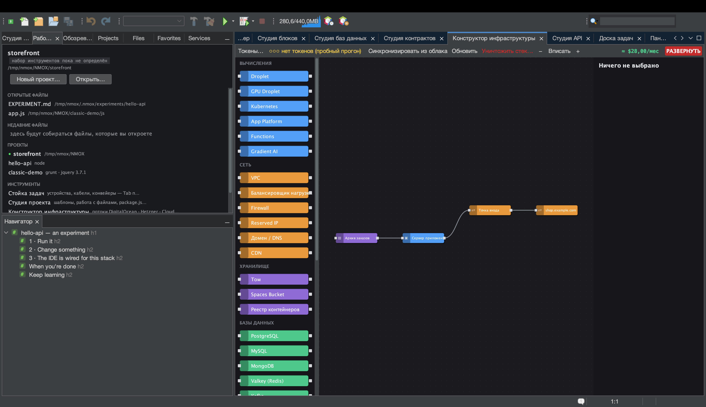

# Урок: Конструктор инфраструктуры

<!-- languages -->
[English](infra-designer.md) · [Español](infra-designer.es.md) · [Français](infra-designer.fr.md) · [Deutsch](infra-designer.de.md) · **Русский** · [Українська](infra-designer.uk.md) · [Polski](infra-designer.pl.md) · [Português (Brasil)](infra-designer.pt.md) · [Bahasa Indonesia](infra-designer.id.md) · [Filipino](infra-designer.tl.md) · [Tiếng Việt](infra-designer.vi.md) · [简体中文](infra-designer.zh.md) · [हिन्दी](infra-designer.hi.md) · [עברית](infra-designer.he.md) · [العربية](infra-designer.ar.md)
<!-- /languages -->

Конструктор инфраструктуры — холст для облачной инфраструктуры в стиле
Node-RED. Вы перетаскиваете узлы (droplet, firewall, записи DNS…),
соединяете их и развёртываете в DigitalOcean, Hetzner или Cloudflare —
и видите стоимость до того, как что-либо потратите. В этом уроке мы
соберём план и сделаем пробный прогон, так что ни копейки не уйдёт.

## Как открыть

`⌥⌘9` или вкладка **Конструктор инфраструктуры**.

## Шаги

1. **Поставьте сервер.** Перетащите узел **Droplet** с палитры на холст.
   Лист свойств справа позволяет задать регион, размер и образ. Оценка
   стоимости обновляется по мере выбора.

2. **Добавьте firewall.** Перетащите узел **Firewall** и соедините его с
   droplet, протянув связь между их портами. Задайте входящее правило
   (например, разрешить 22 и 443).

3. **Добавьте cloud-init (по желанию).** В поле `user_data` у droplet
   вставьте короткий скрипт cloud-init — он выполнится при первой
   загрузке.

4. **Сделайте пробный прогон.** Нажмите красную кнопку **РАЗВЕРНУТЬ**.
   Без облачного токена всё остаётся **пробным прогоном**: вы видите
   точный упорядоченный план вызовов API (создать firewall, создать
   droplet, прикрепить…) и стоимость, но ничего не создаётся. Журнал
   развёртывания показывает каждый шаг.

5. **Разверните по-настоящему (когда будете готовы).** Добавьте токен
   поставщика кнопкой **Токены…** (или в Параметры ▸ Стойка и облако; он
   хранится в связке ключей ОС) — и
   РАЗВЕРНУТЬ выполнит план на самом деле, подставляя ссылки между узлами
   (IP droplet перетекает в запись DNS) по мере появления ресурсов.

## Что вы узнали

- Холст — настоящий граф зависимостей; планировщик упорядочивает вызовы
  API и передаёт идентификаторы и IP между шагами.
- В разрушительных диалогах (уничтожение стека или ресурса, развёртывание)
  Enter по умолчанию нажимает **безопасную** кнопку — рефлекторное
  нажатие не удалит платный ресурс.
- Живые ресурсы можно **синхронизировать** обратно и обновить, чтобы
  увидеть расхождения; план хранится в `.nmoxinfra.json`.

## Дальше

- Скопируйте SSH-команду узла прямо с холста.
- Несколько облаков: один и тот же холст управляет DO, Hetzner и
  Cloudflare.
