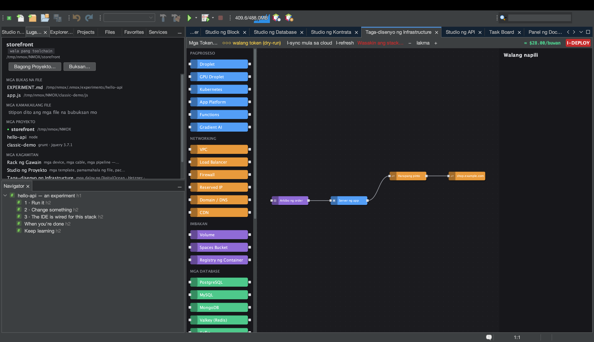

# Tutorial: Taga-disenyo ng Infrastructure

<!-- languages -->
[English](infra-designer.md) · [Español](infra-designer.es.md) · [Français](infra-designer.fr.md) · [Deutsch](infra-designer.de.md) · [Русский](infra-designer.ru.md) · [Українська](infra-designer.uk.md) · [Polski](infra-designer.pl.md) · [Português (Brasil)](infra-designer.pt.md) · [Bahasa Indonesia](infra-designer.id.md) · **Filipino** · [Tiếng Việt](infra-designer.vi.md) · [简体中文](infra-designer.zh.md) · [हिन्दी](infra-designer.hi.md) · [עברית](infra-designer.he.md) · [العربية](infra-designer.ar.md)
<!-- /languages -->

Ang Taga-disenyo ng Infrastructure ay isang canvas na estilong Node-RED
para sa cloud infrastructure. Naghihila mo ng mga node (droplet,
firewall, DNS record…), ikinakabit ang mga ito, at nag-deploy sa
DigitalOcean, Hetzner, o Cloudflare — may pagtatantya ng halaga bago
gumastos ng anuman. Bumubuo ang tutorial na ito ng plano at
pinapatakbo ito nang dry run, kaya walang perang gumagalaw.

## Buksan ito

`⌥⌘9`, o ang tab na **Taga-disenyo ng Infrastructure**.

## Mga hakbang

1. **Maglagay ng server.** Maghila ng node na **Droplet** mula sa palette
   papunta sa canvas. Sa property sheet sa kanan, itakda ang region, size,
   at image. Ina-update ang tantiya ng halaga habang pumipili.

2. **Magdagdag ng firewall.** Maghila ng node na **Firewall** at ikabit
   ito sa droplet sa pamamagitan ng paghila sa pagitan ng kanilang mga
   port. Magtakda ng inbound rule (hal. pahintulutan ang 22 at 443).

3. **Magdagdag ng cloud-init (opsyonal).** Sa field na `user_data` ng
   droplet, idikit ang maikling cloud-init script — tumatakbo ito sa unang
   boot.

4. **Patakbuhin ang deploy nang dry run.** Pindutin ang pulang pindutang
   **I-DEPLOY**. Kung walang cloud token, nananatiling **dry run** ang
   lahat: nakikita mo ang eksaktong nakaayos na plano ng API (lumikha ng
   firewall, lumikha ng droplet, ikabit…) at ang halaga, ngunit walang
   nilikha. Ipinapakita ng log ng deploy ang bawat hakbang.

5. **Ilagay sa produksiyon (kapag handa).** Magdagdag ng token ng
   provider gamit ang **Mga Token…** (o Mga Pagpipilian ▸ Rack at Cloud;
   naka-imbak sa keychain ng OS), at
   tunay na isinasagawa ng I-DEPLOY ang plano, nilulutas ang mga
   sanggunian sa pagitan ng mga node (ang IP ng droplet ay dumadaloy sa
   DNS record) habang nabubuhay ang mga resource.

## Ang iyong natutunan

- Tunay na dependency graph ang canvas; inaayos ng planner ang mga
  API call at ipinapasa ang mga id/IP sa pagitan ng mga hakbang.
- Ang mga mapanirang dialog (Wasakin ang stack/resource, I-deploy) ay
  itinakda ang Enter sa **ligtas** na pindutan — hindi makakabura ng
  resource na may bayad ang pindot na walang pag-iisip.
- Ang mga buhay na resource ay maaaring **i-sync** pabalik at i-refresh
  para makita ang pagkakaiba; naka-imbak ang plano sa `.nmoxinfra.json`.

## Susunod

- Kopyahin ang SSH command ng isang node nang tuwiran mula sa canvas.
- Multi-cloud: ang parehong canvas ang nagpapatakbo sa DO, Hetzner, at
  Cloudflare.
