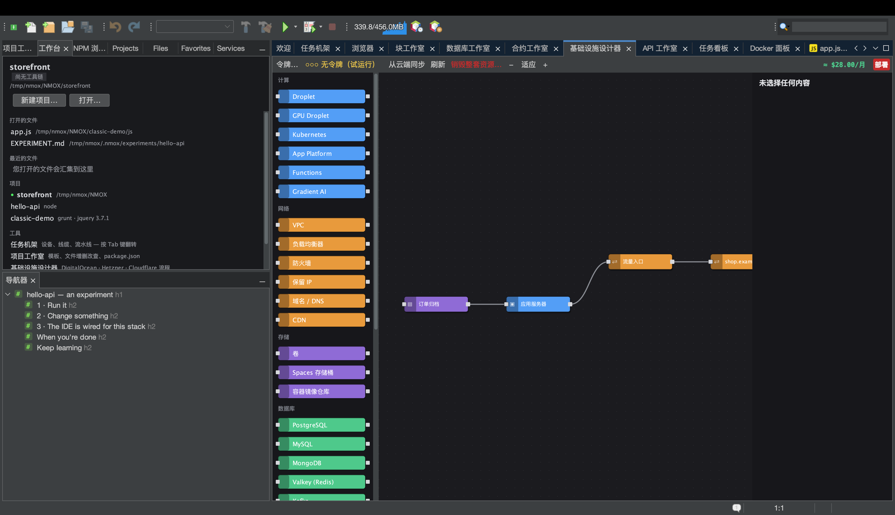

# 教程：基础设施设计器

<!-- languages -->
[English](infra-designer.md) · [Español](infra-designer.es.md) · [Français](infra-designer.fr.md) · [Deutsch](infra-designer.de.md) · [Русский](infra-designer.ru.md) · [Українська](infra-designer.uk.md) · [Polski](infra-designer.pl.md) · [Português (Brasil)](infra-designer.pt.md) · [Bahasa Indonesia](infra-designer.id.md) · [Filipino](infra-designer.tl.md) · [Tiếng Việt](infra-designer.vi.md) · **简体中文** · [हिन्दी](infra-designer.hi.md) · [עברית](infra-designer.he.md) · [العربية](infra-designer.ar.md)
<!-- /languages -->

基础设施设计器是一块 Node-RED 风格的云基础设施画布。你拖出节点（droplet、防火墙、DNS 记录…），把它们连起来，然后部署到 DigitalOcean、Hetzner 或 Cloudflare — 花任何钱之前都先把费用摆在你面前。本教程搭一份计划并试运行它，所以一分钱都不会动。

## 打开方式

`⌥⌘9`，或者 **基础设施设计器** 标签页。

## 步骤

1. **放一台服务器。**从面板里拖一个 **Droplet** 节点到画布上。右侧的属性表可以设置区域、规格和镜像。随着你的选择，费用估算会实时更新。

2. **加一道防火墙。**拖一个 **Firewall** 节点，在两者的端口之间拖动，把它和 droplet 连起来。设一条入站规则（例如放行 22 和 443）。

3. **加上 cloud-init（可选）。**在 droplet 的 `user_data` 字段里粘贴一段简短的 cloud-init 脚本 — 它会在首次启动时运行。

4. **试运行部署。**按红色的**部署**按钮。没有云令牌时，一切都只是**试运行**：你会看到按顺序排好的确切 API 计划（创建防火墙、创建 droplet、挂载…）和费用，但什么都不会被创建。部署日志会显示每一步。

5. **正式上线（等你准备好）。**用**令牌…**（或 选项 ▸ 机架与云）添加服务商令牌（存进操作系统钥匙串），部署就会真正执行这份计划，并在资源陆续就绪时解析跨节点的引用（droplet 的 IP 会流进 DNS 记录）。

## 你刚学到了什么

- 画布是一张真正的依赖图；规划器会给 API 调用排好顺序，并在各步之间传递 id 和 IP。
- 破坏性对话框（销毁整套资源/单个资源、部署）的回车键默认落在**安全**的按钮上 — 条件反射的一下按键删不掉一个正在计费的资源。
- 真实存在的资源可以**同步**回来并刷新差异；计划保存在 `.nmoxinfra.json` 里。

## 下一步

- 直接从画布上复制某个节点的 SSH 命令。
- 多云：同一块画布驱动 DO、Hetzner 和 Cloudflare。
