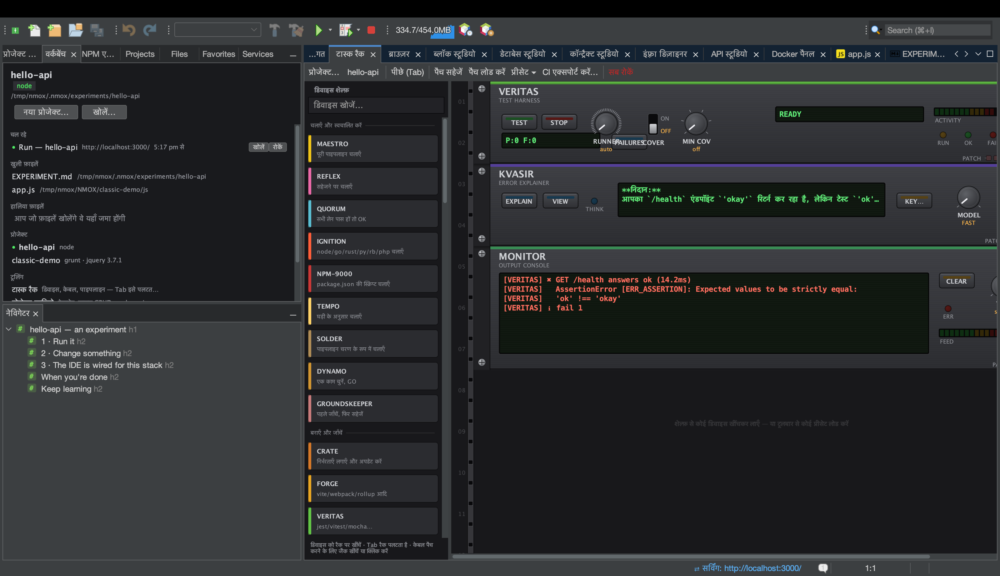

# ट्यूटोरियल: KVASIR — त्रुटियाँ समझाने वाली AI

<!-- languages -->
[English](kvasir.md) · [Español](kvasir.es.md) · [Français](kvasir.fr.md) · [Deutsch](kvasir.de.md) · [Русский](kvasir.ru.md) · [Українська](kvasir.uk.md) · [Polski](kvasir.pl.md) · [Português (Brasil)](kvasir.pt.md) · [Bahasa Indonesia](kvasir.id.md) · [Filipino](kvasir.tl.md) · [Tiếng Việt](kvasir.vi.md) · [简体中文](kvasir.zh.md) · **हिन्दी** · [עברית](kvasir.he.md) · [العربية](kvasir.ar.md)
<!-- /languages -->

KVASIR एक रैक डिवाइस है जो आपका पिछला विफल रन पढ़ता है और आपकी AI —
Claude, ChatGPT या Gemini — से पूछता है कि क्या ग़लत हुआ। यह रैक के ढंग
की AI सहायता है: एक बटन, साफ़ सहमति-द्वार और ईमानदार LCD — न प्रोजेक्ट की
फ़ाइलें भेजी जाती हैं, न रहस्य, केवल विफलता का सीमित संदर्भ।

## शुरू करने से पहले

आपको उन तीन प्रदाताओं में से किसी एक की API कुंजी चाहिए जिनसे KVASIR बात
करता है: Anthropic (Claude), OpenAI (ChatGPT) या Google (Gemini)। फ़ेसप्लेट
पर **KEY…** दबाएँ, प्रदाता चुनें और उसकी कुंजी OS कीचेन में रखें, या
प्रदाता का परिवेश-चर export करें —
`ANTHROPIC_API_KEY` / `CLAUDE_API_KEY`, `OPENAI_API_KEY` /
`CHATGPT_API_KEY`, या `GEMINI_API_KEY` / `GOOGLE_API_KEY`। प्रदाता का चुनाव
KVASIR के हर रूप पर लागू होता है और विकल्प ▸ रैक और क्लाउड में भी मौजूद है।

## चरण

1. **कुछ विफल कराएँ।** कुछ ऐसा चलाएँ जो विफल हो — सिंटैक्स त्रुटि वाला
   बिल्ड, कोई टेस्ट जो exception फेंके। रैक का फ़्लाइट रिकॉर्डर कमांड, exit
   कोड और त्रुटि की अधिकतम पाँच नमूना पंक्तियाँ पकड़ लेता है।

2. पैलेट से **KVASIR लगाएँ** (OBSERVE श्रेणी) और **EXPLAIN** दबाएँ।

3. **सहमति दें (पहली बार)।** KVASIR का अपना एक-बार का सहमति संवाद है, हर
   प्रदाता के लिए अलग, जो डेटा पाने वाली कंपनी का नाम लेता है और ठीक-ठीक
   बताता है कि आपकी मशीन से क्या बाहर जाएगा: विफल कमांड, उसका exit कोड,
   ≤5 त्रुटि पंक्तियाँ, डिवाइस का नाम और प्रोजेक्ट का नाम — और कुछ नहीं
   (न स्रोत, न परिवेश, न रहस्य)। वर्कस्पेस ट्रस्ट कोड *चलाने* पर पहरा देता
   है; डेटा के इस बाहर जाने वाले प्रवाह का अपना अलग द्वार है।

4. **निर्णय पढ़ें।** एक छोटा निदान कई पंक्तियों वाले LCD पर आता है; पूरी
   व्याख्या बातचीत की विंडो में खोलने के लिए **VIEW** दबाएँ। **MODEL** घुंडी FAST (डिफ़ॉल्ट) या DEEP
   चुनती है — Haiku / Sonnet, GPT-5 mini / GPT-5, या Gemini Flash / Pro,
   जो भी प्रदाता आपने चुना हो।

## आपने अभी क्या सीखा

- शुरुआत में KVASIR की कोई लागत नहीं, और बटन दबाए बिना वह कोई नेटवर्क
  कॉल नहीं करता — कुंजी का द्वार और सहमति का द्वार, दोनों लागू हैं।
- कुंजी केवल प्रदाता के auth हेडर में जाती है (`x-api-key`,
  `Authorization: Bearer`, `x-goog-api-key`) — कभी URL, body या लॉग में नहीं।
- कुंजियाँ कभी एक प्रदाता से दूसरे में नहीं जातीं, और सहमति हर प्रदाता की
  अलग है: Anthropic के लिए हाँ, Google या OpenAI के लिए हाँ नहीं है।
- कमज़ोर हालात में भी ईमानदारी: कुंजी नहीं, सहमति नहीं, समझाने को कुछ नहीं,
  ऑफ़लाइन और इनकार — हर एक पर LCD साफ़ संदेश दिखाता है।

## आगे

- इसे बिना हाथ लगाए जोड़ें: `VERITAS FAIL → KVASIR EXPLAIN` केबल विफल
  टेस्ट रन को अपने आप समझा देता है (केबल वाला रास्ता कभी पूछता नहीं और 30s
  में एक बार तक सीमित है); इसका OUT MONITOR/PHOSPHOR को जाता है।
