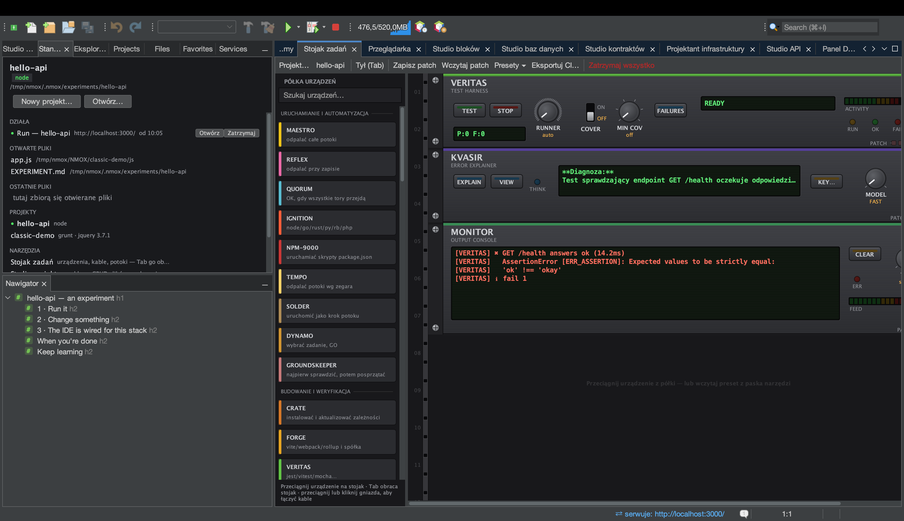

# Samouczek: KVASIR — SI, która wyjaśnia błędy

<!-- languages -->
[English](kvasir.md) · [Español](kvasir.es.md) · [Français](kvasir.fr.md) · [Deutsch](kvasir.de.md) · [Русский](kvasir.ru.md) · [Українська](kvasir.uk.md) · **Polski** · [Português (Brasil)](kvasir.pt.md) · [Bahasa Indonesia](kvasir.id.md) · [Filipino](kvasir.tl.md) · [Tiếng Việt](kvasir.vi.md) · [简体中文](kvasir.zh.md) · [हिन्दी](kvasir.hi.md) · [עברית](kvasir.he.md) · [العربية](kvasir.ar.md)
<!-- /languages -->

KVASIR to urządzenie stojaka, które czyta twoje ostatnie nieudane
uruchomienie i pyta twoją SI — Claude, ChatGPT albo Gemini — co poszło nie
tak. To pomoc SI na sposób stojaka: jeden przycisk, jasna bramka zgody
i uczciwy wyświetlacz — żadne pliki projektu ani sekrety nie wychodzą,
tylko ograniczony kontekst porażki.

## Zanim zaczniesz

Potrzebujesz klucza API od jednego z trzech dostawców, z którymi KVASIR
rozmawia: Anthropic (Claude), OpenAI (ChatGPT) albo Google (Gemini).
Naciśnij **KEY…** na płycie czołowej, żeby wybrać dostawcę i zapisać jego
klucz w pęku kluczy systemu, albo wyeksportuj zmienną środowiskową
dostawcy — `ANTHROPIC_API_KEY` / `CLAUDE_API_KEY`, `OPENAI_API_KEY` /
`CHATGPT_API_KEY` albo `GEMINI_API_KEY` / `GOOGLE_API_KEY`. Wybór dostawcy
obejmuje każde oblicze KVASIR i jest też w Opcje ▸ Stojak i chmura.

## Kroki

1. **Wywołaj porażkę.** Uruchom coś, co pada — budowanie z błędem
   składni, test, który rzuca wyjątek. Rejestrator lotu stojaka zapisuje
   polecenie, kod wyjścia i do pięciu próbek wierszy błędu.

2. **Wstaw KVASIR** z palety (kategoria Obserwacja) i naciśnij
   **EXPLAIN**.

3. **Udziel zgody (za pierwszym razem).** KVASIR ma własne, jednorazowe
   okno zgody, osobne dla każdego dostawcy, które nazywa firmę
   otrzymującą dane i wylicza dokładnie, co opuszcza twoją maszynę:
   nieudane polecenie, jego kod wyjścia, ≤5 wierszy błędu, nazwę
   urządzenia i nazwę projektu — i nic więcej (bez kodu źródłowego, bez
   środowiska, bez sekretów). Zaufanie do obszaru roboczego pilnuje
   *uruchamiania* kodu; ten wychodzący przepływ danych ma własną bramkę.

4. **Przeczytaj werdykt.** Krótka diagnoza pojawia się na wielowierszowym
   wyświetlaczu; naciśnij **VIEW**, żeby otworzyć pełne wyjaśnienie w oknie
   rozmowy. Pokrętło
   **MODEL** wybiera FAST (domyślnie) albo DEEP — Haiku / Sonnet,
   GPT-5 mini / GPT-5 albo Gemini Flash / Pro, zależnie od wybranego
   dostawcy.

## Czego się właśnie nauczyłeś

- KVASIR nic nie kosztuje przy starcie i bez naciśnięcia przycisku nie
  łączy się z siecią — pilnowane są i bramka klucza, i bramka zgody.
- Klucz jedzie wyłącznie w nagłówku uwierzytelniania dostawcy
  (`x-api-key`, `Authorization: Bearer`, `x-goog-api-key`) — nigdy
  w adresie, treści ani dzienniku.
- Klucze nigdy nie przechodzą między dostawcami, a zgoda jest osobna dla
  każdego z nich: „tak” dla Anthropic nie jest „tak” dla Google ani OpenAI.
- Degradacja jest uczciwa: brak klucza, brak zgody, nic do wyjaśnienia,
  brak sieci i odmowa — każde z nich pokazuje na wyświetlaczu jasny
  komunikat.

## Dalej

- Okabluj go bez udziału rąk: kabel `VERITAS FAIL → KVASIR EXPLAIN` sam
  wyjaśnia nieudany przebieg testów (droga kablowa nigdy nie pyta
  i pozwala na jedno wyjaśnienie co 30 s); jego OUT zasila
  MONITOR/PHOSPHOR.
