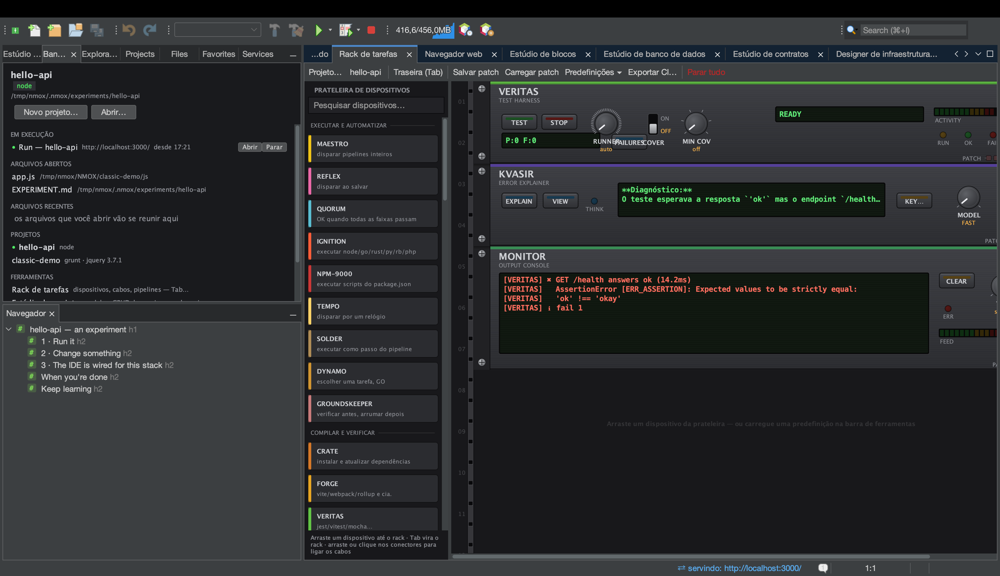

# Tutorial: KVASIR — o explicador de erros com IA

<!-- languages -->
[English](kvasir.md) · [Español](kvasir.es.md) · [Français](kvasir.fr.md) · [Deutsch](kvasir.de.md) · [Русский](kvasir.ru.md) · [Українська](kvasir.uk.md) · [Polski](kvasir.pl.md) · **Português (Brasil)** · [Bahasa Indonesia](kvasir.id.md) · [Filipino](kvasir.tl.md) · [Tiếng Việt](kvasir.vi.md) · [简体中文](kvasir.zh.md) · [हिन्दी](kvasir.hi.md) · [עברית](kvasir.he.md) · [العربية](kvasir.ar.md)
<!-- /languages -->

O KVASIR é um dispositivo do rack que lê a sua última execução que falhou e
pergunta à sua IA — Claude, ChatGPT ou Gemini — o que deu errado. É
assistência de IA do jeito do rack: um botão, um consentimento claro e um
visor honesto — nenhum arquivo do projeto nem segredo é enviado, só o
contexto limitado da falha.

## Antes de começar

Você precisa de uma chave de API de um dos três provedores que o KVASIR
fala: Anthropic (Claude), OpenAI (ChatGPT) ou Google (Gemini). Aperte
**KEY…** no painel frontal para escolher o provedor e guardar a chave dele
no chaveiro do sistema operacional, ou exporte a variável de ambiente do
provedor — `ANTHROPIC_API_KEY` / `CLAUDE_API_KEY`, `OPENAI_API_KEY` /
`CHATGPT_API_KEY`, ou `GEMINI_API_KEY` / `GOOGLE_API_KEY`. A escolha do
provedor vale para todas as faces do KVASIR e também fica em
Opções ▸ Rack e nuvem.

## Passos

1. **Provoque uma falha.** Rode algo que falhe — uma compilação com erro de
   sintaxe, um teste que lança exceção. O gravador de voo do rack captura o
   comando, o código de saída e até cinco linhas de erro amostradas.

2. **Monte o KVASIR** a partir da paleta (categoria OBSERVE) e aperte
   **EXPLAIN**.

3. **Dê o consentimento (na primeira vez).** O KVASIR tem o próprio diálogo
   de consentimento único, por provedor, que nomeia a empresa que recebe os
   dados e diz exatamente o que sai da sua máquina: o comando que falhou, o
   código de saída dele, ≤5 linhas de erro, o nome do dispositivo e o nome
   do projeto — e mais nada (nem código-fonte, nem ambiente, nem segredos).
   A Confiança no espaço de trabalho protege *a execução* de código; este
   fluxo de dados para fora ganha a própria barreira.

4. **Leia o veredito.** Um diagnóstico curto aparece no visor de várias
   linhas; aperte **VIEW** para abrir a explicação completa numa janela de
   conversa. O botão **MODEL**
   escolhe FAST (o padrão) ou DEEP — Haiku / Sonnet, GPT-5 mini / GPT-5, ou
   Gemini Flash / Pro, conforme o provedor que você escolheu.

## O que você aprendeu

- O KVASIR não custa nada na inicialização e não faz chamada de rede sem o
  aperto do botão — a barreira da chave e a do consentimento são ambas
  obrigatórias.
- A chave viaja só no cabeçalho de autenticação do provedor (`x-api-key`,
  `Authorization: Bearer`, `x-goog-api-key`) — nunca numa URL, num corpo ou
  num registro.
- As chaves nunca passam de um provedor para outro, e o consentimento é por
  provedor: um sim para a Anthropic não é um sim para o Google nem para a
  OpenAI.
- A degradação é honesta: sem chave, sem consentimento, nada para explicar,
  offline e recusa mostram cada um uma mensagem clara no visor.

## Próximos passos

- Ligue-o sem as mãos: um cabo `VERITAS FAIL → KVASIR EXPLAIN` explica
  sozinho uma execução de testes que falhou (o caminho pelo cabo nunca
  pergunta nada e se limita a uma consulta a cada 30s); a saída OUT dele
  alimenta MONITOR/PHOSPHOR.
