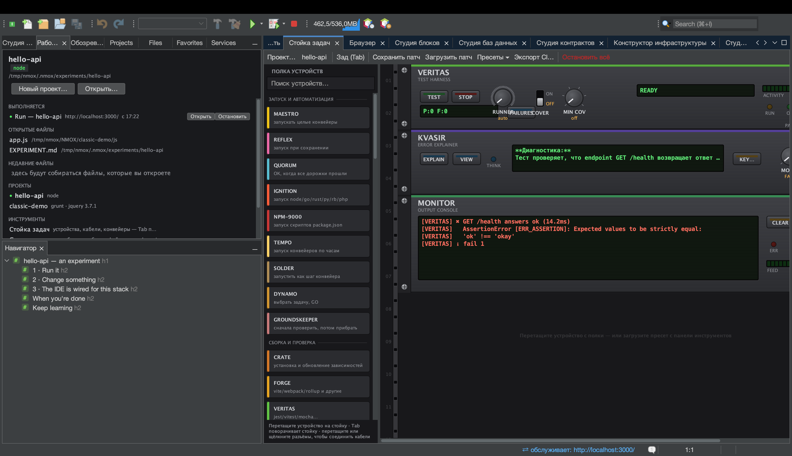

# Урок: KVASIR — ИИ, объясняющий ошибки

<!-- languages -->
[English](kvasir.md) · [Español](kvasir.es.md) · [Français](kvasir.fr.md) · [Deutsch](kvasir.de.md) · **Русский** · [Українська](kvasir.uk.md) · [Polski](kvasir.pl.md) · [Português (Brasil)](kvasir.pt.md) · [Bahasa Indonesia](kvasir.id.md) · [Filipino](kvasir.tl.md) · [Tiếng Việt](kvasir.vi.md) · [简体中文](kvasir.zh.md) · [हिन्दी](kvasir.hi.md) · [עברית](kvasir.he.md) · [العربية](kvasir.ar.md)
<!-- /languages -->

KVASIR — прибор стойки, который читает ваш последний упавший запуск и
спрашивает вашу ИИ — Claude, ChatGPT или Gemini, — что пошло не так. Это
помощь ИИ в метафоре стойки: одна кнопка, понятный шлюз согласия и честный
ЖК-экран. Файлы проекта и секреты не отправляются — только ограниченный
контекст сбоя.

## Перед началом

Нужен ключ API одного из трёх поставщиков, с которыми работает KVASIR:
Anthropic (Claude), OpenAI (ChatGPT) или Google (Gemini). Нажмите
**KEY…** на лицевой панели, чтобы выбрать поставщика и сохранить его
ключ в связке ключей ОС, либо экспортируйте переменную окружения
поставщика — `ANTHROPIC_API_KEY` / `CLAUDE_API_KEY`, `OPENAI_API_KEY` /
`CHATGPT_API_KEY` или `GEMINI_API_KEY` / `GOOGLE_API_KEY`. Выбор
поставщика действует на все грани KVASIR и доступен также в
Параметры ▸ Стойка и облако.

## Шаги

1. **Вызовите сбой.** Запустите что-нибудь, что падает, — сборку с
   синтаксической ошибкой или тест, бросающий исключение. Бортовой
   самописец стойки фиксирует команду, код выхода и до пяти выбранных
   строк с ошибками.

2. **Поставьте KVASIR** с палитры (категория «Наблюдение») и нажмите
   **EXPLAIN**.

3. **Дайте согласие (в первый раз).** У KVASIR свой разовый диалог
   согласия — отдельный для каждого поставщика: он называет компанию,
   которая получит данные, и точно перечисляет, что покинет вашу машину:
   упавшую команду, её код выхода, не более 5 строк с ошибками, имя
   прибора и имя проекта — и больше ничего (ни исходников, ни окружения,
   ни секретов). Доверие рабочей области охраняет *запуск* кода; у этого
   исходящего потока данных свой затвор.

4. **Прочтите вердикт.** Краткий диагноз появляется на многострочном
   ЖК-экране; нажмите **VIEW**, чтобы открыть полное объяснение в окне беседы. Ручка
   **MODEL** выбирает FAST (по умолчанию) или DEEP — Haiku / Sonnet,
   GPT-5 mini / GPT-5 или Gemini Flash / Pro, в зависимости от выбранного
   поставщика.

## Что вы узнали

- KVASIR ничего не стоит при запуске IDE и не ходит в сеть без нажатия
  кнопки — действуют и затвор ключа, и затвор согласия.
- Ключ передаётся только в заголовке авторизации поставщика
  (`x-api-key`, `Authorization: Bearer`, `x-goog-api-key`) — никогда в
  URL, теле запроса или журнале.
- Ключи никогда не переходят между поставщиками, и согласие даётся каждому
  отдельно: «да» для Anthropic — не «да» для Google или OpenAI.
- Отказы честные: нет ключа, нет согласия, нечего объяснять, нет сети или
  отказ модели — у каждого случая своё понятное сообщение на ЖК-экране.

## Дальше

- Подключите без рук: кабель `VERITAS FAIL → KVASIR EXPLAIN` сам
  объясняет упавший прогон тестов (по кабелю запрос никогда не выводится,
  а частота ограничена одним разом в 30 с); выход OUT питает
  MONITOR/PHOSPHOR.
