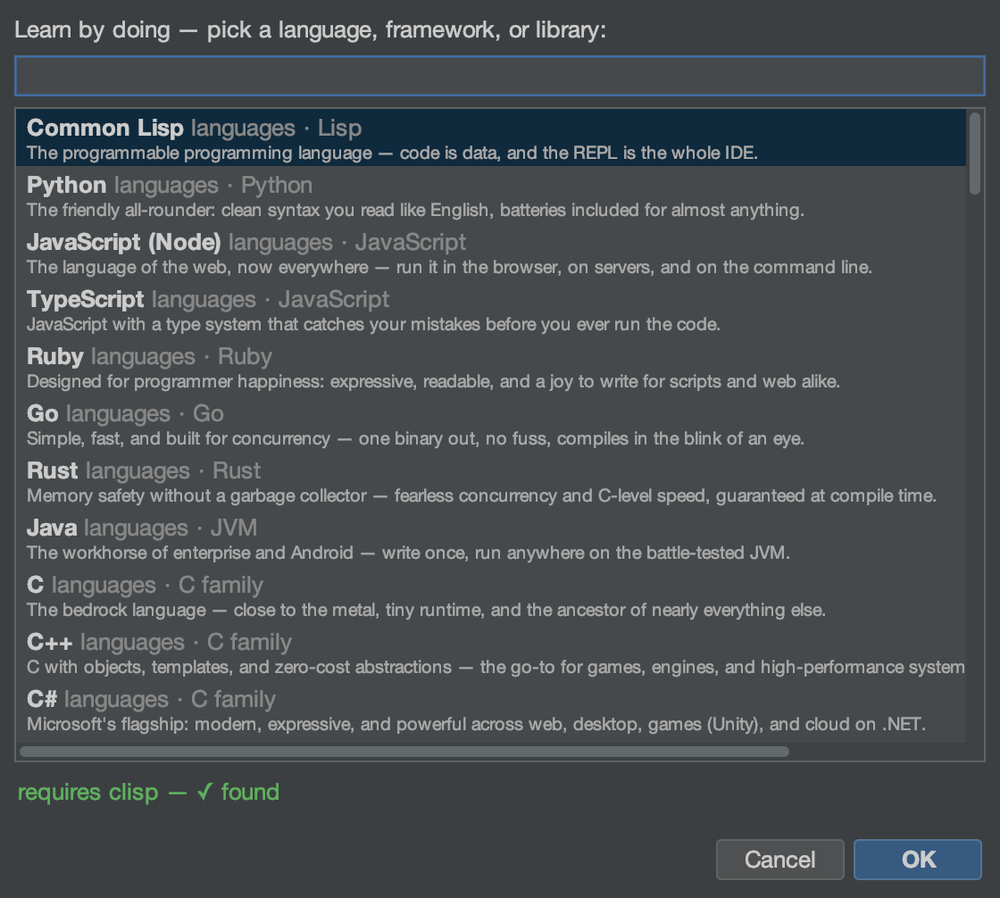

# Tutorial: Learning Spaces

A Learning Space is a self-contained sandbox for learning a language,
framework, or library: NMOX Studio generates sample code, a walked
tutorial, and a rack pre-wired with a **real in-rack REPL** you type
into. There are 78 built in.

<!-- screenshot: a learning space open — sample code, the tutorial pane, and the REPL device with typed input -->

## Open it

`File ▸ New Learning Space…` (the launcher lists every built-in space).

## Steps

1. **Pick a space.** Choose one — Python, Rust, Solid, htmx, Solidity,
   Elm, a REPL for a systems language, an E2E/Playwright space, etc. The
   picker probes whether the interpreter/toolchain is available first.

2. **Let it generate.** NMOX Studio creates the space under
   `~/.nmox/learn/<slug>`: a minimal working sample plus a tutorial that
   walks you through it, pointing at the relevant console or device.

3. **Type into the REPL.** The pre-wired rack includes a **REPL** device
   whose ENGINE knob is set for the space's language (26 engines, each
   with force-interactive flags seeded). Type an expression, press
   enter — output streams onto the REPL screen. Missing interpreter?
   The **INSTALL** button installs it from the rack.

4. **Follow the tutorial.** Work through the steps; the sample code is
   real and runnable, and the space is yours to modify.

## What you just learned

- A Learning Space is a full project + tutorial + wired rack, not just a
  snippet.
- The REPL is a real interactive process, not a canned playback.
- You can add your own: drop a `*.json` into `~/.nmox/learn-catalog.d/`
  and it joins the picker (see [learning-spaces.md](../learning-spaces.md)
  for the schema).

## Next

- Framework spaces (Astro/SvelteKit/Nuxt/Next) point at their rack
  console (COSMOS/KINETIC/NIMBUS/NEXUS).
