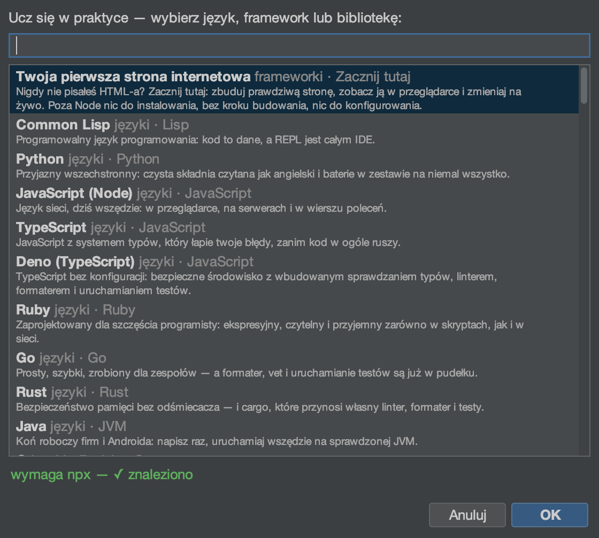

# Samouczek: Przestrzenie nauki

<!-- languages -->
[English](learning-spaces.md) · [Español](learning-spaces.es.md) · [Français](learning-spaces.fr.md) · [Deutsch](learning-spaces.de.md) · [Русский](learning-spaces.ru.md) · [Українська](learning-spaces.uk.md) · **Polski** · [Português (Brasil)](learning-spaces.pt.md) · [Bahasa Indonesia](learning-spaces.id.md) · [Filipino](learning-spaces.tl.md) · [Tiếng Việt](learning-spaces.vi.md) · [简体中文](learning-spaces.zh.md) · [हिन्दी](learning-spaces.hi.md) · [עברית](learning-spaces.he.md) · [العربية](learning-spaces.ar.md)
<!-- /languages -->

Przestrzeń nauki to samowystarczalna piaskownica do nauki języka,
frameworka albo biblioteki: NMOX Studio tworzy przykładowy kod, prowadzony
kurs i stojak z już podpiętym **prawdziwym REPL-em na stojaku**, do
którego piszesz. Wbudowanych jest 93.

<!-- screenshot: a learning space open — sample code, the tutorial pane, and the REPL device with typed input -->

## Otwieranie

`Plik ▸ Nowa przestrzeń nauki…` (okno wyboru wymienia każdą wbudowaną
przestrzeń).

## Kroki

1. **Wybierz przestrzeń.** Python, Rust, Solid, htmx, Solidity, Elm, REPL
   dla języka systemowego, przestrzeń E2E z Playwright i tak dalej. Okno
   wyboru najpierw sprawdza, czy interpreter albo łańcuch narzędzi jest
   dostępny.

2. **Pozwól jej powstać.** NMOX Studio tworzy przestrzeń w
   `~/.nmox/learn/<slug>`: minimalny działający przykład plus kurs, który
   cię przez niego przeprowadza i wskazuje właściwą konsolę albo
   urządzenie.

3. **Pisz do REPL-a.** Podpięty stojak ma urządzenie **REPL**, którego
   pokrętło ENGINE jest ustawione na język przestrzeni (po jednym silniku
   na każdy język REPL w katalogu, każdy z gotowymi flagami wymuszającymi tryb interaktywny). Wpisz
   wyrażenie, naciśnij Enter — wyjście spływa na ekran REPL-a. Brakuje
   interpretera? Przycisk **INSTALL** instaluje go prosto ze stojaka.

4. **Idź za kursem.** Przejdź kolejne kroki; przykładowy kod jest
   prawdziwy i da się go uruchomić, a przestrzeń jest twoja — przerabiaj
   ją do woli.

## Czego się właśnie nauczyłeś

- Przestrzeń nauki to pełny projekt + kurs + okablowany stojak, a nie
  sam fragment kodu.
- REPL to prawdziwy proces interaktywny, a nie odtwarzane nagranie.
- Możesz dodać własne: wrzuć `*.json` do `~/.nmox/learn-catalog.d/`,
  a dołączy do okna wyboru (schemat opisuje
  [learning-spaces.md](../learning-spaces.md)).

## Dalej

- Przestrzenie frameworków (Astro/SvelteKit/Nuxt/Next) wskazują swoją
  konsolę na stojaku (COSMOS/KINETIC/NIMBUS/NEXUS).
