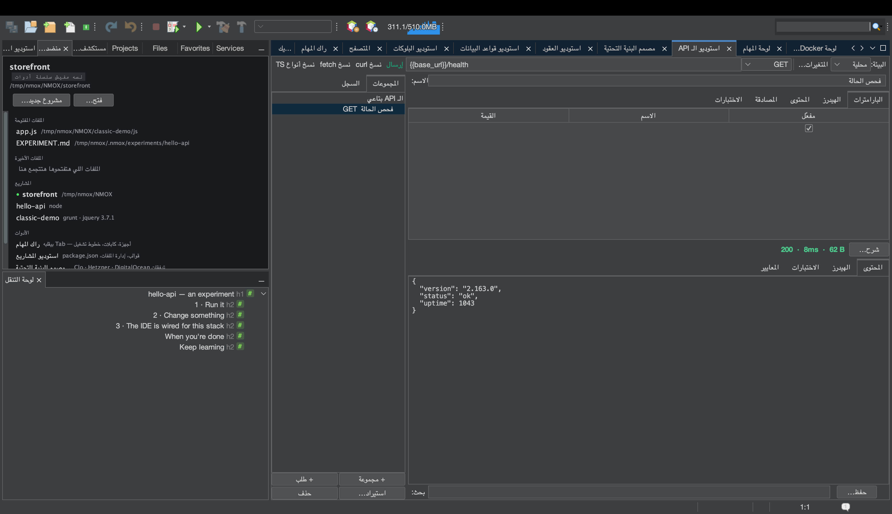

# درس: الانتقال من Postman (ومن Insomnia، ومن المتصفح)

<!-- languages -->
[English](migrating-from-postman.md) · [Español](migrating-from-postman.es.md) · [Français](migrating-from-postman.fr.md) · [Deutsch](migrating-from-postman.de.md) · [Русский](migrating-from-postman.ru.md) · [Українська](migrating-from-postman.uk.md) · [Polski](migrating-from-postman.pl.md) · [Português (Brasil)](migrating-from-postman.pt.md) · [Bahasa Indonesia](migrating-from-postman.id.md) · [Filipino](migrating-from-postman.tl.md) · [Tiếng Việt](migrating-from-postman.vi.md) · [简体中文](migrating-from-postman.zh.md) · [हिन्दी](migrating-from-postman.hi.md) · [עברית](migrating-from-postman.he.md) · **العربية**
<!-- /languages -->

استوديو الـ API بيقرا الملفات اللي عندكم أصلًا: مجموعة أو بيئة Postman،
وتصدير Insomnia v4 (بتركيب مساحة الشغل وترجمة `{{ _.templates }}`)،
وتسجيل HAR من devtools، وأمر curl، وملف ‎`.http`، ومواصفات OpenAPI.
الجولة دي بتاخد تصدير Postman حقيقي من الأول للآخر — وبتوريكم الحاجة
الوحيدة اللي NMOX Studio بيعملها بشكل مختلف عن قصد: **الأسرار بتنزل في
سلسلة مفاتيح نظامكم، عمرها ما بتنزل في ملف بيتضاف للمستودع.**

## قبل ما تبدأوا

صدّروا مجموعتكم من Postman: collection ‏◂‏ … ‏◂‏ Export ‏◂‏
**Collection v2.1**. (تصدير v1 بيترفض وبيتكتب معاه الحل — صدّروا تاني كـ
v2.1.) البيئات بتتصدّر لوحدها وبتتستورد من
**استيراد… ‏◂‏ بيئة Postman…** — القيم العادية بتدخل، والاستيراد بنفس
الاسم بيندمج من غير ما يكتب فوق اللي انتوا ظابطينه، والقيم اللي Postman
معلّمها *secret* بتفضل برّه ومعاها ملاحظة بتشاور على حقل المصادقة
المربوط بسلسلة المفاتيح، لأن بيئات استوديو الـ API موجودة في
`.nmoxapi.json` اللي بيتضاف للمستودع.

## الخطوات

1. **افتحوا استوديو الـ API** (⌥⌘8) ودوسوا **استيراد… ‏◂‏ مجموعة
   Postman…**. اختاروا ملف ‎`.json` اللي صدّرتوه.

2. **شوفوا إيه اللي وصل.** المجلدات بتحتفظ بهويتها في أسامي على شكل
   «المجلد / الطلب». الـ `{{variables}}` بتاعة Postman بتتستورد *زي ما هي* —
   دي نفس صيغة استوديو الـ API — ومتغيرات المجموعة بتنضم للبيئة الشغالة
   من غير ما تكتب فوق أي حاجة انتوا ظابطينها. متغيرات المسار `:id` بتبقى
   `{{id}}`.

3. **بصوا على تبويب المصادقة في طلب كان فيه bearer token.** التوكن *موجود* —
   بس دخل عن طريق حقل المصادقة المربوط بسلسلة المفاتيح، مش كسطر هيدر.
   ضيفوا ‎`.nmoxapi.json` للمستودع براحتكم؛ السر مش فيه. أي حاجة الاستيراد
   مقدرش يمثّلها (أجسام multipart، والسكريبتات) بتتسمّى في سطر الحالة،
   عمرها ما بتتبوّظ في السكوت.

4. **استوردوا تسجيل من المتصفح.** في تبويب Network في devtools، اختاروا
   «Save all as HAR»، وبعدين **استيراد… ‏◂‏ تسجيل HAR…**. ترافيك XHR/fetch
   بتاعكم بس هو اللي بيتستورد (ملفات الصفحة بتتعد بصوت عالي)، وكوكيز
   الجلسة بتتشال — الكوكي المتسجّلة بيانات دخول — وأي `Authorization`
   متسجّل يا إما بيتنقل لسلسلة المفاتيح (Bearer/Basic) يا إما بيتشال
   وبيتعد (أي حاجة مش مفهومة).

5. **ابعتوا واحد.** اختاروا طلب مستورد، وحلّوا `{{baseUrl}}` في بيئتكم لو
   محتاج، ودوسوا **إرسال** — واقروا درجة هيدرز الأمان في تبويب المعايير
   وانتوا هناك.

6. **روحوا في الاتجاه التاني.** **استيراد… ‏◂‏ تصدير المجموعة لملف ‎.http…**
   بيكتب المجموعة كلها بلهجة REST Client لأي محرر أو CI runner. المصادقة
   مش في الملف عن قصد؛ وكل طلب فيه مصادقة جنبه تعليق بيقول إيه اللي
   تضيفوه تاني.

## اللي اتعلمتوه

- الانتقال قايمة واحدة: curl / `.http` / OpenAPI / Postman / HAR داخلين،
  و‎`.http` خارج.
- قانون الأسرار ماشي على كل الحدود: بتدخل سلسلة المفاتيح، وبتفضل فيها.
- الرفض بيتسمّى، عمره ما بيبقى في السكوت — لو حاجة متستوردتش، سطر الحالة
  بيقول إيه وليه.
