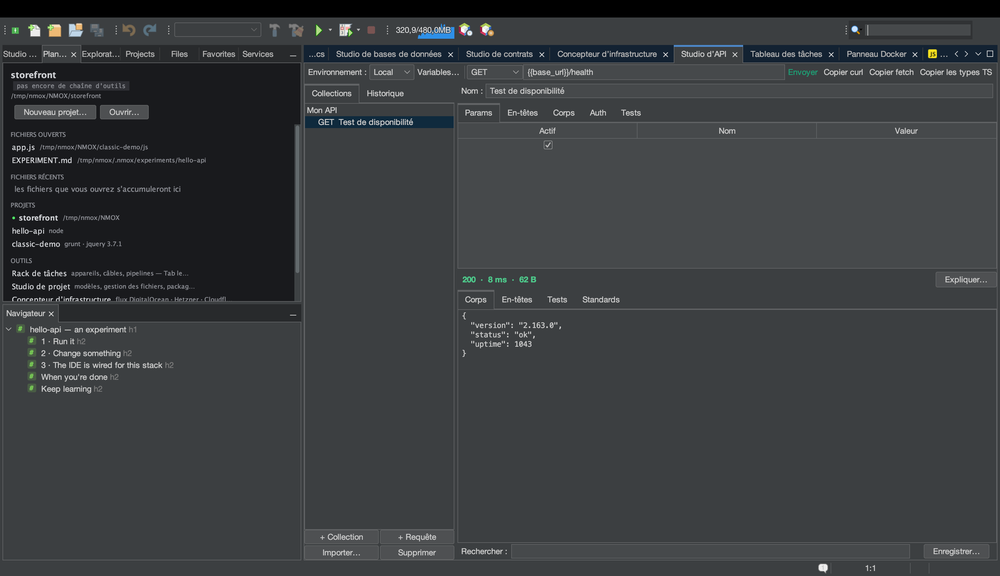

# Tutoriel : migrer depuis Postman (et Insomnia, et le navigateur)

<!-- languages -->
[English](migrating-from-postman.md) · [Español](migrating-from-postman.es.md) · **Français** · [Deutsch](migrating-from-postman.de.md) · [Русский](migrating-from-postman.ru.md) · [Українська](migrating-from-postman.uk.md) · [Polski](migrating-from-postman.pl.md) · [Português (Brasil)](migrating-from-postman.pt.md) · [Bahasa Indonesia](migrating-from-postman.id.md) · [Filipino](migrating-from-postman.tl.md) · [Tiếng Việt](migrating-from-postman.vi.md) · [简体中文](migrating-from-postman.zh.md) · [हिन्दी](migrating-from-postman.hi.md) · [עברית](migrating-from-postman.he.md) · [العربية](migrating-from-postman.ar.md)
<!-- /languages -->

Le Studio d’API lit les fichiers que vous avez déjà : une collection ou un
environnement Postman, un export Insomnia v4 (structure de l’espace de
travail et `{{ _.templates }}` traduits), une capture HAR des outils de
développement, une commande curl, un fichier `.http`, une spécification
OpenAPI.
Ce parcours prend un vrai export Postman de bout en bout — et montre la
seule chose que NMOX Studio fait autrement exprès : **les secrets
atterrissent dans le trousseau de votre système, jamais dans un fichier
versionnable.**

## Avant de commencer

Exportez votre collection depuis Postman : collection ▸ … ▸ Export ▸
**Collection v2.1**. (Un export v1 est refusé avec la correction écrite
noir sur blanc — réexportez en v2.1.) Les environnements s’exportent à
part et s’importent par **Importer… ▸ Environnement Postman…** — les
valeurs simples arrivent, un import de même nom fusionne sans écraser ce
que vous avez déjà défini, et les valeurs que Postman marque *secrètes*
restent dehors avec une note qui désigne le champ Auth adossé au trousseau,
parce que les environnements du Studio d’API vivent dans le
`.nmoxapi.json` versionnable.

## Étapes

1. **Ouvrez le Studio d’API** (⌥⌘8) et pressez **Importer… ▸ Collection
   Postman…**. Choisissez le `.json` exporté.

2. **Vérifiez ce qui est arrivé.** Les dossiers gardent leur identité sous
   forme de noms « Dossier / Requête ». Les `{{variables}}` de Postman
   s’importent *telles quelles* — c’est la syntaxe même du Studio d’API —
   et les variables de collection rejoignent votre environnement actif sans
   rien écraser de ce que vous avez déjà défini. Les variables de chemin
   `:id` deviennent `{{id}}`.

3. **Regardez l’onglet Auth d’une requête qui avait un jeton bearer.** Le
   jeton est *là* — mais il est arrivé par le champ Auth adossé au
   trousseau, pas par une ligne d’en-tête. Versionnez `.nmoxapi.json` sans
   crainte ; le secret n’y est pas. Tout ce que l’import n’a pas pu
   représenter (corps multipart, scripts) est nommé dans la ligne d’état,
   jamais mutilé en silence.

4. **Importez une capture du navigateur.** Dans l’onglet Network des outils
   de développement, « Save all as HAR », puis **Importer… ▸ Capture HAR…**.
   Seul votre trafic XHR/fetch est importé (les ressources de la page sont
   décomptées à voix haute), les cookies de session sont écartés — un
   cookie capturé est un identifiant — et un `Authorization` enregistré
   passe soit dans le trousseau (Bearer/Basic), soit est écarté et compté
   (tout ce qui est opaque).

5. **Envoyez-en une.** Choisissez une requête importée, renseignez
   `{{baseUrl}}` dans votre environnement si nécessaire, pressez
   **Envoyer** — et lisez au passage la note des en-têtes de sécurité dans
   l’onglet Standards.

6. **Faites le chemin inverse.** **Importer… ▸ Exporter la collection vers .http…**
   écrit toute la collection dans le dialecte REST Client, pour n’importe
   quel éditeur ou exécuteur d’intégration continue. L’authentification
   n’est volontairement pas dans le fichier ; chaque requête authentifiée
   porte un commentaire qui nomme ce qu’il faut rajouter.

## Ce que vous venez d’apprendre

- La migration tient dans un seul menu : curl / `.http` / OpenAPI /
  Postman / HAR en entrée, `.http` en sortie.
- La loi des secrets tient à chaque frontière : entré par le trousseau,
  resté dans le trousseau.
- Les refus sont nommés, jamais silencieux — si quelque chose ne s’est pas
  importé, la ligne d’état dit quoi et pourquoi.
