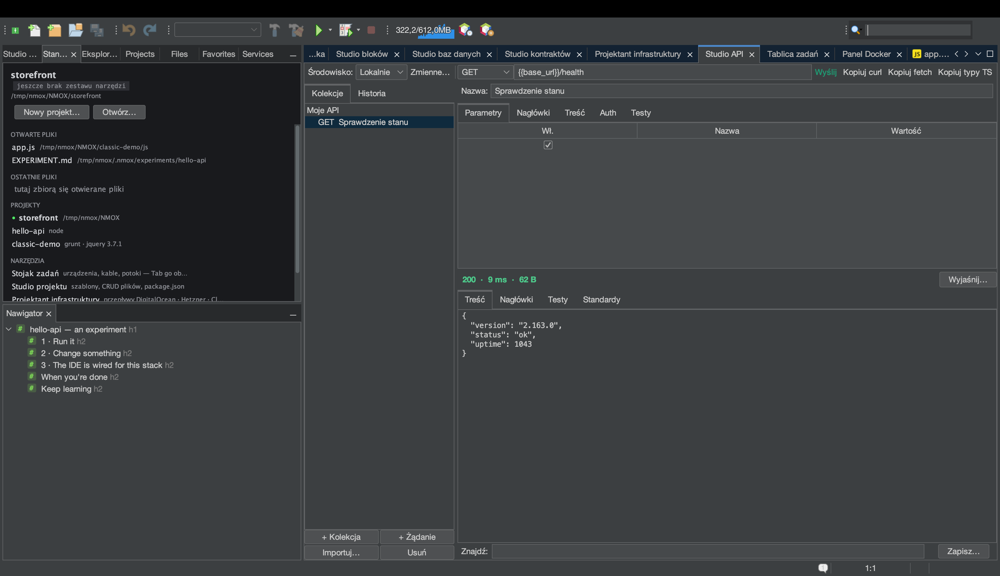

# Samouczek: Przesiadka z Postmana (i z Insomnii, i z przeglądarki)

<!-- languages -->
[English](migrating-from-postman.md) · [Español](migrating-from-postman.es.md) · [Français](migrating-from-postman.fr.md) · [Deutsch](migrating-from-postman.de.md) · [Русский](migrating-from-postman.ru.md) · [Українська](migrating-from-postman.uk.md) · **Polski** · [Português (Brasil)](migrating-from-postman.pt.md) · [Bahasa Indonesia](migrating-from-postman.id.md) · [Filipino](migrating-from-postman.tl.md) · [Tiếng Việt](migrating-from-postman.vi.md) · [简体中文](migrating-from-postman.zh.md) · [हिन्दी](migrating-from-postman.hi.md) · [עברית](migrating-from-postman.he.md) · [العربية](migrating-from-postman.ar.md)
<!-- /languages -->

Studio API czyta pliki, które już masz: kolekcję albo środowisko Postmana,
eksport Insomnii v4 (ze strukturą przestrzeni roboczej i przetłumaczonymi
`{{ _.templates }}`), przechwycenie HAR z narzędzi deweloperskich,
polecenie curl, plik `.http`, specyfikację OpenAPI.
To przejście prowadzi prawdziwy eksport z Postmana od początku do końca
— i pokazuje jedną rzecz, którą NMOX Studio celowo robi inaczej:
**sekrety lądują w pęku kluczy systemu, nigdy w pliku do wersjonowania.**

## Zanim zaczniesz

Wyeksportuj kolekcję z Postmana: kolekcja ▸ … ▸ Export ▸
**Collection v2.1**. (Eksport v1 zostanie odrzucony, a komunikat powie,
jak to naprawić — wyeksportuj ponownie jako v2.1.) Środowiska eksportuje
się osobno i importuje przez **Importuj… ▸ Środowisko Postman…** — zwykłe
wartości wchodzą, importy o tej samej nazwie scalają się, nie nadpisując
tego, co już ustawiłeś, a wartości oznaczone w Postmanie jako *secret*
zostają za drzwiami, z uwagą wskazującą pole Auth oparte na pęku kluczy,
bo środowiska Studia API mieszkają w wersjonowanym `.nmoxapi.json`.

## Kroki

1. **Otwórz Studio API** (⌥⌘8) i naciśnij **Importuj… ▸ Kolekcja
   Postman…**. Wskaż wyeksportowany plik `.json`.

2. **Sprawdź, co przyszło.** Foldery zachowują tożsamość jako nazwy
   „Folder / Żądanie”. `{{variables}}` z Postmana importują się
   *dosłownie* — to własna składnia Studia API — a zmienne kolekcji
   dołączają do aktywnego środowiska, nie nadpisując niczego, co już
   ustawiłeś. Zmienne ścieżki `:id` stają się `{{id}}`.

3. **Zajrzyj na kartę Auth żądania, które miało token bearer.** Token
   *jest* — ale przyszedł przez pole Auth oparte na pęku kluczy, a nie
   jako wiersz nagłówka. Wrzucaj `.nmoxapi.json` do repozytorium bez obaw;
   sekretu w nim nie ma. Wszystko, czego import nie umiał odwzorować
   (treści multipart, skrypty), zostaje nazwane w wierszu stanu — nigdy po
   cichu przekręcone.

4. **Zaimportuj przechwycenie z przeglądarki.** Na karcie Network narzędzi
   deweloperskich wybierz „Save all as HAR”, potem **Importuj… ▸
   Przechwycenie HAR…**. Importuje się tylko twój ruch XHR/fetch (zasoby
   strony zostają policzone na głos), ciasteczka sesji są odrzucane —
   przechwycone ciasteczko to poświadczenie — a nagrany `Authorization`
   albo przenosi się do pęku kluczy (Bearer/Basic), albo zostaje odrzucony
   i policzony (wszystko nieprzejrzyste).

5. **Wyślij jedno.** Wybierz zaimportowane żądanie, w razie potrzeby
   ustaw `{{baseUrl}}` w środowisku, naciśnij **Wyślij** — i skoro już tam
   jesteś, przeczytaj ocenę nagłówków bezpieczeństwa na karcie Standardy.

6. **W drugą stronę.** **Importuj… ▸ Eksportuj kolekcję do .http…**
   zapisuje całą kolekcję w dialekcie REST Client dla dowolnego edytora
   albo uruchamiacza CI. Uwierzytelniania celowo nie ma w pliku; każde
   żądanie z uwierzytelnianiem niesie komentarz, co trzeba dodać
   z powrotem.

## Czego się właśnie nauczyłeś

- Przesiadka to jedno menu: curl / `.http` / OpenAPI / Postman / HAR na
  wejściu, `.http` na wyjściu.
- Prawo sekretów obowiązuje na każdej granicy: do pęku kluczy wchodzi,
  w pęku kluczy zostaje.
- Odmowy są nazwane, nigdy ciche — jeśli coś się nie zaimportowało,
  wiersz stanu mówi co i dlaczego.
