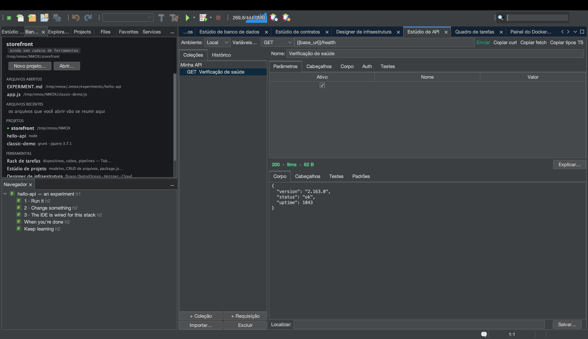

# Tutorial: migrando do Postman (e do Insomnia, e do navegador)

<!-- languages -->
[English](migrating-from-postman.md) · [Español](migrating-from-postman.es.md) · [Français](migrating-from-postman.fr.md) · [Deutsch](migrating-from-postman.de.md) · [Русский](migrating-from-postman.ru.md) · [Українська](migrating-from-postman.uk.md) · [Polski](migrating-from-postman.pl.md) · **Português (Brasil)** · [Bahasa Indonesia](migrating-from-postman.id.md) · [Filipino](migrating-from-postman.tl.md) · [Tiếng Việt](migrating-from-postman.vi.md) · [简体中文](migrating-from-postman.zh.md) · [हिन्दी](migrating-from-postman.hi.md) · [עברית](migrating-from-postman.he.md) · [العربية](migrating-from-postman.ar.md)
<!-- /languages -->

O Estúdio de API lê os arquivos que você já tem: uma coleção ou um ambiente
do Postman, uma exportação v4 do Insomnia (a estrutura do workspace e os
`{{ _.templates }}` traduzidos), uma captura HAR das ferramentas de
desenvolvedor, um comando curl, um arquivo `.http`, uma especificação
OpenAPI.
Este passeio leva uma exportação real do Postman de ponta a ponta — e
mostra a única coisa que o NMOX Studio faz diferente de propósito: **os
segredos vão para o chaveiro do sistema operacional, nunca para um arquivo
versionável.**

## Antes de começar

Exporte a sua coleção no Postman: coleção ▸ … ▸ Export ▸
**Collection v2.1**. (Uma exportação v1 é recusada com a correção explicada
— exporte de novo como v2.1.) Os ambientes são exportados à parte e
importados por **Importar… ▸ Ambiente do Postman…** — os valores comuns
entram, importações com o mesmo nome se mesclam sem sobrescrever o que você
já definiu, e os valores que o Postman marca como *secret* ficam de fora,
com uma nota apontando para o campo Auth guardado no chaveiro, porque os
ambientes do Estúdio de API moram no `.nmoxapi.json` versionável.

## Passos

1. **Abra o Estúdio de API** (⌥⌘8) e aperte **Importar… ▸ Coleção do
   Postman…**. Escolha o `.json` exportado.

2. **Confira o que chegou.** As pastas mantêm a identidade como nomes
   “Pasta / Requisição”. As `{{variables}}` do Postman entram *literalmente*
   — são a sintaxe do próprio Estúdio de API — e as variáveis da coleção se
   juntam ao seu ambiente ativo sem sobrescrever nada que você já tenha
   definido. As variáveis de caminho `:id` viram `{{id}}`.

3. **Olhe a aba Auth de uma requisição que tinha um token bearer.** O token
   *está lá* — mas chegou pelo campo Auth guardado no chaveiro, não como uma
   linha de cabeçalho. Versione o `.nmoxapi.json` à vontade; o segredo não
   está nele. Qualquer coisa que a importação não conseguiu representar
   (corpos multipart, scripts) é nomeada na linha de status, nunca
   estropiada em silêncio.

4. **Importe uma captura do navegador.** Na aba Network das ferramentas de
   desenvolvedor, use “Save all as HAR”, depois **Importar… ▸ Captura
   HAR…**. Só o seu tráfego XHR/fetch é importado (os recursos da página são
   contados em voz alta), os cookies de sessão são descartados — um cookie
   capturado é uma credencial — e um `Authorization` gravado ou vai para o
   chaveiro (Bearer/Basic) ou é descartado e contado (qualquer coisa opaca).

5. **Envie uma.** Escolha uma requisição importada, resolva `{{baseUrl}}`
   no seu ambiente se for preciso, aperte **Enviar** — e, já que está ali,
   leia a nota dos cabeçalhos de segurança na aba Padrões.

6. **Faça o caminho inverso.** **Importar… ▸ Exportar coleção para .http…**
   grava a coleção inteira no dialeto do REST Client, para qualquer editor
   ou executor de CI. A autenticação fica de fora do arquivo de propósito;
   cada requisição autenticada leva um comentário dizendo o que acrescentar
   de volta.

## O que você aprendeu

- A migração é um menu só: curl / `.http` / OpenAPI / Postman / HAR para
  dentro, `.http` para fora.
- A lei dos segredos vale em toda fronteira: entram no chaveiro, ficam no
  chaveiro.
- As recusas têm nome, nunca são silenciosas — se algo não foi importado, a
  linha de status diz o quê e por quê.
