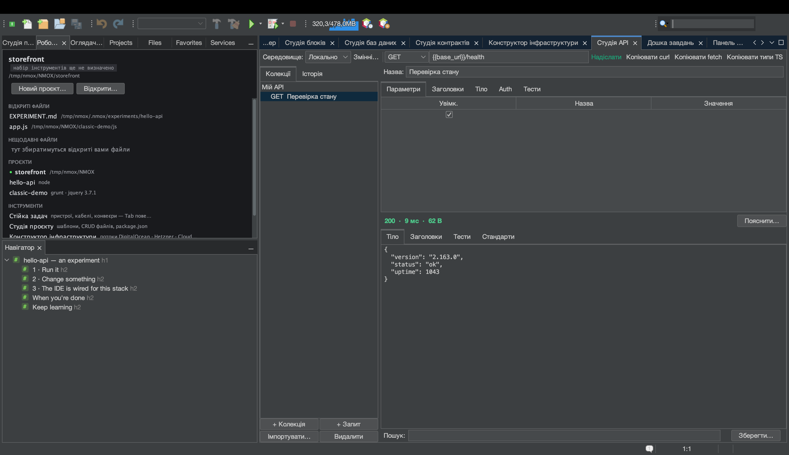

# Урок: Перехід із Postman (а також з Insomnia і браузера)

<!-- languages -->
[English](migrating-from-postman.md) · [Español](migrating-from-postman.es.md) · [Français](migrating-from-postman.fr.md) · [Deutsch](migrating-from-postman.de.md) · [Русский](migrating-from-postman.ru.md) · **Українська** · [Polski](migrating-from-postman.pl.md) · [Português (Brasil)](migrating-from-postman.pt.md) · [Bahasa Indonesia](migrating-from-postman.id.md) · [Filipino](migrating-from-postman.tl.md) · [Tiếng Việt](migrating-from-postman.vi.md) · [简体中文](migrating-from-postman.zh.md) · [हिन्दी](migrating-from-postman.hi.md) · [עברית](migrating-from-postman.he.md) · [العربية](migrating-from-postman.ar.md)
<!-- /languages -->

Студія API читає файли, які у вас уже є: колекцію чи середовище Postman,
експорт Insomnia v4 (структуру робочого простору й
`{{ _.templates }}` перекладено), запис HAR із devtools, команду curl,
файл `.http`, специфікацію OpenAPI.
Цей розбір проводить справжній експорт Postman від початку до кінця — і
показує єдине, що NMOX Studio свідомо робить інакше: **таємниці потрапляють
у в’язку ключів ОС, ніколи — у файл, який комітять.**

## Перед початком

Експортуйте колекцію з Postman: колекція ▸ … ▸ Export ▸
**Collection v2.1**. (Експорт v1 відхиляється з готовою порадою —
експортуйте знову як v2.1.) Середовища експортуються окремо й імпортуються
через **Імпортувати… ▸ Середовище Postman…** — звичайні значення надходять,
імпорт із тією самою назвою зливається, не затираючи вже заданого, а
значення, які Postman позначає як *secret*, лишаються поза файлом із
примітком, що вказує на поле Auth у в’язці ключів, бо середовища Студії API
живуть у `.nmoxapi.json`, який комітять.

## Кроки

1. **Відкрийте Студію API** (⌥⌘8) і натисніть **Імпортувати… ▸ Колекція
   Postman…**. Оберіть експортований `.json`.

2. **Перевірте, що надійшло.** Теки зберігаються в назвах вигляду
   «Тека / Запит». `{{variables}}` Postman імпортуються
   *дослівно* — це власний синтаксис Студії API, — а змінні колекції
   приєднуються до активного середовища, не затираючи нічого вже
   заданого. Змінні шляху `:id` стають `{{id}}`.

3. **Погляньте на вкладку Auth запиту, що мав bearer-токен.** Токен
   *там* — але прийшов через поле Auth у в’язці ключів, а не рядком
   заголовка. Комітьте `.nmoxapi.json` сміливо: таємниці в ньому
   немає. Усе, що імпорт не зміг відтворити (тіла multipart, скрипти),
   названо в рядку стану, а не мовчки перекручено.

4. **Імпортуйте запис із браузера.** На вкладці Network у devtools оберіть
   «Save all as HAR», потім **Імпортувати… ▸ Запис HAR…**. Імпортується
   лише ваш трафік XHR/fetch (ресурси сторінки чесно пораховано), сесійні
   cookie відкидаються — записаний cookie і є обліковими даними, — а
   записаний `Authorization` або переходить у в’язку ключів
   (Bearer/Basic), або відкидається й враховується (усе непрозоре).

5. **Надішліть один.** Оберіть імпортований запит, за потреби задайте
   `{{baseUrl}}` у середовищі, натисніть **Надіслати** — і, раз уже тут,
   прочитайте оцінку заголовків безпеки на вкладці «Стандарти».

6. **Ідіть у зворотний бік.** **Імпортувати… ▸ Експортувати колекцію у .http…**
   записує всю колекцію діалектом REST Client для будь-якого редактора
   чи CI. Автентифікації у файлі свідомо немає; кожен запит з
   автентифікацією несе коментар, що називає, що треба додати знову.

## Що ви щойно дізналися

- Перехід — це одне меню: curl / `.http` / OpenAPI / Postman / HAR на вхід,
  `.http` на вихід.
- Закон таємниць діє на кожному кордоні: прийшло у в’язку ключів — там і лишається.
- Відмови названо, а не замовчано: якщо щось не імпортувалося, рядок
  стану каже, що і чому.
