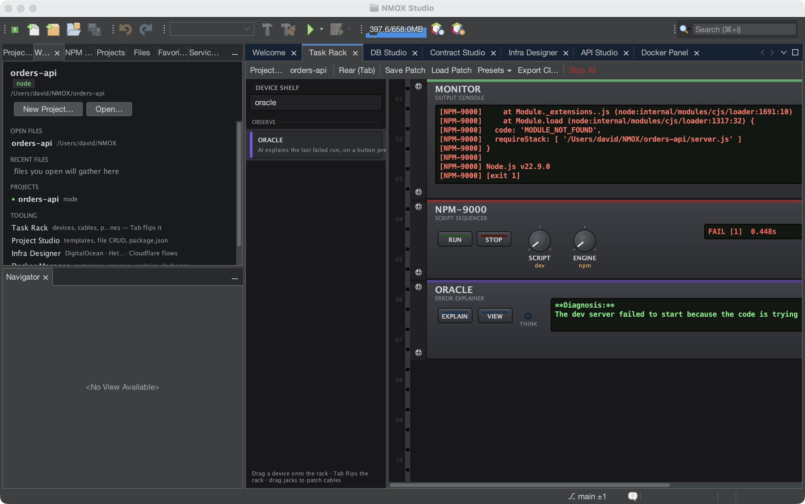

# Tutorial: ORACLE — the AI error explainer

ORACLE is a rack device that reads your last failed run and asks the
Anthropic API what went wrong. It's AI assistance through the rack's
metaphor: one button, a clear consent gate, and an honest LCD — no
project files or secrets are sent, only the bounded failure context.

## Before you start

You need an Anthropic API key. ORACLE reads it from the OS keychain
(set it with the **KEY…** button on the faceplate) or from the
`ANTHROPIC_API_KEY` / `CLAUDE_API_KEY` environment variable.

## Steps

1. **Cause a failure.** Run something that fails — a build with a syntax
   error, a test that throws. The rack's flight recorder captures the
   command, exit code, and up to five sampled error lines.

2. **Mount ORACLE** from the palette (OBSERVE category) and press
   **EXPLAIN**.

3. **Grant consent (first time).** ORACLE has its own one-time consent
   dialog spelling out exactly what leaves your machine: the failing
   command, its exit code, ≤5 error lines, the device name, and the
   project name — and nothing else (no source, no environment, no
   secrets). Workspace Trust guards *running* code; this outward data
   flow gets its own gate.

4. **Read the verdict.** A short diagnosis appears on the multi-line LCD;
   the full explanation opens in a popup. The **MODEL** knob picks
   Haiku (fast, default) or Sonnet (stronger).

## What you just learned

- ORACLE costs nothing at boot and makes no network call without the
  button press — both the key gate and the consent gate are enforced.
- The key rides the `x-api-key` header only — never a URL, body, or log.
- Degradation is honest: no-key, no-consent, nothing-to-explain, offline,
  and refusal each show a clear LCD message.

## Next

- Wire it hands-free: a `VERITAS FAIL → ORACLE EXPLAIN` cable
  auto-explains a failed test run (the cable path never prompts and
  rate-limits at 30s); its OUT feeds MONITOR/PHOSPHOR.
