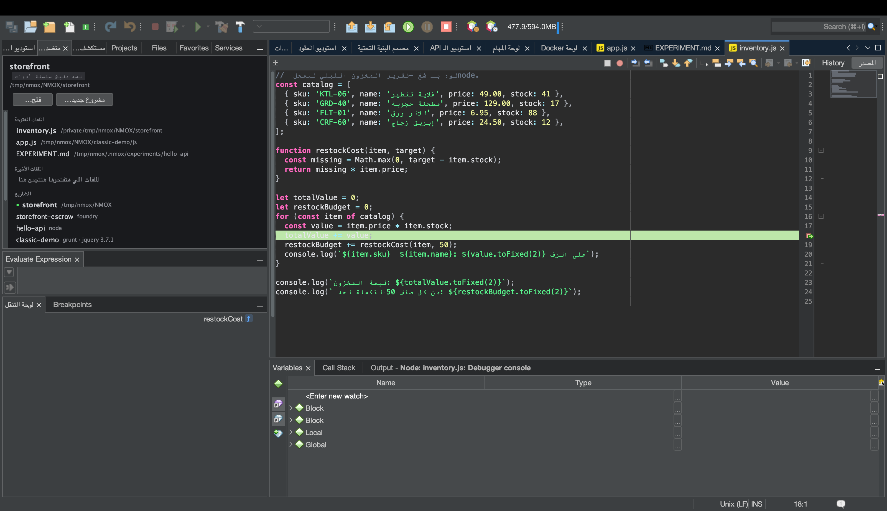

# درس: التحرير والتصحيح بلغات كتير

<!-- languages -->
[English](polyglot-editing-and-debugging.md) · [Español](polyglot-editing-and-debugging.es.md) · [Français](polyglot-editing-and-debugging.fr.md) · [Deutsch](polyglot-editing-and-debugging.de.md) · [Русский](polyglot-editing-and-debugging.ru.md) · [Українська](polyglot-editing-and-debugging.uk.md) · [Polski](polyglot-editing-and-debugging.pl.md) · [Português (Brasil)](polyglot-editing-and-debugging.pt.md) · [Bahasa Indonesia](polyglot-editing-and-debugging.id.md) · [Filipino](polyglot-editing-and-debugging.tl.md) · [Tiếng Việt](polyglot-editing-and-debugging.vi.md) · [简体中文](polyglot-editing-and-debugging.zh.md) · [हिन्दी](polyglot-editing-and-debugging.hi.md) · [עברית](polyglot-editing-and-debugging.he.md) · **العربية**
<!-- /languages -->

NMOX Studio بيحرّر أكتر من 70 لغة بتلوين حقيقي للصيغة، ومخطط في لوحة
التنقل، وذكاء خوادم اللغات — وبيصحّح JavaScript/TypeScript (والمتصفح)
على طول بنقاط توقف بتوقف فعلًا. الدرس ده بيوقف عند نقطة توقف في تطبيق
Node.

## قبل ما تبدأوا

افتحوا (أو اعملوا) مشروع Node صغير فيه سكريبت تقدروا تشغّلوه، زي route
في Express أو `node server.js` عادي.

## الخطوات

1. **افتحوا ملف مصدر.** التلوين، ومطابقة الأقواس، وطي الكود، وتعليم
   التكرارات، كلهم بيشتغلوا لوحدهم. **لوحة التنقل** بتعرض مخطط الملف؛
   وخوادم اللغات (اللي بتتثبت من تلميحات `أدوات ◂ طبيب البيئة…`) بتضيف
   الإكمال والتشخيصات.

2. **حطوا نقطة توقف.** اضغطوا في هامش المحرر على سطر جوه الـ handler
   بتاعكم — بتظهر علامة نقطة التوقف.

3. **صحّحوا الملف.** شغّلوا **تصحيح الملف (نقاط توقف)** (أو «تصحيح في
   Chrome (نقاط توقف)» لصفحة HTML/JS). سؤال الثقة في مساحة العمل بيظهر مرة
   واحدة ويحرس التشغيل؛ وبعدها المحوّل `js-debug` المرفق بيشغّل برنامجكم.

4. **اوصلوا لنقطة التوقف.** شغّلوا مسار الكود (ابعتوا الطلب، أو سيبوا
   السكريبت يوصل للسطر). التنفيذ **بيقف** عند نقطة التوقف — افحصوا
   المتغيرات، وامشوا في مكدّس الاستدعاءات، واعملوا step over/into. في تصحيح
   المتصفح، Chrome ببروفايل مؤقت بيتفتح على URL خادم التطوير الشغال
   عندكم، ونقاط التوقف في الصفحة بترجع للـ IDE.

## اللي اتعلمتوه

- المحرر بيتعامل مع أكتر من 70 لغة كمواطنين درجة أولى (TextMate grammars +
  CSL + LSP)؛ وملفات الإعدادات (YAML، وTOML، وDockerfile، وnginx…) متغطية
  كمان.
- تصحيح JS/TS مدمج — multiplexer للجلسات بيفرد الجلسات الفرعية بتاعة
  js-debug عشان المصحّح بتاع المنصة، اللي بيتعامل مع جلسة واحدة بس، يقدر
  يشغّله.
- كل تشغيل للتصحيح بيعدّي على الثقة، وعند الإيقاف بيتقفل كشجرة عمليات
  كاملة (من غير عمليات يتيمة).

## بعد كده

- **تشغيل الاختبار المحدد** بيشغّل method اختبار واحدة في كل لغة.
- التشخيصات اللي جاية من أدوات الراك (eslint/tsc/phpstan) بتنزل في نافذة
  Action Items بتاعة المنصة.
