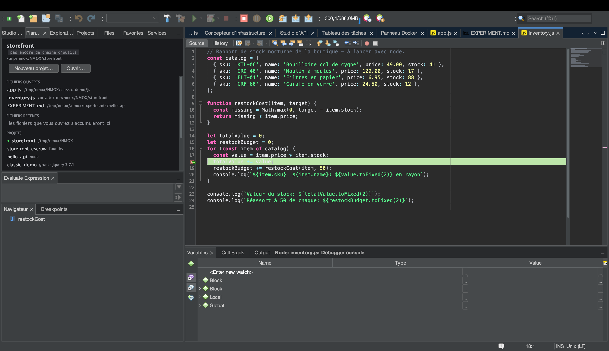

# Tutoriel : édition polyglotte et débogage

<!-- languages -->
[English](polyglot-editing-and-debugging.md) · [Español](polyglot-editing-and-debugging.es.md) · **Français** · [Deutsch](polyglot-editing-and-debugging.de.md) · [Русский](polyglot-editing-and-debugging.ru.md) · [Українська](polyglot-editing-and-debugging.uk.md) · [Polski](polyglot-editing-and-debugging.pl.md) · [Português (Brasil)](polyglot-editing-and-debugging.pt.md) · [Bahasa Indonesia](polyglot-editing-and-debugging.id.md) · [Filipino](polyglot-editing-and-debugging.tl.md) · [Tiếng Việt](polyglot-editing-and-debugging.vi.md) · [简体中文](polyglot-editing-and-debugging.zh.md) · [हिन्दी](polyglot-editing-and-debugging.hi.md) · [עברית](polyglot-editing-and-debugging.he.md) · [العربية](polyglot-editing-and-debugging.ar.md)
<!-- /languages -->

NMOX Studio édite plus de 70 langages avec une vraie coloration
syntaxique, le plan du Navigateur et l’intelligence des serveurs de
langage — et il débogue JavaScript/TypeScript (et le navigateur) d’origine,
avec des points d’arrêt qui arrêtent vraiment. Ce tutoriel atteint un
point d’arrêt dans une application Node.

## Avant de commencer

Ouvrez (ou échafaudez) un petit projet Node avec un script que vous pouvez
exécuter, par exemple une route Express ou un simple `node server.js`.

## Étapes

1. **Ouvrez un fichier source.** Coloration, appariement des accolades,
   repliement du code et surlignage des occurrences arrivent
   automatiquement. Le **Navigateur** montre le plan du fichier ; les
   serveurs de langage (installés d’après les indications de
   `Outils ▸ Docteur de l'environnement…`) ajoutent la complétion et les
   diagnostics.

2. **Posez un point d’arrêt.** Cliquez dans la marge de l’éditeur sur une
   ligne de votre gestionnaire — un point apparaît.

3. **Déboguez le fichier.** Lancez **Déboguer le fichier (points d'arrêt)**
   (ou « Déboguer dans Chrome (points d'arrêt) » pour une page HTML/JS).
   Une confirmation unique de confiance de l’espace de travail garde le
   lancement ; ensuite l’adaptateur `js-debug` embarqué démarre votre
   programme.

4. **Atteignez le point d’arrêt.** Déclenchez le chemin du code (faites la
   requête, ou laissez le script arriver à la ligne). L’exécution
   **s’arrête** sur votre point d’arrêt — inspectez les variables,
   parcourez la pile d’appels, avancez pas à pas par-dessus ou dedans.
   Pour déboguer dans le navigateur, un Chrome à profil jetable s’ouvre
   sur l’URL de votre serveur de développement vivant, et les points
   d’arrêt de la page renvoient dans l’IDE.

## Ce que vous venez d’apprendre

- L’éditeur traite plus de 70 langages de plein droit (grammaires TextMate,
  CSL et LSP) ; les fichiers de configuration (YAML, TOML, Dockerfile,
  nginx…) sont couverts aussi.
- Le débogage JS/TS est intégré — un multiplexeur de sessions aplatit les
  sessions filles de js-debug pour que le débogueur à session unique de
  la plateforme puisse le piloter.
- Chaque lancement de débogage passe par la confiance et, à l’arrêt, est
  tué comme arbre de processus entier (pas d’orphelins).

## Et ensuite

- **Exécuter le test ciblé** exécute une seule méthode de test, pour
  chaque langage.
- Les diagnostics des outils du rack (eslint/tsc/phpstan) arrivent dans la
  fenêtre **Éléments à traiter** de la plateforme.
