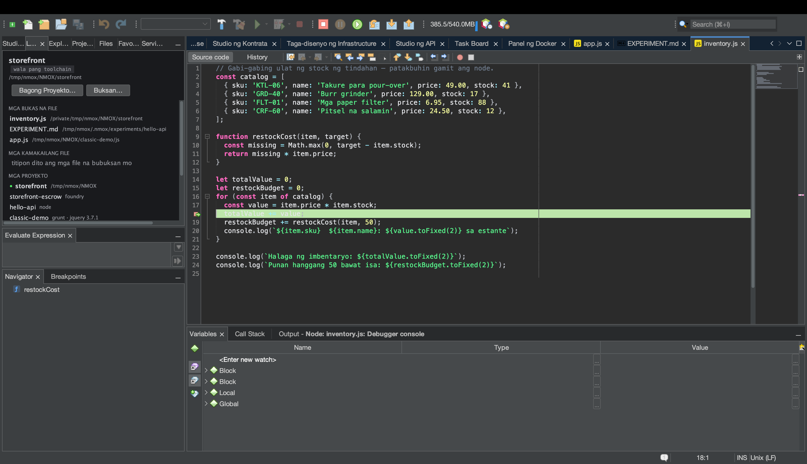

# Tutorial: Pag-edit at pag-debug sa maraming wika

<!-- languages -->
[English](polyglot-editing-and-debugging.md) · [Español](polyglot-editing-and-debugging.es.md) · [Français](polyglot-editing-and-debugging.fr.md) · [Deutsch](polyglot-editing-and-debugging.de.md) · [Русский](polyglot-editing-and-debugging.ru.md) · [Українська](polyglot-editing-and-debugging.uk.md) · [Polski](polyglot-editing-and-debugging.pl.md) · [Português (Brasil)](polyglot-editing-and-debugging.pt.md) · [Bahasa Indonesia](polyglot-editing-and-debugging.id.md) · **Filipino** · [Tiếng Việt](polyglot-editing-and-debugging.vi.md) · [简体中文](polyglot-editing-and-debugging.zh.md) · [हिन्दी](polyglot-editing-and-debugging.hi.md) · [עברית](polyglot-editing-and-debugging.he.md) · [العربية](polyglot-editing-and-debugging.ar.md)
<!-- /languages -->

Ini-edit ng NMOX Studio ang 70+ wika na may tunay na syntax highlighting,
balangkas sa Navigator, at talino ng language server — at dini-debug nito
ang JavaScript/TypeScript (at ang browser) mula sa pabrika, na may mga
breakpoint na talagang humihinto. Humihinto ang tutorial na ito sa isang
breakpoint sa Node app.

## Bago magsimula

Buksan (o lumikha ng) maliit na Node project na may script na
napapatakbo, hal. isang route ng Express o payak na `node server.js`.

## Mga hakbang

1. **Magbukas ng source file.** Kusang lumalabas ang highlighting,
   pagtutugma ng bracket, code folding, at mark-occurrences. Ipinapakita
   ng **Navigator** ang balangkas ng file; nagdaragdag ang mga language
   server (nakainstall ayon sa mga pahiwatig ng
   `Kasangkapan ▸ Doktor ng Environment…`) ng completion at diagnostics.

2. **Maglagay ng breakpoint.** I-click ang gutter ng editor sa isang
   linya sa loob ng iyong handler — lumilitaw ang tuldok ng breakpoint.

3. **I-debug ang file.** Patakbuhin ang **I-debug ang file (breakpoints)**
   (o **I-debug sa Chrome (breakpoints)** para sa pahinang HTML/JS). Isang
   minsanang tanong ng Tiwala sa Workspace ang bantay bago ang spawn; saka
   inilulunsad ng kasamang adapter na `js-debug` ang iyong programa.

4. **Humantong sa breakpoint.** Paganahin ang landas ng code (magpadala
   ng request, o hayaang umabot ang script sa linya). **Humihinto** ang
   pagpapatakbo sa iyong breakpoint — suriin ang mga variable, lakarin ang
   call stack, step over/into. Para sa pag-debug sa browser, bumubukas ang
   Chrome na may pansamantalang profile sa buhay na URL ng dev server, at
   mapang pabalik sa IDE ang mga breakpoint ng pahina.

## Ang iyong natutunan

- Tinatrato ng editor ang 70+ wika bilang first-class (TextMate grammar +
  CSL + LSP); sakop pati ang mga file ng kompigurasyon (YAML, TOML,
  Dockerfile, nginx…).
- Built-in ang pag-debug ng JS/TS — pinapatag ng session multiplexer ang
  mga child session ng js-debug para mapatakbo ito ng single-session
  debugger ng plataporma.
- Dumadaan sa tiwala ang bawat spawn ng debug at pinapatay bilang buong
  puno ng proseso sa paghinto (walang ulila).

## Susunod

- Pinapatakbo ng **Patakbuhin ang nakapokus na test** ang iisang test
  method, sa bawat wika.
- Dumadapo ang mga diagnostics mula sa mga kasangkapan ng rack
  (eslint/tsc/phpstan) sa window na Action Items ng plataporma.
