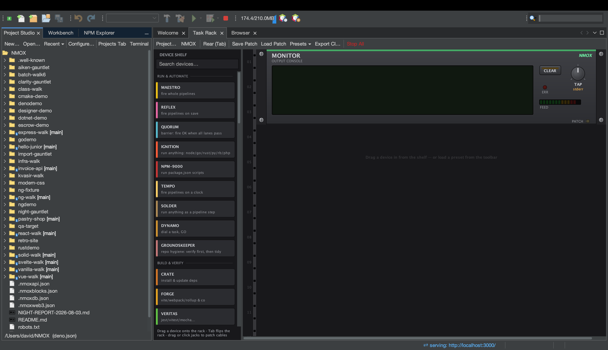

# Tutorial: el Estudio de proyecto

<!-- languages -->
[English](project-studio.md) · **Español** · [Français](project-studio.fr.md) · [Deutsch](project-studio.de.md) · [Русский](project-studio.ru.md) · [Українська](project-studio.uk.md) · [Polski](project-studio.pl.md) · [Português (Brasil)](project-studio.pt.md) · [Bahasa Indonesia](project-studio.id.md) · [Filipino](project-studio.tl.md) · [Tiếng Việt](project-studio.vi.md) · [简体中文](project-studio.zh.md) · [हिन्दी](project-studio.hi.md) · [עברית](project-studio.he.md) · [العربية](project-studio.ar.md)
<!-- /languages -->

El Estudio de proyecto es donde nacen y se gestionan los proyectos:
plantillas, un árbol de archivos nativo de la plataforma, un editor de
package.json y preajustes del rack, además de **Ejecutar / Compilar /
Probar / Limpiar** nativos del IDE, que funcionan sin que abras nunca una
terminal.

## Ábrelo

La pestaña **Estudio de proyecto**, acoplada junto al Banco de trabajo, o
`Archivo ▸ Nuevo proyecto…`.

## Pasos

1. **Genera un proyecto.** `Archivo ▸ Nuevo proyecto…` → elige una
   plantilla (Angular, Vue, Vanilla JS, Elixir/Phoenix, PHP LEMP y más).
   Elige una ubicación (por omisión `~/NMOX`) y termina. El proyecto se
   abre y el rack apunta a él.

2. **Recorre el árbol.** El árbol de archivos es un árbol real de la
   plataforma: iconos correctos por tipo de archivo, una anotación git
   `[branch]` en la raíz y el menú completo de
   Abrir/Cortar/Copiar/Eliminar/Renombrar/Herramientas/Propiedades. Las
   carpetas pesadas (`node_modules`, `.git`, `dist`) se muestran sin hijos
   para que un repositorio enorme siga yendo rápido.

3. **Ejecútalo, sin terminal.** Usa **Ejecutar** del IDE (o pulsa GO en
   IGNITION, en el rack). Resuelve tu gestor de paquetes a partir del
   propio archivo de bloqueo o del pin de corepack del proyecto y ejecuta
   el comando correcto; la salida corre por el rack. **Compilar**,
   **Probar** y **Limpiar** funcionan igual.

4. **Edita package.json.** El editor integrado permite editar scripts y
   dependencias de forma estructurada.

5. **Carga un preajuste.** El menú de preajustes cablea un rack ya hecho
   para un flujo de trabajo —Vigilancia de disponibilidad, Puerta de
   publicación, Web moderna, Vías de monorepo, Banco Web3 y más— para que
   no montes el patch a mano.

## Lo que acabas de aprender

- Los proyectos nuevos se reconocen por cualquiera de 60 nombres de
  manifiesto (package.json, Cargo.toml, go.mod, pom.xml, gleam.toml, …)
  más cuatro que se detectan por patrón (`.csproj`, `.fsproj`, `.sln`,
  `.nimble`); incluso un sitio con etiquetas script y sin manifiesto se
  abre como proyecto STATIC.
- Ejecutar/Compilar/Probar/Limpiar y el rack son **un solo mecanismo**; la
  primera vez que ejecuten código del proyecto verás una confirmación de
  confianza del espacio de trabajo.

## Siguiente

- Abre el [Rack de tareas](the-task-rack.es.md) para ver qué cableó el
  preajuste.
- Prueba un [espacio de aprendizaje](learning-spaces.es.md) para un
  entorno guiado.
