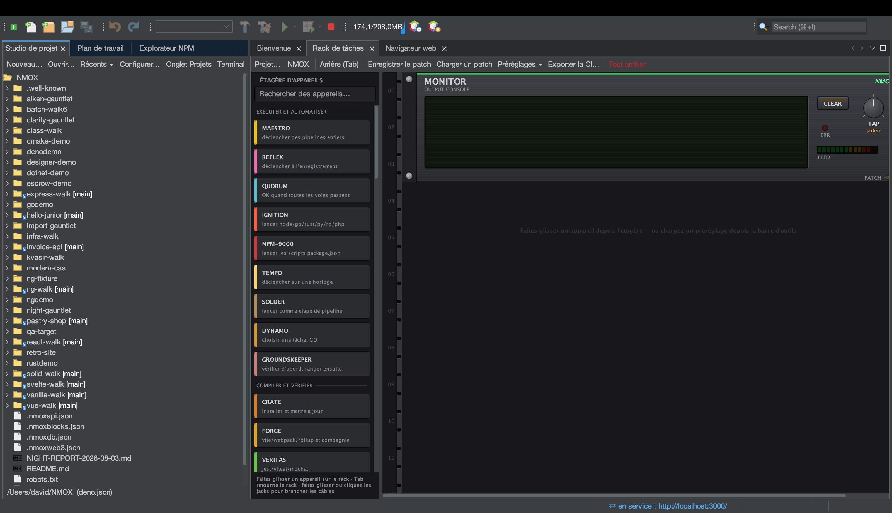

# Tutoriel : le Studio de projet

<!-- languages -->
[English](project-studio.md) · [Español](project-studio.es.md) · **Français** · [Deutsch](project-studio.de.md) · [Русский](project-studio.ru.md) · [Українська](project-studio.uk.md) · [Polski](project-studio.pl.md) · [Português (Brasil)](project-studio.pt.md) · [Bahasa Indonesia](project-studio.id.md) · [Filipino](project-studio.tl.md) · [Tiếng Việt](project-studio.vi.md) · [简体中文](project-studio.zh.md) · [हिन्दी](project-studio.hi.md) · [עברית](project-studio.he.md) · [العربية](project-studio.ar.md)
<!-- /languages -->

Le Studio de projet est l’endroit où les projets naissent et se gèrent :
des modèles, une arborescence de fichiers native de la plateforme, un
éditeur de package.json et des préréglages de rack — plus les
**Exécuter / Construire / Tester / Nettoyer** natifs de l’IDE, qui
marchent sans que vous ouvriez jamais un terminal.

## L’ouvrir

L’onglet **Studio de projet**, ancré à côté du Plan de travail, ou `Fichier ▸ Nouveau projet…`.

## Étapes

1. **Échafaudez un projet.** `Fichier ▸ Nouveau projet…` → choisissez un
   modèle (Angular, Vue, Vanilla Web, Elixir/Phoenix, PHP LEMP, et d’autres).
   Choisissez un emplacement (par défaut `~/NMOX`) et terminez. Le projet
   s’ouvre et le rack le vise.

2. **Parcourez l’arborescence.** C’est une vraie arborescence de la
   plateforme — les bonnes icônes de type de fichier, une annotation git
   `[branch]` sur la racine, et le menu complet
   Ouvrir/Couper/Copier/Supprimer/Renommer/Outils/Propriétés. Les dossiers
   lourds (`node_modules`, `.git`, `dist`) s’affichent sans enfants, pour
   qu’un énorme dépôt reste rapide.

3. **Exécutez-le — sans terminal.** Utilisez **Exécuter** dans l’IDE (ou
   pressez le IGNITE d’IGNITION dans le rack). Il déduit votre gestionnaire de
   paquets du fichier de verrouillage du projet ou de son épinglage
   corepack et lance la bonne commande ; la sortie défile dans le rack.
   **Construire**, **Tester** et **Nettoyer** marchent de la même façon.

4. **Modifiez package.json.** L’éditeur intégré offre une édition
   structurée des scripts et des dépendances.

5. **Chargez un préréglage.** Le menu **Préréglages ▾** du Rack de tâches câble un rack prêt à
   l’emploi pour un flux de travail — Uptime Watch, Ship Gate, Modern Web,
   Monorepo Lanes, Web3 Bench, et d’autres — pour que vous n’ayez pas à
   construire le montage à la main.

## Ce que vous venez d’apprendre

- Les nouveaux projets sont reconnus par l’un des 60 noms de manifeste
  (package.json, Cargo.toml, go.mod, pom.xml, gleam.toml, …) plus quatre
  détectés par motif (`.csproj`, `.fsproj`, `.sln`, `.nimble`) — même un
  site à balises script sans manifeste s’ouvre comme projet STATIC.
- Exécuter/Construire/Tester/Nettoyer et le rack sont **un seul mécanisme** ;
  la première fois qu’ils exécutent du code du projet, vous aurez une
  confirmation de confiance de l’espace de travail.

## Et ensuite

- Ouvrez le [Rack de tâches](the-task-rack.fr.md) pour voir ce que le
  préréglage a câblé.
- Essayez un [espace d’apprentissage](learning-spaces.fr.md) pour un bac à
  sable guidé.
