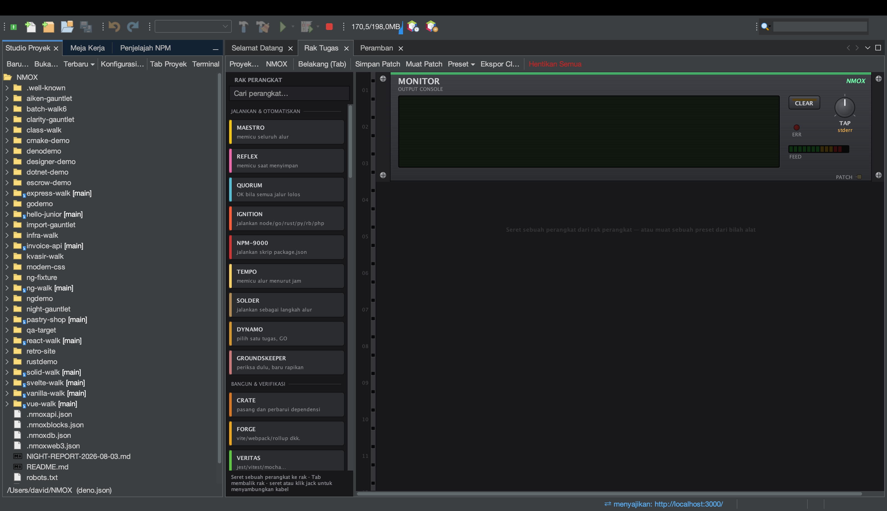

# Tutorial: Studio Proyek

<!-- languages -->
[English](project-studio.md) · [Español](project-studio.es.md) · [Français](project-studio.fr.md) · [Deutsch](project-studio.de.md) · [Русский](project-studio.ru.md) · [Українська](project-studio.uk.md) · [Polski](project-studio.pl.md) · [Português (Brasil)](project-studio.pt.md) · **Bahasa Indonesia** · [Filipino](project-studio.tl.md) · [Tiếng Việt](project-studio.vi.md) · [简体中文](project-studio.zh.md) · [हिन्दी](project-studio.hi.md) · [עברית](project-studio.he.md) · [العربية](project-studio.ar.md)
<!-- /languages -->

Studio Proyek adalah tempat proyek lahir dan dikelola: templat, pohon berkas
asli platform, penyunting package.json, dan prasetel rak — ditambah
**Jalankan / Bangun / Uji / Bersihkan** bawaan IDE yang bekerja tanpa Anda
pernah membuka terminal.

## Membukanya

Tab **Studio Proyek**, tertambat di samping Meja Kerja, atau `Berkas ▸ Proyek Baru…`.

## Langkah-langkah

1. **Buat kerangka proyek.** `Berkas ▸ Proyek Baru…` → pilih templat
   (Angular, Vue, Vanilla Web, Elixir/Phoenix, PHP LEMP, dan lainnya).
   Pilih lokasi (bawaannya `~/NMOX`) lalu selesaikan. Proyeknya terbuka
   dan rak membidiknya.

2. **Telusuri pohonnya.** Pohon berkas ini adalah pohon platform sungguhan —
   ikon jenis berkas yang tepat, anotasi git `[branch]` pada akarnya, dan menu
   Open/Cut/Copy/Delete/Rename/Tools/Properties yang lengkap. Folder berat
   (`node_modules`, `.git`, `dist`) tampil tanpa anak sehingga repositori raksasa
   tetap cepat.

3. **Jalankan — tanpa terminal.** Pakai **Jalankan** milik IDE (atau tekan IGNITE
   IGNITION di rak). Ia menentukan pengelola paket Anda dari berkas kunci /
   patokan corepack proyek itu sendiri dan menjalankan perintah yang tepat;
   keluarannya mengalir ke rak. **Bangun**, **Uji**, dan **Bersihkan** bekerja
   dengan cara yang sama.

4. **Sunting package.json.** Penyunting bawaan memberi penyuntingan terstruktur
   untuk skrip dan dependensi.

5. **Muat sebuah prasetel.** Menu **Preset ▾** di Rak Tugas merangkai rak siap pakai untuk sebuah
   alur kerja — Uptime Watch, Ship Gate, Modern Web, Monorepo Lanes, Web3 Bench,
   dan lainnya — sehingga Anda tidak menyusun patch dengan tangan.

## Yang baru saja Anda pelajari

- Proyek baru dikenali dari salah satu dari 60 nama manifes (package.json,
  Cargo.toml, go.mod, pom.xml, gleam.toml, …) ditambah empat yang dideteksi lewat
  glob (`.csproj`, `.fsproj`, `.sln`, `.nimble`) — bahkan situs bertag script
  tanpa manifes terbuka sebagai proyek STATIC.
- Jalankan/Bangun/Uji/Bersihkan dan rak adalah **satu mekanisme**; pertama kali
  keduanya menjalankan kode proyek, Anda akan mendapat konfirmasi kepercayaan
  ruang kerja.

## Berikutnya

- Buka [Rak Tugas](the-task-rack.id.md) untuk melihat apa yang dirangkai prasetel itu.
- Coba sebuah [ruang belajar](learning-spaces.id.md) untuk kotak pasir terpandu.
