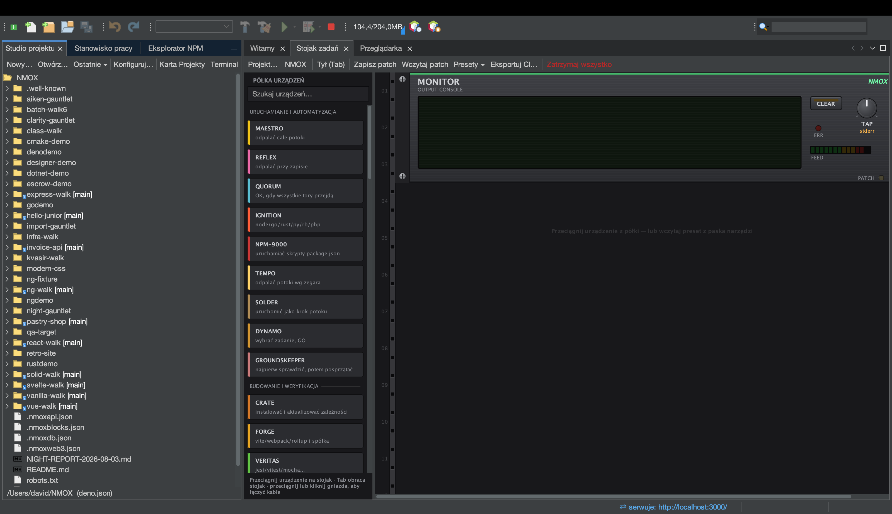

# Samouczek: Studio projektu

<!-- languages -->
[English](project-studio.md) · [Español](project-studio.es.md) · [Français](project-studio.fr.md) · [Deutsch](project-studio.de.md) · [Русский](project-studio.ru.md) · [Українська](project-studio.uk.md) · **Polski** · [Português (Brasil)](project-studio.pt.md) · [Bahasa Indonesia](project-studio.id.md) · [Filipino](project-studio.tl.md) · [Tiếng Việt](project-studio.vi.md) · [简体中文](project-studio.zh.md) · [हिन्दी](project-studio.hi.md) · [עברית](project-studio.he.md) · [العربية](project-studio.ar.md)
<!-- /languages -->

Studio projektu to miejsce, w którym projekty się rodzą i w którym się
nimi zarządza: szablony, natywne drzewo plików platformy, edytor
package.json i presety stojaka — plus wbudowane w IDE **Uruchom / Zbuduj
/ Testuj / Wyczyść**, które działają, choć nigdy nie otworzysz terminala.

## Otwieranie

Karta **Studio projektu**, zadokowana obok Stanowiska pracy, albo
`Plik ▸ Nowy projekt…`.

## Kroki

1. **Postaw projekt.** `Plik ▸ Nowy projekt…` → wybierz szablon
   (Angular, Vue, Vanilla Web, Elixir/Phoenix, PHP LEMP i inne).
   Wybierz lokalizację (domyślnie `~/NMOX`) i zakończ. Projekt się
   otwiera, a stojak w niego celuje.

2. **Przeglądaj drzewo.** Drzewo plików to prawdziwe drzewo platformy —
   właściwe ikony typów plików, adnotacja gita `[branch]` na korzeniu
   i pełne menu Otwórz/Wytnij/Kopiuj/Usuń/Zmień nazwę/Narzędzia/Właściwości.
   Ciężkie katalogi (`node_modules`, `.git`, `dist`) wyświetlają się bez
   dzieci, więc nawet ogromne repozytorium działa szybko.

3. **Uruchom go — bez terminala.** Użyj polecenia **Uruchom** w IDE
   (albo naciśnij IGNITE na urządzeniu IGNITION w stojaku). Rozpoznaje ono
   menedżera pakietów z pliku blokady projektu albo z przypięcia corepack
   i uruchamia właściwe polecenie; wyjście spływa do stojaka. **Zbuduj**,
   **Testuj** i **Wyczyść** działają tak samo.

4. **Edytuj package.json.** Wbudowany edytor pozwala strukturalnie
   edytować skrypty i zależności.

5. **Wczytaj preset.** Menu **Presety ▾** Stojaka zadań okablowuje gotowy stojak pod dany
   proces pracy — Uptime Watch, Ship Gate, Modern Web, Monorepo Lanes, Web3
   Bench i inne — więc nie musisz składać układu ręcznie.

## Czego się właśnie nauczyłeś

- Nowe projekty są rozpoznawane po każdej z 60 nazw manifestów
  (package.json, Cargo.toml, go.mod, pom.xml, gleam.toml, …) oraz po
  czterech wykrywanych wzorcem (`.csproj`, `.fsproj`, `.sln`, `.nimble`)
  — nawet strona ze znacznikami script bez manifestu otwiera się jako
  projekt STATIC.
- Uruchom/Zbuduj/Testuj/Wyczyść i stojak to **jeden mechanizm**; gdy
  pierwszy raz uruchomią kod projektu, dostaniesz pytanie o zaufanie do
  przestrzeni roboczej.

## Dalej

- Otwórz [Stojak zadań](the-task-rack.pl.md), żeby zobaczyć, co okablował
  preset.
- Spróbuj [przestrzeni nauki](learning-spaces.pl.md), jeśli chcesz
  piaskownicy z przewodnikiem.
