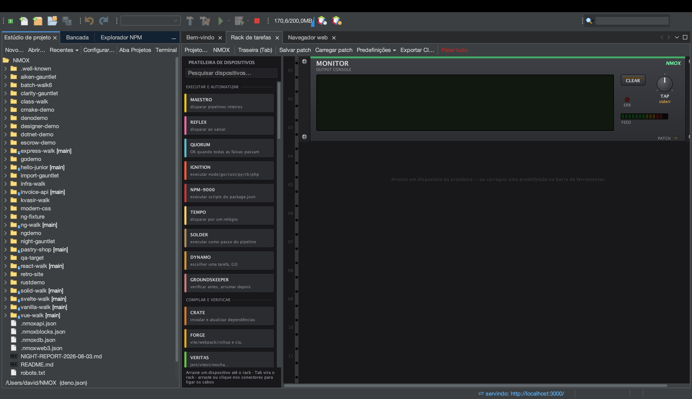

# Tutorial: Estúdio de projeto

<!-- languages -->
[English](project-studio.md) · [Español](project-studio.es.md) · [Français](project-studio.fr.md) · [Deutsch](project-studio.de.md) · [Русский](project-studio.ru.md) · [Українська](project-studio.uk.md) · [Polski](project-studio.pl.md) · **Português (Brasil)** · [Bahasa Indonesia](project-studio.id.md) · [Filipino](project-studio.tl.md) · [Tiếng Việt](project-studio.vi.md) · [简体中文](project-studio.zh.md) · [हिन्दी](project-studio.hi.md) · [עברית](project-studio.he.md) · [العربية](project-studio.ar.md)
<!-- /languages -->

O Estúdio de projeto é onde os projetos nascem e são cuidados: modelos, uma
árvore de arquivos nativa da plataforma, um editor de package.json e as
predefinições do rack — mais o **Executar / Compilar / Testar / Limpar**
nativos da IDE, que funcionam sem você jamais abrir um terminal.

## Abrir

A aba **Estúdio de projeto**, encaixada ao lado da Bancada, ou
`Arquivo ▸ Novo projeto…`.

## Passos

1. **Gere um projeto.** `Arquivo ▸ Novo projeto…` → escolha um modelo
   (Angular, Vue, Vanilla Web, Elixir/Phoenix, PHP LEMP e outros). Escolha
   um local (o padrão é `~/NMOX`) e conclua. O projeto abre e o rack aponta
   para ele.

2. **Navegue pela árvore.** A árvore de arquivos é uma árvore da plataforma
   de verdade — os ícones certos para cada tipo de arquivo, uma anotação
   git `[branch]` na raiz e o menu completo Abrir/Recortar/Copiar/Excluir/
   Renomear/Ferramentas/Propriedades. Pastas pesadas (`node_modules`,
   `.git`, `dist`) aparecem sem filhos, para que um repositório enorme
   continue rápido.

3. **Execute — sem terminal.** Use o **Executar** da IDE (ou aperte o IGNITE do
   IGNITION no rack). Ele descobre o seu gerenciador de pacotes pelo próprio
   lockfile do projeto ou pela fixação do corepack e roda o comando certo; a
   saída corre para o rack. **Compilar**, **Testar** e **Limpar** funcionam
   do mesmo jeito.

4. **Edite o package.json.** O editor embutido permite editar scripts e
   dependências de forma estruturada.

5. **Carregue uma predefinição.** O menu **Predefinições ▾** do Rack de tarefas monta um rack
   pronto para um fluxo de trabalho — Uptime Watch, Ship Gate, Modern Web,
   Monorepo Lanes, Web3 Bench e outros — para você não montar a ligação à
   mão.

## O que você aprendeu

- Projetos novos são reconhecidos por qualquer um de 60 nomes de manifesto
  (package.json, Cargo.toml, go.mod, pom.xml, gleam.toml, …) mais quatro
  detectados por padrão de nome (`.csproj`, `.fsproj`, `.sln`, `.nimble`) —
  até um site só com tags script, sem manifesto, abre como projeto STATIC.
- Executar/Compilar/Testar/Limpar e o rack são **um mecanismo só**; na
  primeira vez que eles rodarem código do projeto, você verá o aviso de
  Confiança no espaço de trabalho.

## Próximos passos

- Abra o [Rack de tarefas](the-task-rack.pt.md) para ver o que a
  predefinição montou.
- Experimente um [espaço de aprendizado](learning-spaces.pt.md) para ter um
  ambiente guiado.
