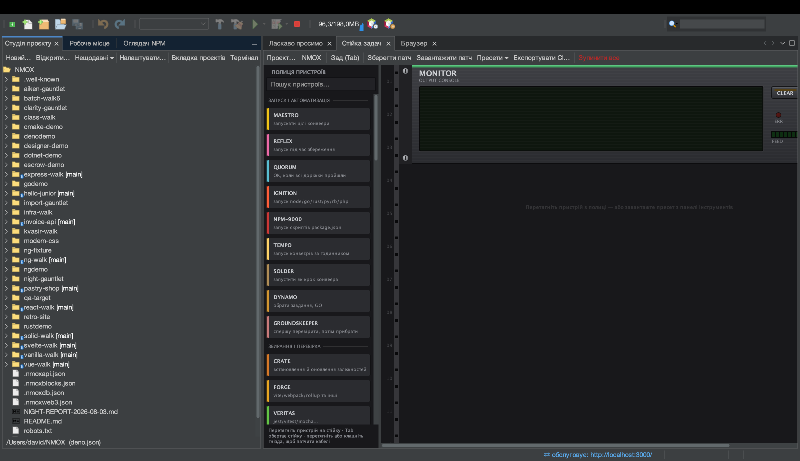

# Урок: Студія проєкту

<!-- languages -->
[English](project-studio.md) · [Español](project-studio.es.md) · [Français](project-studio.fr.md) · [Deutsch](project-studio.de.md) · [Русский](project-studio.ru.md) · **Українська** · [Polski](project-studio.pl.md) · [Português (Brasil)](project-studio.pt.md) · [Bahasa Indonesia](project-studio.id.md) · [Filipino](project-studio.tl.md) · [Tiếng Việt](project-studio.vi.md) · [简体中文](project-studio.zh.md) · [हिन्दी](project-studio.hi.md) · [עברית](project-studio.he.md) · [العربية](project-studio.ar.md)
<!-- /languages -->

Студія проєкту — місце, де проєкти народжуються й живуть: шаблони, рідне
для платформи дерево файлів, редактор package.json і пресети стійки — плюс
вбудовані в IDE **Запустити / Зібрати / Тестувати / Очистити**, які
працюють, навіть якщо ви жодного разу не відкриєте термінал.

## Як відкрити

Вкладка **Студія проєкту**, пришвартована поряд із Робочим місцем, або `Файл ▸ Новий проєкт…`.

## Кроки

1. **Створіть проєкт.** `Файл ▸ Новий проєкт…` → оберіть шаблон
   (Angular, Vue, Vanilla Web, Elixir/Phoenix, PHP LEMP та інші).
   Виберіть розташування (типово `~/NMOX`) і завершіть. Проєкт відкриється,
   і стійка на нього націлиться.

2. **Перегляньте дерево.** Дерево файлів — справжнє дерево платформи:
   правильні піктограми типів файлів, позначка git `[branch]` на корені та
   повне контекстне меню (відкрити, вирізати, копіювати, видалити,
   перейменувати, інструменти, властивості). Важкі теки
   (`node_modules`, `.git`, `dist`) показуються без вмісту, тож величезне
   сховище лишається швидким.

3. **Запустіть — без термінала.** Скористайтеся командою **Запустити** в
   IDE (або натисніть IGNITE на IGNITION у стійці). Вона визначає менеджер
   пакетів із власного lock-файлу проєкту чи закріплення corepack і виконує
   правильну команду; вивід тече у стійку. **Зібрати**, **Тестувати** й
   **Очистити** працюють так само.

4. **Редагуйте package.json.** Вбудований редактор дає структуровано
   редагувати скрипти й залежності.

5. **Завантажте пресет.** Меню **Пресети ▾** Стійки задач підключає готову стійку під робочий
   процес — Uptime Watch, Ship Gate, Modern Web, Monorepo Lanes, Web3
   Bench та інші, — тож не доводиться збирати схему вручну.

## Що ви щойно дізналися

- Нові проєкти розпізнаються за будь-якою з 60 назв маніфестів (package.json,
  Cargo.toml, go.mod, pom.xml, gleam.toml, …) плюс чотирма, які визначаються
  за шаблоном (`.csproj`, `.fsproj`, `.sln`, `.nimble`), — навіть сайт на
  тегах script без маніфесту відкривається як проєкт STATIC.
- «Запустити / Зібрати / Тестувати / Очистити» і стійка — **один механізм**;
  коли вони вперше виконують код проєкту, з’явиться запит «Довіра до
  робочої області».

## Далі

- Відкрийте [Стійку задач](the-task-rack.uk.md), щоб побачити, що підключив пресет.
- Спробуйте [навчальний простір](learning-spaces.uk.md) як керовану пісочницю.
