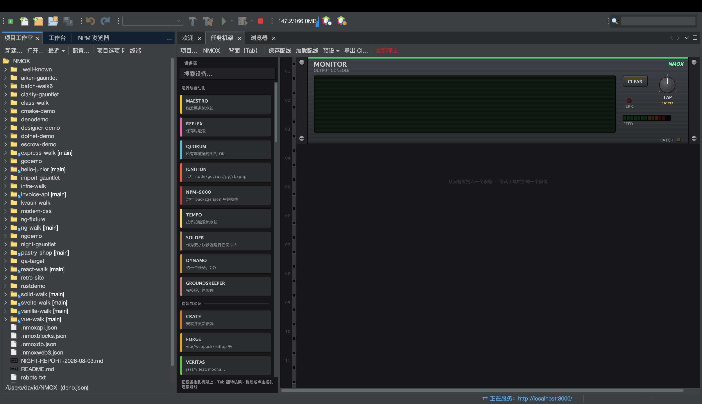

# 教程：项目工作室

<!-- languages -->
[English](project-studio.md) · [Español](project-studio.es.md) · [Français](project-studio.fr.md) · [Deutsch](project-studio.de.md) · [Русский](project-studio.ru.md) · [Українська](project-studio.uk.md) · [Polski](project-studio.pl.md) · [Português (Brasil)](project-studio.pt.md) · [Bahasa Indonesia](project-studio.id.md) · [Filipino](project-studio.tl.md) · [Tiếng Việt](project-studio.vi.md) · **简体中文** · [हिन्दी](project-studio.hi.md) · [עברית](project-studio.he.md) · [العربية](project-studio.ar.md)
<!-- /languages -->

项目工作室是项目诞生和被管理的地方：模板、一棵平台原生的文件树、一个 package.json 编辑器和机架预设 — 还有 IDE 原生的**运行 / 构建 / 测试 / 清理**，让你从头到尾都不用打开终端。

## 打开方式

**项目工作室** 标签页（停靠在工作台旁边），或者 `文件 ▸ 新建项目…`。

## 步骤

1. **搭一个项目的脚手架。**`文件 ▸ 新建项目…` → 挑一个模板（Angular、Vue、Vanilla Web、Elixir/Phoenix、PHP LEMP，等等）。选一个位置（默认是 `~/NMOX`），然后完成。项目会打开，机架也会瞄准它。

2. **浏览文件树。**这棵文件树是真正的平台树 — 正确的文件类型图标、根节点上的 `[branch]` git 标注，以及完整的 Open/Cut/Copy/Delete/Rename/Tools/Properties 菜单。沉重的文件夹（`node_modules`、`.git`、`dist`）显示为没有子项，所以巨大的仓库也照样快。

3. **运行它 — 不开终端。**用 IDE 的**运行**（或者按机架上 IGNITION 的 IGNITE）。它会根据项目自己的锁文件或 corepack 版本声明判断出你的包管理器，并运行正确的命令；输出会流进机架。**构建**、**测试**和**清理**也是一样的用法。

4. **编辑 package.json。**内置的编辑器可以结构化地编辑脚本和依赖。

5. **载入一个预设。**任务机架上的**预设 ▾**菜单会为某种工作流程接好一整个现成的机架 — Uptime Watch、Ship Gate、Modern Web、Monorepo Lanes、Web3 Bench，等等 — 这样你就不用手工接配线。

## 你刚学到了什么

- 新项目靠 60 个清单文件名中的任意一个来识别（package.json、Cargo.toml、go.mod、pom.xml、gleam.toml…），另有四种按通配符检测（`.csproj`、`.fsproj`、`.sln`、`.nimble`）— 就连一个没有清单、只有 script 标签的网站，也会作为 STATIC 项目打开。
- 运行/构建/测试/清理和机架是**同一套机制**；它们第一次运行项目代码时，你会看到一次工作区信任确认。

## 下一步

- 打开[任务机架](the-task-rack.zh.md)，看看预设接了些什么。
- 试试一个[学习空间](learning-spaces.zh.md)，那是带引导的沙盒。
