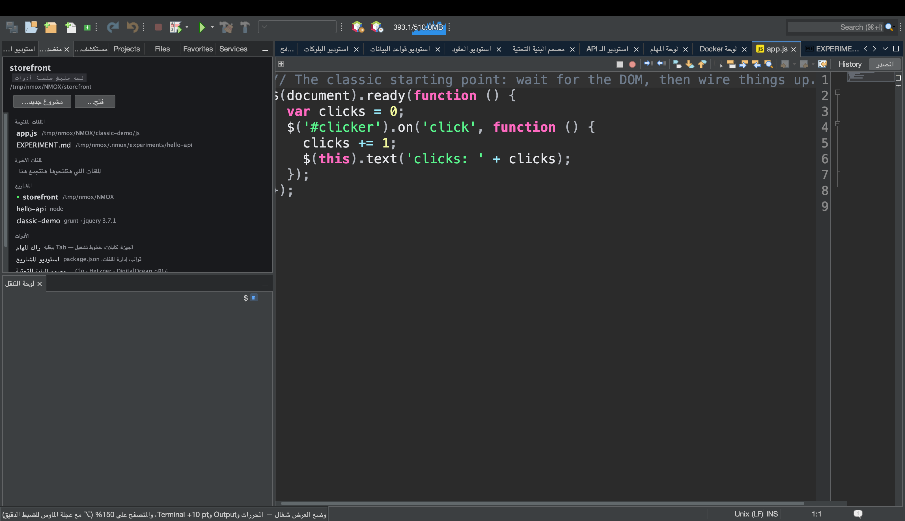
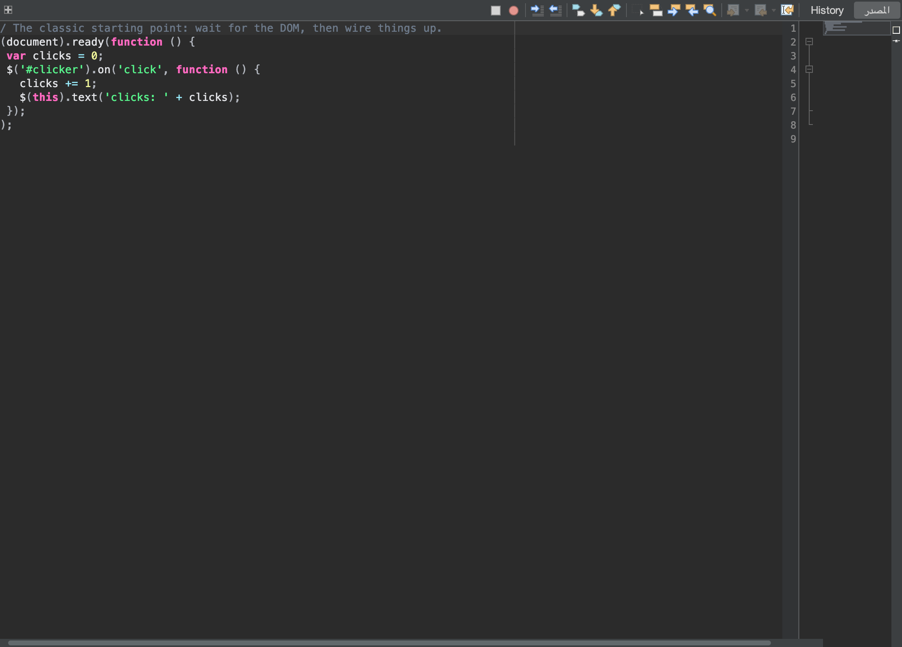

# درس: اعرضوه قدام الناس

<!-- languages -->
[English](show-it-to-a-room.md) · [Español](show-it-to-a-room.es.md) · [Français](show-it-to-a-room.fr.md) · [Deutsch](show-it-to-a-room.de.md) · [Русский](show-it-to-a-room.ru.md) · [Українська](show-it-to-a-room.uk.md) · [Polski](show-it-to-a-room.pl.md) · [Português (Brasil)](show-it-to-a-room.pt.md) · [Bahasa Indonesia](show-it-to-a-room.id.md) · [Filipino](show-it-to-a-room.tl.md) · [Tiếng Việt](show-it-to-a-room.vi.md) · [简体中文](show-it-to-a-room.zh.md) · [हिन्दी](show-it-to-a-room.hi.md) · [עברית](show-it-to-a-room.he.md) · **العربية**
<!-- /languages -->

فيه أيام الكود نفسه مش هو المطلوب — المطلوب هو *العرض*: بروجيكتور، أو
README، أو تعليق على issue، أو سلايد. NMOX Studio فيه عدة عرض صغيرة
للشخص ده بالظبط، وكل قطعة فيها راكبة على حاجة الـ IDE كان عنده أصلًا
مش حاجة متلزّقة من برا: التكبير بتاع المحرر نفسه، وقاموس اللغات الواحد
اللي بيسمّي بلوكات الكود، والرسم بتاع مصنع لقطات التوثيق. الدرس ده بيمشي
عليها كلها في قعدة واحدة، من آخر صف في القاعة لحد الحافظة.





## قبل ما تبدأوا

افتحوا مشروع موجود في مستودع GitHub (حركة اللينك محتاجة `origin` على
GitHub — أي حاجة تانية بتترفض بصوت عالي، مش بتتخمّن) وافتحوا ملف من
ملفات المصدر بتاعته. احفظوه: حركة اللينك بترفض كمان أي buffer فيه
تعديلات متحفظتش، لأن بلوك مش مطابق للينك بتاعه يبقى كدبة. للخطوة 2،
شغّلوا المشروع كمان (زرار ▶ في شريط الأدوات أو الراك) عشان يبقى فيه صفحة
في المتصفح المدمج ومخرجات في نافذة Output.

## الخطوات

1. **خلّوا القاعة تقدر تقرا.** `عرض ◂ وضع العرض`.
   كل محرر مفتوح بيكبر عشر نقط، على طول، ونفس الكلام لأي محرر تفتحوه
   والوضع شغال. عنصر القايمة بيظهر جنبه علامة صح، وشريط الحالة بيقول
   الزيادة قد إيه. مفيش حاجة بتتكتب في إعداداتكم — اقفلوه (أو أعيدوا
   التشغيل) والخط بيرجع زي ما كان بالظبط، ومعاه أي ضبط دقيق بعجلة الماوس
   مع ⌥ كنتوا عملتوه فوقه.

2. **شوفوا باقي الـ IDE بيمشي وراه.** والوضع شغال، صفحة المتصفح المدمج
   بتكبر لـ 150% من التكبير اللي كان عندكم أيًا كان، ونص نافذة Output
   بيكبر نفس العشر نقط، وكل ترمينال مفتوح بيكبر هو كمان — وكل واحد
   بيرجع لحجمه هو لما تخرجوا. العرض التجريبي للتطبيق الشغال، ومخرجاته،
   والـ shell اللي بتكتبوا فيه، كلهم بيتقروا من آخر صف، مش الكود بس.

3. **ورّوا إيديكم.** `عرض ◂ عرض ضغطات المفاتيح`، وبعدين دوسوا `⌘S`.
   كبسولة غامقة مكتوب فيها `⌘S` بتظهر كبيرة تحت في النافذة لحظة (والتكرار
   بيتقري `⌘Z ×3`). دلوقتي اكتبوا كلمة: مفيش حاجة بتظهر. مبيظهرش غير
   التركيبات اللي فيها ⌘ أو ⌃ أو ⌥ ومفاتيح الـ function وEscape — الكتابة
   العادية عمرها ما بتظهر، فباسورد مكتوب في ترمينال ميقدرش يوصل للبروجيكتور.

4. **شاركوا الكود.** حدّدوا كام سطر واختاروا `تعديل ◂ نسخ كـ Markdown`
   (أو كليك يمين في المحرر). الزقوه في README، أو issue، أو شات: بلوك كود
   محاط بعلامة لغة الملف (` ```html `، ` ```typescript `، ` ```bash `…)،
   بيخلص بسطر جديد واحد بالظبط، وبسور أطول لو المقطع نفسه فيه تلات
   backticks عشان يتعرض كامل. ولو مفيش تحديد، الملف كله بيتنسخ. شريط
   الحالة بيقول كام سطر وأنهي علامة.

5. **قولوا هو موجود فين.** نفس التحديد، `تعديل ◂ نسخ كـ Markdown مع لينك`
   (أو كليك يمين). اللي بيتلزق هو نفس البلوك وبعده
   `[src/app/app.ts#L3-L12](https://github.com/you/repo/blob/main/src/app/app.ts#L3-L12)`
   — الفرع اللي عاملين عليه checkout (والـ HEAD المنفصل بيعمل لينك
   بالـ commit)، لأن commit محلي عمره ما اتعمله push هيبقى 404 لابس لبس
   permalink. ملف برا أي مستودع، أو مستودع من غير `origin`، أو origin
   مش GitHub، أو تعديلات متحفظتش: شريط الحالة بيرفض ومبينسخش حاجة.

6. **خدوا الصورة.** `أدوات ◂ نسخ لقطة شاشة المحرر` بتحط التبويب المتختار
   في منطقة المحرر — شريط الأدوات، والهامش، والكود، والأشرطة الجانبية، من
   غير إطار الـ IDE — في الحافظة كصورة بحجم مضاعف؛ الزقوها على طول في شات
   أو سلايد. بتاخد التبويب اللي بتبصّوا عليه حتى لو التركيز في نافذة
   التنقل، ولو مفيش حاجة مفتوحة في منطقة المحرر بتقول كده بدل ما تنسخ
   صورة فاضية. `أدوات ◂ حفظ لقطة شاشة المحرر…` بتحفظ نفس اللقطة كـ PNG
   متسمّي على اسم المستند (`app.ts-<stamp>.png`)، و`أدوات ◂ حفظ لقطة شاشة…`
   بتحفظ نافذة الـ IDE كلها (`nmox-studio-<stamp>.png`، في Pictures
   افتراضيًا). وعشان الـ IDE بيرسم نفسه، مفيش إذن تسجيل شاشة محتاجين
   تدّوه، ومفيش سطح مكتب في الكادر، ومفيش حاجة تتقص.

7. **الزقوا الشجرة.** `أدوات ◂ نسخ شجرة المشروع كـ Markdown`. تركيب المشروع
   المتوجّه عليه بيوصل كشجرة مرسومة بخطوط الصناديق جوه بلوك كود، زي اللي
   بتشوفوه في README: المجلدات الأول، و`node_modules/ …` وأخواته التقال
   متسمّيين بس عمرنا ما بندخلهم، والشجر العميقة أو الضخمة بتتقفل عند حد
   والباقي بيتعدّ بدل ما يتشال في السكوت، وملفات
   ‎`.nmox*.json` بتاعة الـ IDE نفسه مش موجودة لأنها تبع المنتج، مش تبع
   المشروع.

8. **انزلوا من على المسرح.** `عرض ◂ وضع العرض` تاني. المحررات، والمتصفح،
   وOutput، وكل ترمينال بيرجعوا بالظبط زي ما كانوا؛ و`عرض ◂ عرض ضغطات المفاتيح`
   اقفلوه، والكبسولة هتختفي.

## اللي اتعلمتوه دلوقتي

- **العرض حالة، مش إعداد.** وضع العرض بيشتغل على طول وعمره ما بيتحفظ —
  إعادة التشغيل بترجّع كل حاجة لطبيعتها — وهو حالة واحدة على مستوى
  المنتج كله، المحرر بيقلبها وأي نافذة تقدر تمشي وراها.
- **الطبقة اللي فوق ضيقة عن قصد.** «عرض ضغطات المفاتيح» بيعيد التركيبات
  ومفاتيح الـ function بس؛ اللي بتكتبوه عمره ما بيظهر.
- **النسخة اللي متقدرش تضمن نفسها مبتنسخش حاجة.** «نسخ كـ Markdown مع
  لينك» بترفض أي خطوة متقدرش تتأكد منها — مفيش origin، مش GitHub،
  buffer متحفظش — في شريط الحالة، بدل ما تلزق لينك بيكدب.
- **كل مشاركة محدودة وصريحة.** الشجرة عمرها ما بتمشي ورا symlink، ولا
  بتدخل مجلد تقيل، وبتحط حد للي بتعرضه وبتعدّ الباقي؛ ولقطة شاشة المحرر
  صورة، وصورة وبس.

## الخطوة الجاية

- اعرضوا التطبيق الشغال من آخر صف كمان: [من المتصفح
  للمصدر](browser-to-source.ar.md) بيمشي على المتصفح المدمج وأدوات
  المطورين بتاعته.
- الستاند أب اللي بتلزقوه في الشات جاي من [لوحة المهام
  والسبرينتات](task-board.ar.md).
- ملاحظات الإصدار عشان تكتبوا بوست بتبدأ من `مساعدة ◂ إيه الجديد…`، وبعدين
  زرار **نسخ كـ Markdown** اللي فيه؛ وقسم العرض كله موجود في [دليل
  المستخدم](../user-guide.ar.md).
