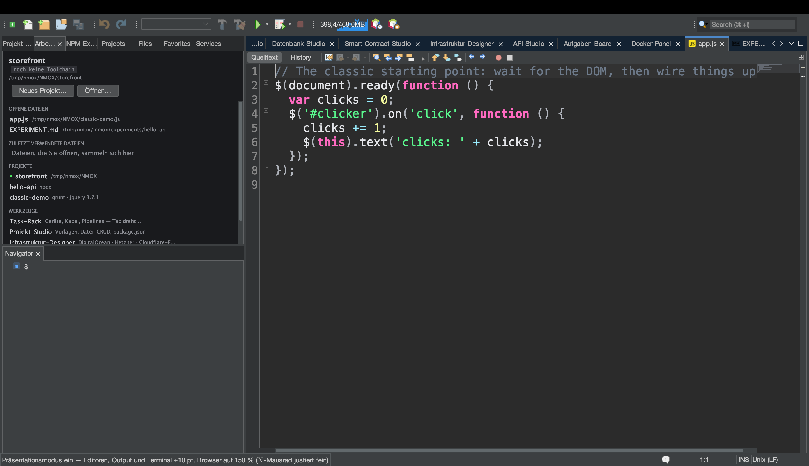
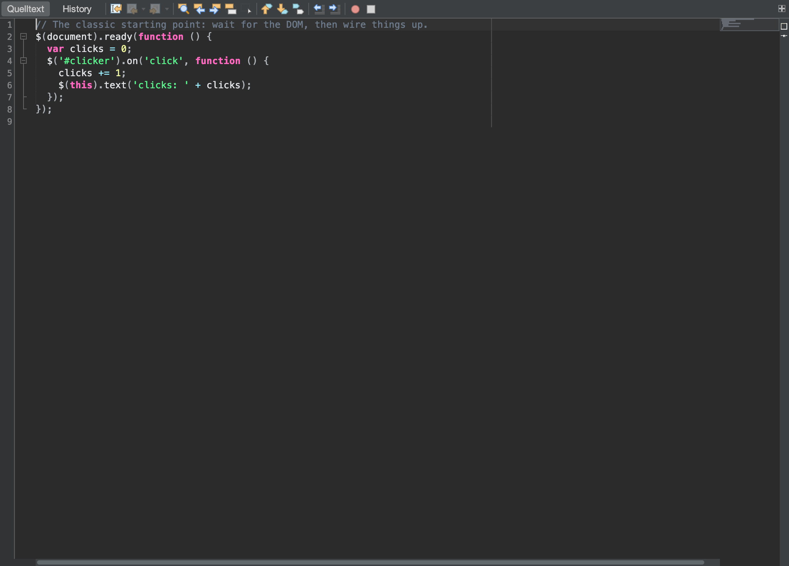

# Tutorial: vor Publikum zeigen

<!-- languages -->
[English](show-it-to-a-room.md) · [Español](show-it-to-a-room.es.md) · [Français](show-it-to-a-room.fr.md) · **Deutsch** · [Русский](show-it-to-a-room.ru.md) · [Українська](show-it-to-a-room.uk.md) · [Polski](show-it-to-a-room.pl.md) · [Português (Brasil)](show-it-to-a-room.pt.md) · [Bahasa Indonesia](show-it-to-a-room.id.md) · [Filipino](show-it-to-a-room.tl.md) · [Tiếng Việt](show-it-to-a-room.vi.md) · [简体中文](show-it-to-a-room.zh.md) · [हिन्दी](show-it-to-a-room.hi.md) · [עברית](show-it-to-a-room.he.md) · [العربية](show-it-to-a-room.ar.md)
<!-- /languages -->

An manchen Tagen ist nicht der Code das Ergebnis, sondern das *Zeigen*:
ein Beamer, ein README, ein Kommentar in einem Issue, eine Folie. NMOX
Studio hat für genau diese Arbeit ein kleines Präsentationspaket, und
jedes Teil davon baut auf etwas auf, das die IDE schon hatte, statt
angeschraubt zu sein: der Text-Zoom des Editors selbst, das eine
Sprachvokabular, das Codeblöcke benennt, das Zeichnen der eigenen
Doku-Screenshots. Dieses Tutorial geht alles in einer Sitzung durch, von
der letzten Reihe bis zur Zwischenablage.





## Bevor Sie beginnen

Öffnen Sie ein Projekt, das in einem GitHub-Repository liegt (die
Link-Funktion braucht ein `origin` auf GitHub — alles andere wird laut
abgelehnt, nicht geraten), und öffnen Sie eine seiner Quelldateien.
Speichern Sie sie: Die Link-Funktion lehnt auch einen Puffer mit
ungespeicherten Änderungen ab, denn ein Block, der nicht zu seinem Link
passt, ist eine Lüge. Starten Sie für Schritt 2 außerdem das Projekt
(das ▶ der Werkzeugleiste oder das Rack), damit im eingebauten Browser
eine Seite und im Output-Fenster Ausgabe steht.

## Schritte

1. **Den Raum lesen lassen.** `Ansicht ▸ Präsentationsmodus`. Jeder
   offene Editor wächst live um zehn Punkt, ebenso jeder Editor, den Sie
   bei eingeschaltetem Modus öffnen. Der Menüeintrag trägt ein Häkchen,
   und die Statuszeile nennt die Vergrößerung. In Ihre Einstellungen wird
   nichts geschrieben — schalten Sie den Modus aus (oder starten Sie neu),
   und die Schrift ist genau wie vorher, samt jeder Feinjustierung per
   ⌥-Mausrad, die Sie obendrauf gemacht haben.

2. **Zusehen, wie der Rest der IDE folgt.** Bei eingeschaltetem Modus
   zoomt die Seite im eingebauten Browser auf 150 % Ihres bisherigen
   Zooms, der Text im Output-Fenster wächst um dieselben zehn Punkt, und
   jedes offene Terminal wird ebenfalls vergrößert — und jedes kehrt beim
   Verlassen zu seiner eigenen Größe zurück. Bei einer Demo der laufenden
   Anwendung sind so auch ihre Ausgabe und die Shell, in die Sie tippen,
   aus der letzten Reihe lesbar, nicht nur der Code.

3. **Die Hände zeigen.** `Ansicht ▸ Tastenanschläge anzeigen`, dann
   `⌘S` drücken. Unten im Fenster erscheint kurz eine große dunkle Pille
   mit `⌘S` (eine Wiederholung liest sich `⌘Z ×3`). Tippen Sie jetzt ein
   Wort: Nichts erscheint. Angezeigt werden nur Tastengriffe mit ⌘, ⌃
   oder ⌥ sowie die Funktions- und die Escape-Taste — gewöhnliches
   Tippen nie, also kann ein in ein Terminal getipptes Passwort nicht auf
   dem Beamer landen.

4. **Den Code teilen.** Markieren Sie ein paar Zeilen und wählen Sie
   `Bearbeiten ▸ Als Markdown kopieren` (oder das Kontextmenü im
   Editor). Fügen Sie das Ergebnis in ein README, ein Issue oder einen
   Chat ein: ein abgegrenzter Codeblock mit der Sprache der Datei als
   Marke (` ```html `, ` ```typescript `, ` ```bash `…), der mit genau
   einem Zeilenumbruch endet, mit einem längeren Zaun, wenn der
   Ausschnitt selbst drei Backticks enthält, damit er vollständig
   dargestellt wird. Ohne Markierung wird die ganze Datei kopiert. Die
   Statuszeile sagt, wie viele Zeilen und welche Marke.

5. **Sagen, wo er steht.** Dieselbe Markierung, `Bearbeiten ▸ Als
   Markdown mit Link kopieren` (oder das Kontextmenü). Eingefügt wird
   derselbe Block, gefolgt von
   `[src/app/app.ts#L3-L12](https://github.com/you/repo/blob/main/src/app/app.ts#L3-L12)`
   — mit dem ausgecheckten Branch (ein losgelöster HEAD verlinkt auf den
   Commit), denn ein lokaler Commit, der nie gepusht wurde, wäre ein 404
   im Kostüm eines Permalinks. Eine Datei außerhalb eines Repositorys,
   ein Repository ohne `origin`, ein origin, das nicht auf GitHub liegt,
   oder ungespeicherte Änderungen: Die Statuszeile lehnt ab, und nichts
   wird kopiert.

6. **Das Bild holen.** `Extras ▸ Editor-Screenshot kopieren` legt den
   ausgewählten Tab des Editorbereichs — Werkzeugleiste, Rand, Code,
   Seitenleisten, ohne das Drumherum der IDE — als Bild in doppelter
   Größe in die Zwischenablage; fügen Sie es direkt in einen Chat oder
   eine Folie ein. Genommen wird der Tab, den Sie sehen, auch wenn der
   Fokus im Navigator liegt, und ist im Editorbereich nichts geöffnet,
   sagt die Aktion das, statt eine leere Fläche zu kopieren.
   `Extras ▸ Editor-Screenshot speichern…` speichert dasselbe Bild als
   PNG, benannt nach dem Dokument (`app.ts-<stamp>.png`), und
   `Extras ▸ Screenshot speichern…` speichert das ganze IDE-Fenster
   (`nmox-studio-<stamp>.png`, standardmäßig unter Bilder). Weil die IDE
   sich selbst zeichnet, ist keine Bildschirmaufnahme-Berechtigung zu
   erteilen, kein Schreibtisch im Bild und nichts zuzuschneiden.

7. **Den Baum einfügen.** `Extras ▸ Projektbaum als Markdown kopieren`.
   Der Aufbau des angezielten Projekts landet als abgegrenzter Baum aus
   Rahmenzeichen, wie ihn ein README zeigt: Verzeichnisse zuerst,
   `node_modules/ …` und seine schweren Geschwister benannt, aber nie
   betreten, tiefe oder riesige Bäume gekappt, wobei der Rest gezählt
   statt still weggelassen wird, und die eigenen `.nmox*.json`-Dateien
   der IDE bleiben draußen, denn sie gehören dem Produkt, nicht dem
   Projekt.

8. **Die Bühne verlassen.** Noch einmal `Ansicht ▸ Präsentationsmodus`.
   Editoren, Browser, Output und jedes Terminal kehren genau dorthin
   zurück, wo sie waren; `Ansicht ▸ Tastenanschläge anzeigen` aus, und
   die Pille ist weg.

## Was Sie gerade gelernt haben

- **Präsentieren ist ein Zustand, keine Einstellung.** Der
  Präsentationsmodus ist live und wird nie gespeichert — nach einem
  Neustart ist alles wie gewohnt —, und er ist ein einziger Zustand für
  das ganze Produkt, den der Editor umschaltet und dem jedes Fenster
  folgen kann.
- **Die Einblendung ist bewusst schmal.** Tastenanschläge anzeigen gibt
  nur Tastengriffe und Funktionstasten wieder; was Sie tippen, erscheint
  nie.
- **Eine Kopie, die sich nicht selbst verbürgen kann, kopiert nichts.**
  Als Markdown mit Link kopieren lehnt jede Stufe ab, die sich nicht
  prüfen lässt — kein origin, nicht GitHub, ungespeicherter Puffer —,
  und zwar in der Statuszeile, statt einen Link einzufügen, der lügt.
- **Alles Geteilte ist begrenzt und schlicht.** Der Baum folgt nie einem
  symbolischen Link, betritt nie ein schweres Verzeichnis, kappt, was er
  auflistet, und zählt den Rest; der Editor-Screenshot ist ein Bild und
  nur ein Bild.

## Weiter

- Zeigen Sie auch die laufende Anwendung für die letzte Reihe: [Vom
  Browser zur Quelle](browser-to-source.de.md) geht den eingebauten
  Browser und seine DevTools durch.
- Das Standup, das Sie in einen Chat einfügen, kommt aus [Das
  Aufgaben-Board und Sprints](task-board.de.md).
- Versionshinweise für einen Beitrag beginnen bei `Hilfe ▸ Neuerungen…`
  und dem Knopf **Als Markdown kopieren** dort; der ganze Abschnitt zum
  Präsentieren steht im [Benutzerhandbuch](../user-guide.de.md).
