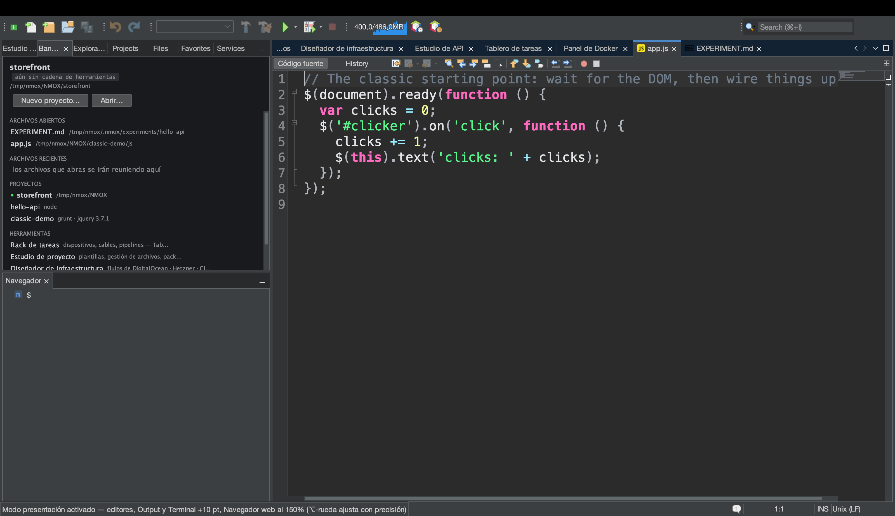
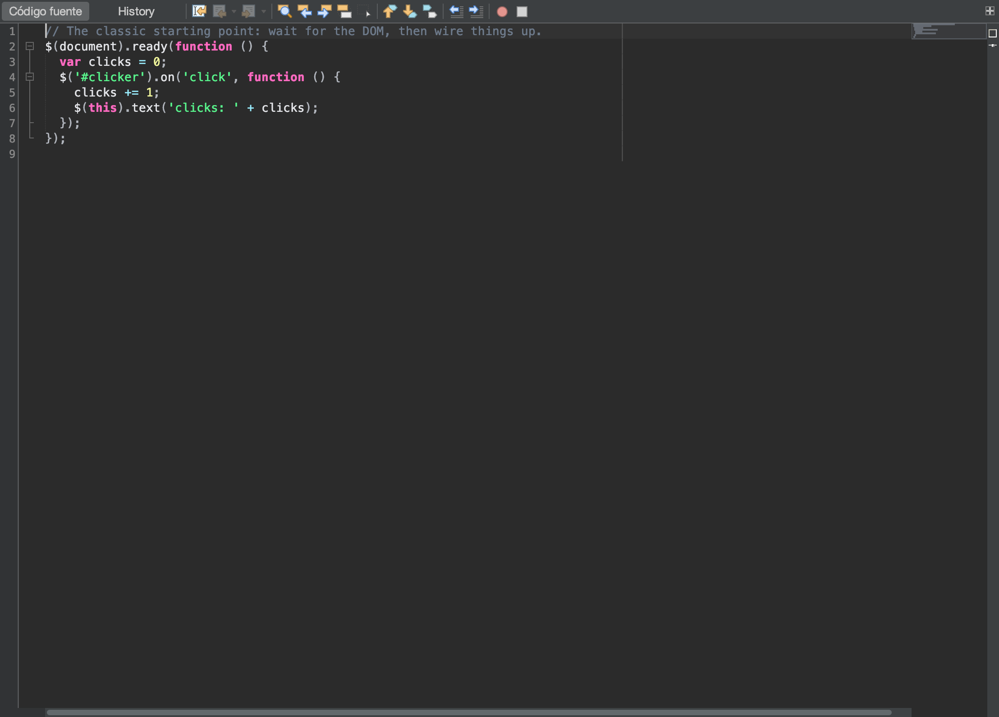

# Tutorial: enséñalo en una sala

<!-- languages -->
[English](show-it-to-a-room.md) · **Español** · [Français](show-it-to-a-room.fr.md) · [Deutsch](show-it-to-a-room.de.md) · [Русский](show-it-to-a-room.ru.md) · [Українська](show-it-to-a-room.uk.md) · [Polski](show-it-to-a-room.pl.md) · [Português (Brasil)](show-it-to-a-room.pt.md) · [Bahasa Indonesia](show-it-to-a-room.id.md) · [Filipino](show-it-to-a-room.tl.md) · [Tiếng Việt](show-it-to-a-room.vi.md) · [简体中文](show-it-to-a-room.zh.md) · [हिन्दी](show-it-to-a-room.hi.md) · [עברית](show-it-to-a-room.he.md) · [العربية](show-it-to-a-room.ar.md)
<!-- /languages -->

Hay días en que lo que entregas no es el código sino *enseñarlo*: un
proyector, un README, un comentario en una incidencia, una diapositiva.
NMOX Studio trae un pequeño kit de presentación justo para eso, y cada
pieza se apoya en algo que el IDE ya tenía en lugar de ser un añadido: el
zoom de texto del propio editor, el único vocabulario de lenguajes que
etiqueta los bloques de código, el pintado de la forja de documentación.
Este tutorial lo recorre todo en una sola sesión, de la última fila al
portapapeles.





## Antes de empezar

Abre un proyecto que viva en un repositorio de GitHub (el gesto del enlace
necesita un `origin` en GitHub — cualquier otra cosa se rechaza en voz
alta, no se adivina) y abre uno de sus archivos. Guárdalo: el gesto del
enlace también rechaza un búfer con cambios sin guardar, porque un bloque
que no coincide con su enlace es una mentira. Para el paso 2, ejecuta
también el proyecto (el ▶ de la barra o el rack), para que haya una página
en el Navegador web integrado y salida en la ventana Output.

## Pasos

1. **Haz que la sala pueda leerlo.** `Ver ▸ Modo presentación`. Todos los
   editores abiertos crecen diez puntos, en vivo, y también cualquier
   editor que abras mientras el modo está activo. El elemento del menú
   muestra una marca y la barra de estado nombra el aumento. No se escribe
   nada en tus ajustes — desactívalo (o reinicia) y la fuente queda
   exactamente como estaba, incluido cualquier ajuste fino con ⌥-rueda
   que hubieras añadido encima.

2. **Mira cómo te sigue el resto del IDE.** Con el modo activo, la página
   del Navegador web integrado se amplía al 150 % del zoom que tuvieras, el
   texto de la ventana Output crece esos mismos diez puntos y todas las
   Terminal abiertas también — cada una vuelve a su propio tamaño al
   salir. Una demostración de la aplicación en marcha, su salida y la shell
   en la que escribes se leen desde la última fila, no solo el código.

3. **Enseña tus manos.** `Ver ▸ Mostrar pulsaciones de teclas` y pulsa
   `⌘S`. Una píldora oscura con `⌘S` aparece en grande en la parte inferior
   de la ventana durante un momento (una repetición se lee `⌘Z ×3`). Ahora
   escribe una palabra: no aparece nada. Solo se muestran los atajos con
   ⌘, ⌃ o ⌥ y las teclas de función y Escape — lo que tecleas normalmente
   nunca, así que una contraseña escrita en una terminal no puede acabar
   en el proyector.

4. **Comparte el código.** Selecciona unas líneas y elige
   `Edición ▸ Copiar como Markdown` (o clic derecho en el editor). Pégalo
   en un README, una incidencia o un chat: un bloque delimitado con la
   etiqueta del lenguaje del archivo (` ```html `, ` ```typescript `,
   ` ```bash `…), que termina en exactamente un salto de línea, con un
   delimitador más largo si el fragmento contiene tres acentos graves,
   para que se muestre entero. Sin nada seleccionado, se copia el archivo
   entero. La barra de estado dice cuántas líneas y qué etiqueta.

5. **Di dónde vive.** Con la misma selección,
   `Edición ▸ Copiar como Markdown con enlace` (o clic derecho). Lo que
   pegas es el mismo bloque seguido de
   `[src/app/app.ts#L3-L12](https://github.com/you/repo/blob/main/src/app/app.ts#L3-L12)`
   — la rama que tienes activa (un HEAD separado enlaza por commit),
   porque un commit local que nunca se subió sería un 404 disfrazado de
   enlace permanente. Un archivo fuera de un repositorio, un repositorio
   sin `origin`, un origen que no es GitHub o cambios sin guardar: la
   barra de estado se niega y no copia nada.

6. **Llévate la imagen.** `Herramientas ▸ Copiar captura del editor` pone
   en el portapapeles la pestaña seleccionada del área del editor — barra
   de herramientas, margen, código, barras laterales, sin el marco del
   IDE — como una imagen 2x; pégala directamente en un chat o una
   diapositiva. Toma la pestaña que estás mirando aunque el foco esté en
   el Navegador, y si no hay nada abierto en el área del editor lo
   dice en vez de copiar algo en blanco.
   `Herramientas ▸ Guardar captura del editor…` guarda esa misma captura
   como un PNG con el nombre del documento (`app.ts-<stamp>.png`), y
   `Herramientas ▸ Guardar captura de pantalla…` guarda la ventana entera
   del IDE (`nmox-studio-<stamp>.png`, en Imágenes por omisión). Como el
   IDE se pinta a sí mismo, no hay permiso de grabación de pantalla que
   conceder, ni escritorio en el encuadre, ni nada que recortar.

7. **Pega el árbol.** `Herramientas ▸ Copiar árbol del proyecto como
   Markdown`. La estructura del proyecto al que apunta el rack llega como
   el árbol delimitado de líneas que muestra un README: primero los
   directorios, `node_modules/ …` y sus hermanos pesados nombrados pero
   nunca recorridos, los árboles profundos o enormes recortados con el
   resto contado en lugar de descartado en silencio, y los archivos
   `.nmox*.json` del propio IDE fuera, porque son del producto, no del
   proyecto.

8. **Baja del escenario.** `Ver ▸ Modo presentación` otra vez. Los
   editores, el Navegador web, la ventana Output y todas las terminales vuelven
   exactamente a donde estaban; desactiva
   `Ver ▸ Mostrar pulsaciones de teclas` y la píldora desaparece.

## Lo que acabas de aprender

- **Presentar es un estado, no un ajuste.** El Modo presentación es en
  vivo y nunca se guarda — al reiniciar todo vuelve a la normalidad — y es
  un único estado de todo el producto que el editor activa y cualquier
  ventana puede seguir.
- **La superposición es estrecha a propósito.** Mostrar pulsaciones de
  teclas solo repite atajos y teclas de función; lo que escribes nunca se
  muestra.
- **Una copia que no puede responder de sí misma no copia nada.** Copiar
  como Markdown con enlace rechaza cada escalón que no puede verificar —
  sin origin, no es GitHub, búfer sin guardar — en la barra de estado, en
  lugar de pegar un enlace que miente.
- **Todo lo que compartes está acotado y es texto plano.** El árbol nunca
  sigue un enlace simbólico, nunca entra en un directorio pesado, limita lo
  que enumera y cuenta el resto; la captura del editor es una imagen y
  solo una imagen.

## Siguiente

- Enseña también la aplicación en marcha desde la última fila: [Del
  navegador al código fuente](browser-to-source.es.md) recorre el Navegador web
  integrado y sus DevTools.
- El standup que pegas en un chat sale de [El Tablero de tareas y los
  sprints](task-board.es.md).
- Las notas de la versión para una publicación empiezan en
  `Ayuda ▸ Novedades…` y su botón **Copiar como Markdown**; toda la sección
  sobre presentar está en la [Guía de usuario](../user-guide.es.md).
