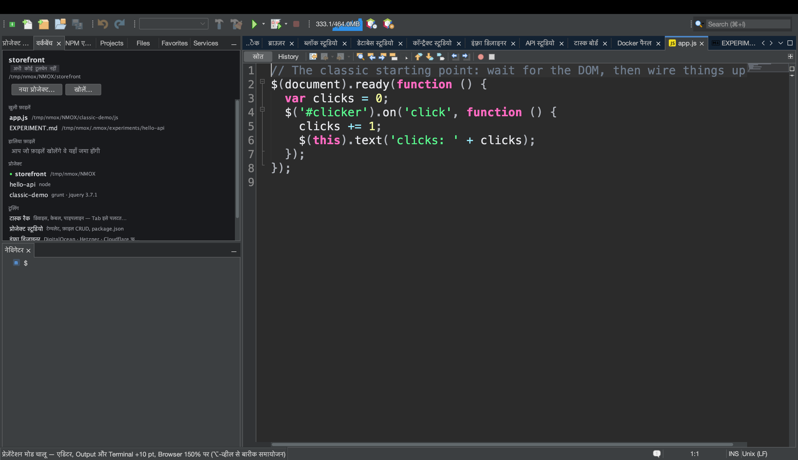
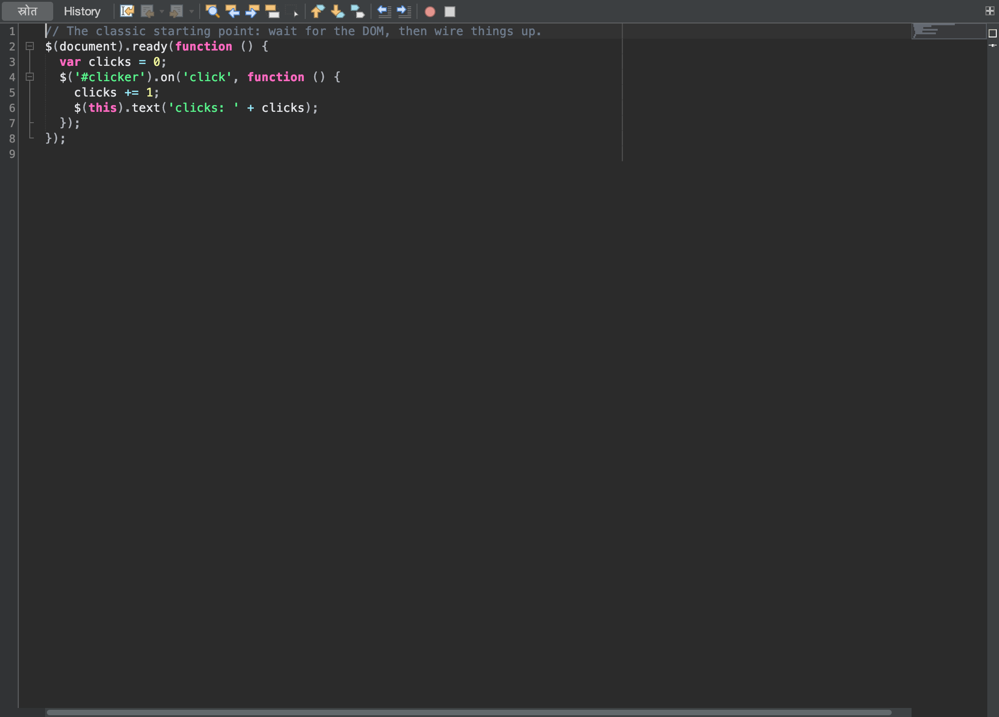

# ट्यूटोरियल: कमरे को दिखाइए

<!-- languages -->
[English](show-it-to-a-room.md) · [Español](show-it-to-a-room.es.md) · [Français](show-it-to-a-room.fr.md) · [Deutsch](show-it-to-a-room.de.md) · [Русский](show-it-to-a-room.ru.md) · [Українська](show-it-to-a-room.uk.md) · [Polski](show-it-to-a-room.pl.md) · [Português (Brasil)](show-it-to-a-room.pt.md) · [Bahasa Indonesia](show-it-to-a-room.id.md) · [Filipino](show-it-to-a-room.tl.md) · [Tiếng Việt](show-it-to-a-room.vi.md) · [简体中文](show-it-to-a-room.zh.md) · **हिन्दी** · [עברית](show-it-to-a-room.he.md) · [العربية](show-it-to-a-room.ar.md)
<!-- /languages -->

कुछ दिन कोड सौंपने की चीज़ नहीं होता — *दिखाना* होता है: प्रोजेक्टर, README,
किसी issue पर टिप्पणी, कोई स्लाइड। ठीक ऐसे व्यक्ति के लिए NMOX Studio में
प्रस्तुति का एक छोटा किट है, और उसका हर हिस्सा ऊपर से जोड़ा हुआ नहीं, बल्कि
उसी चीज़ पर चलता है जो IDE के पास पहले से थी: एडिटर का अपना टेक्स्ट ज़ूम, भाषाओं
की वही एक शब्दावली जो कोड फ़ेंस को नाम देती है, और डॉक्स फ़ोर्ज का अपना चित्रण।
यह ट्यूटोरियल यह सब एक ही बैठक में दिखाता है, पिछली पंक्ति से क्लिपबोर्ड तक।





## शुरू करने से पहले

कोई ऐसा प्रोजेक्ट खोलिए जो GitHub रिपॉज़िटरी में है (लिंक वाले क़दम को GitHub
पर एक `origin` चाहिए — बाक़ी कुछ भी साफ़ शब्दों में मना होता है, अंदाज़े से नहीं
चलता) और उसकी कोई सोर्स फ़ाइल खोलिए। उसे सेव कीजिए: लिंक वाला क़दम बिना सेव
किए बदलावों वाले बफ़र को भी मना करता है, क्योंकि जो ब्लॉक अपने लिंक से मेल न
खाए वह झूठ है। क़दम 2 के लिए प्रोजेक्ट चलाइए भी (टूलबार का ▶ या रैक), ताकि ऐप
के अंदर वाले ब्राउज़र में एक पेज हो और Output विंडो में आउटपुट।

## क़दम

1. **कमरे के लिए पढ़ने लायक बनाइए।** `दृश्य ▸ प्रेज़ेंटेशन मोड`। हर खुला एडिटर
   उसी पल दस पॉइंट बड़ा हो जाता है, और मोड चालू रहते जो एडिटर आप खोलें वह भी।
   मेनू आइटम पर सही का निशान दिखता है और स्थिति-पट्टी बढ़ोतरी बताती है। आपकी
   सेटिंग में कुछ नहीं लिखा जाता — इसे बंद कीजिए (या पुनःआरंभ कीजिए) और फ़ॉन्ट
   ठीक वैसा ही होता है जैसा था, ऊपर से किया गया ⌥-व्हील का बारीक समायोजन भी।

2. **बाक़ी IDE को साथ चलते देखिए।** मोड चालू रहते, ऐप के अंदर वाले ब्राउज़र का
   पेज आपके मौजूदा ज़ूम के 150% पर चला जाता है, Output विंडो का टेक्स्ट उन्हीं
   दस पॉइंट से बढ़ता है, और हर खुला टर्मिनल भी बढ़ जाता है — बाहर निकलने पर हर
   एक अपने ही आकार पर लौटता है। चलते ऐप, उसके आउटपुट और जिस शेल में आप टाइप
   करते हैं, इन सबका डेमो पिछली पंक्ति से पढ़ा जा सकता है, सिर्फ़ कोड नहीं।

3. **अपने हाथ दिखाइए।** `दृश्य ▸ कीस्ट्रोक दिखाएँ`, फिर `⌘S` दबाइए। विंडो के नीचे
   एक पल के लिए `⌘S` लिखी एक गहरी गोली बड़े अक्षरों में आती है (दोहराने पर
   `⌘Z ×3`)। अब कोई शब्द टाइप कीजिए: कुछ नहीं दिखता। सिर्फ़ ⌘, ⌃ या ⌥ वाले
   संयोजन और फ़ंक्शन तथा Escape कुंजियाँ दिखती हैं — सादी टाइपिंग कभी नहीं,
   इसलिए टर्मिनल में टाइप किया पासवर्ड प्रोजेक्टर पर नहीं पहुँच सकता।

4. **कोड साझा कीजिए।** कुछ पंक्तियाँ चुनिए और `संपादन ▸ Markdown के रूप में कॉपी करें`
   चुनिए (या एडिटर में राइट-क्लिक)। इसे README, issue या चैट में पेस्ट कीजिए:
   फ़ाइल की भाषा से टैग किया एक फ़ेंस्ड ब्लॉक (` ```html `, ` ```typescript `,
   ` ```bash `…), ठीक एक न्यूलाइन पर ख़त्म, और अगर स्निपेट में ख़ुद तीन बैकटिक
   हों तो लंबे फ़ेंस के साथ ताकि वह पूरा रेंडर हो। कुछ न चुना हो तो पूरी फ़ाइल
   कॉपी होती है। स्थिति-पट्टी बताती है कितनी पंक्तियाँ और कौन-सा टैग।

5. **बताइए कि वह कहाँ रहता है।** वही चयन, `संपादन ▸ लिंक सहित Markdown के रूप में कॉपी करें`
   (या राइट-क्लिक)। पेस्ट में वही ब्लॉक होता है, उसके बाद
   `[src/app/app.ts#L3-L12](https://github.com/you/repo/blob/main/src/app/app.ts#L3-L12)`
   — वह ब्रांच जो आपने चेकआउट की है (detached HEAD कमिट से लिंक करता है),
   क्योंकि जो लोकल कमिट कभी पुश नहीं हुआ, उसका लिंक परमालिंक के भेस में 404
   होता। रिपॉज़िटरी के बाहर की फ़ाइल, बिना `origin` की रिपॉज़िटरी, GitHub के
   अलावा कोई origin, या बिना सेव किए बदलाव: स्थिति-पट्टी मना करती है और कुछ
   कॉपी नहीं होता।

6. **तस्वीर लीजिए।** `उपकरण ▸ एडिटर स्क्रीनशॉट कॉपी करें` एडिटर क्षेत्र का चुना हुआ
   टैब — टूलबार, गटर, कोड, साइडबार, IDE का बाक़ी ढाँचा नहीं — 2x तस्वीर के रूप
   में क्लिपबोर्ड पर रख देता है; उसे सीधे चैट या स्लाइड में पेस्ट कीजिए। फ़ोकस
   नेविगेटर में हो तब भी वह वही टैब लेता है जिसे आप देख रहे हैं, और एडिटर
   क्षेत्र में कुछ खुला न हो तो ख़ाली तस्वीर कॉपी करने के बजाय यही बता देता है।
   `उपकरण ▸ एडिटर स्क्रीनशॉट सेव करें…` वही शॉट दस्तावेज़ के नाम वाली PNG के रूप
   में सेव करता है (`app.ts-<stamp>.png`), और `उपकरण ▸ स्क्रीनशॉट सेव करें…` पूरी
   IDE विंडो सेव करता है (`nmox-studio-<stamp>.png`, डिफ़ॉल्ट रूप से Pictures में)।
   क्योंकि IDE ख़ुद को ख़ुद चित्रित करता है, न स्क्रीन-रिकॉर्डिंग की कोई अनुमति
   देनी पड़ती है, न फ़्रेम में डेस्कटॉप आता है, न कुछ काटना पड़ता है।

7. **ट्री पेस्ट कीजिए।** `उपकरण ▸ प्रोजेक्ट ट्री Markdown के रूप में कॉपी करें`।
   लक्षित प्रोजेक्ट की बनावट उसी फ़ेंस्ड बॉक्स-ड्रॉइंग ट्री के रूप में आती है जो
   README दिखाता है: पहले डायरेक्टरी, `node_modules/ …` और उसके भारी साथी नाम
   से दिखते हैं पर उनमें कभी जाया नहीं जाता, गहरे या बहुत बड़े ट्री सीमित होते हैं
   और बाक़ी चुपचाप गिराने के बजाय गिना जाता है, और IDE की अपनी `.nmox*.json`
   फ़ाइलें छोड़ दी जाती हैं क्योंकि वे प्रोडक्ट की हैं, प्रोजेक्ट की नहीं।

8. **मंच छोड़िए।** फिर से `दृश्य ▸ प्रेज़ेंटेशन मोड`। एडिटर, ब्राउज़र, Output और हर
   टर्मिनल ठीक वहीं लौट आते हैं जहाँ थे; `दृश्य ▸ कीस्ट्रोक दिखाएँ` बंद कीजिए, और
   गोली चली जाती है।

## आपने अभी क्या सीखा

- **प्रस्तुति एक अवस्था है, सेटिंग नहीं।** प्रेज़ेंटेशन मोड जीवित है और कभी सहेजा
  नहीं जाता — पुनःआरंभ के बाद सब सामान्य — और यह पूरे प्रोडक्ट की एक अवस्था है
  जिसे एडिटर बदलता है और कोई भी विंडो उसके पीछे चल सकती है।
- **ओवरले जान-बूझकर संकरा है।** कीस्ट्रोक दिखाएँ सिर्फ़ संयोजन और फ़ंक्शन कुंजियाँ
  दोहराता है; आप जो टाइप करते हैं वह कभी नहीं दिखता।
- **जो कॉपी अपनी गवाही नहीं दे सकती, वह कुछ कॉपी नहीं करती।** लिंक सहित
  Markdown के रूप में कॉपी करें हर वह सीढ़ी मना करता है जिसे वह जाँच न सके —
  origin नहीं, GitHub नहीं, बफ़र सेव नहीं — स्थिति-पट्टी पर, झूठा लिंक पेस्ट
  करने के बजाय।
- **हर साझा चीज़ सीमित और सादी है।** ट्री कभी symlink का पीछा नहीं करता, कभी
  भारी डायरेक्टरी में नहीं जाता, जो सूचीबद्ध करता है उसे सीमित रखता है और बाक़ी
  गिनता है; एडिटर स्क्रीनशॉट एक तस्वीर है और सिर्फ़ तस्वीर।

## आगे

- चलता ऐप भी पिछली पंक्ति से दिखाइए: [ब्राउज़र से
  सोर्स तक](browser-to-source.hi.md) ऐप के अंदर वाले ब्राउज़र और उसके DevTools
  से गुज़रता है।
- चैट में पेस्ट किया जाने वाला स्टैंडअप [टास्क बोर्ड और
  स्प्रिंट](task-board.hi.md) से आता है।
- किसी पोस्ट के लिए रिलीज़ नोट्स `सहायता ▸ नया क्या है…` से शुरू होते हैं, फिर
  उसका **Markdown के रूप में कॉपी करें** बटन; प्रस्तुति का पूरा खंड [उपयोगकर्ता
  मार्गदर्शिका](../user-guide.hi.md) में है।
