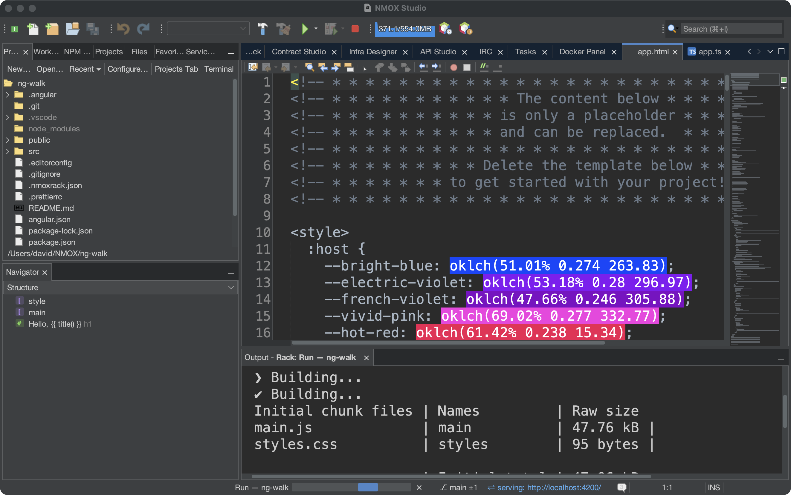
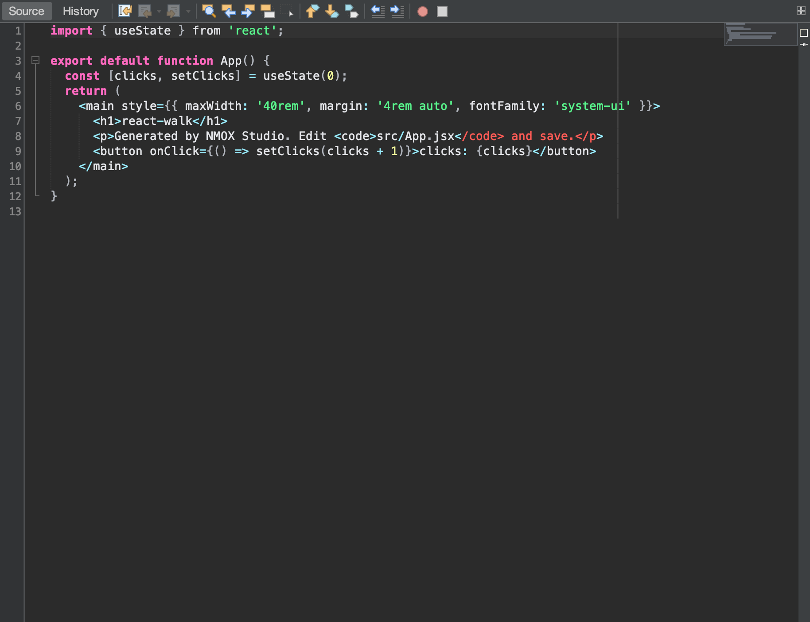

# Tutorial: Show it to a room

Some days the code isn't the deliverable — the *showing* is: a
projector, a README, an issue comment, a slide. NMOX Studio has a
small presenting kit for exactly that person, and every piece of it
rides something the IDE already had rather than a bolt-on: the
editor's own text zoom, the one language vocabulary that names code
fences, the docs forge's own painting. This tutorial walks all of it
in one sitting, from the back row to the clipboard.





## Before you start

Open a project that lives in a GitHub repository (the link gesture
needs an `origin` on GitHub — anything else is refused out loud, not
guessed) and open one of its source files. Save it: the link gesture
also refuses a buffer with unsaved changes, because a block that
doesn't match its link is a lie. For step 2, run the project too
(the toolbar ▶ or the rack) so there is a page in the in-app Browser
and output in the Output window.

## Steps

1. **Make the room able to read it.** `View ▸ Presentation Mode`.
   Every open editor grows by ten points, live, and so does any editor
   you open while the mode is on. The menu item shows a check and the
   status line names the bump. Nothing is written to your settings —
   toggle it off (or restart) and the font is exactly what it was,
   including any ⌥-wheel fine-tuning you added on top.

2. **Watch the rest of the IDE follow.** With the mode on, the in-app
   Browser's page zooms to 150% of whatever zoom you had, the Output
   window's text grows by the same ten points, and every open Terminal
   is bumped too — each restored to its own size on leaving. A demo of
   the running app, its output, and the shell you type into all read
   from the back row, not just the code.

3. **Show your hands.** `View ▸ Show Keystrokes`, then press `⌘S`. A
   dark pill reading `⌘S` appears large at the bottom of the window for
   a moment (a repeat reads `⌘Z ×3`). Now type a word: nothing
   appears. Only chords with ⌘, ⌃ or ⌥ and the function and Escape keys
   ever show — plain typing never does, so a password typed into a
   terminal can't end up on the projector.

4. **Share the code.** Select a few lines and choose `Edit ▸ Copy as
   Markdown` (or right-click in the editor). Paste into a README, an
   issue, or a chat: a fenced block tagged with the file's language
   (` ```html `, ` ```typescript `, ` ```bash `…), ending in exactly one
   newline, with a longer fence if the snippet itself contains three
   backticks so it renders whole. With nothing selected, the whole
   file is copied. The status line says how many lines and which tag.

5. **Say where it lives.** Same selection, `Edit ▸ Copy as Markdown
   with Link` (or right-click). The paste is the same block followed by
   `[src/app/app.ts#L3-L12](https://github.com/you/repo/blob/main/src/app/app.ts#L3-L12)`
   — the branch you have checked out (a detached HEAD links by commit),
   because a local commit that was never pushed would be a 404 dressed
   as a permalink. A file outside a repository, a repository without an
   `origin`, an origin that isn't GitHub, or unsaved changes: the
   status line refuses and copies nothing.

6. **Grab the picture.** `Tools ▸ Copy Editor Screenshot` puts the
   editor area's selected tab — toolbar, gutter, code, sidebars, no IDE
   chrome — on the clipboard as a 2x image; paste it straight into a
   chat or a slide. It takes the tab you are looking at even when focus
   is in the Navigator, and with nothing open in the editor area it
   says so instead of copying a blank. `Tools ▸ Save Editor
   Screenshot…` saves the same shot as a PNG named after the document
   (`app.ts-<stamp>.png`), and `Tools ▸ Save Screenshot…` saves the
   whole IDE window (`nmox-studio-<stamp>.png`, Pictures by default).
   Because the IDE paints itself, there is no screen-recording
   permission to grant, no desktop in the frame, and nothing to crop.

7. **Paste the tree.** `Tools ▸ Copy Project Tree as Markdown`. The
   aimed project's layout lands as the fenced box-drawing tree a README
   shows: directories first, `node_modules/ …` and its heavy siblings
   named but never entered, deep or huge trees capped with the
   remainder counted rather than silently dropped, and the IDE's own
   `.nmox*.json` files left out because they are the product's, not
   the project's.

8. **Leave the stage.** `View ▸ Presentation Mode` again. Editors,
   Browser, Output, and every terminal come back exactly where they
   were; `View ▸ Show Keystrokes` off, and the pill is gone.

## What you just learned

- **Presenting is a state, not a setting.** Presentation Mode is live
  and never persisted — a restart is back to normal — and it is one
  product-wide state that the editor flips and any window may follow.
- **The overlay is deliberately narrow.** Show Keystrokes echoes chords
  and function keys only; what you type is never shown.
- **A copy that can't vouch for itself copies nothing.** Copy as
  Markdown with Link refuses every rung it can't verify — no origin,
  not GitHub, unsaved buffer — on the status line, rather than pasting
  a link that lies.
- **Every share is bounded and plain.** The tree never follows a
  symlink, never enters a heavy directory, caps what it lists and
  counts the rest; the editor screenshot is an image and only an image.

## Next

- Show the running app from the back row too: [Browser to
  Source](browser-to-source.md) walks the in-app Browser and its
  DevTools.
- The Standup you paste into a chat comes from [The Task Board and
  sprints](task-board.md).
- Release notes for a post start at `Help ▸ What's New… ▸ Copy as
  Markdown`; the whole presenting section is in the [User
  Guide](../user-guide.md).
