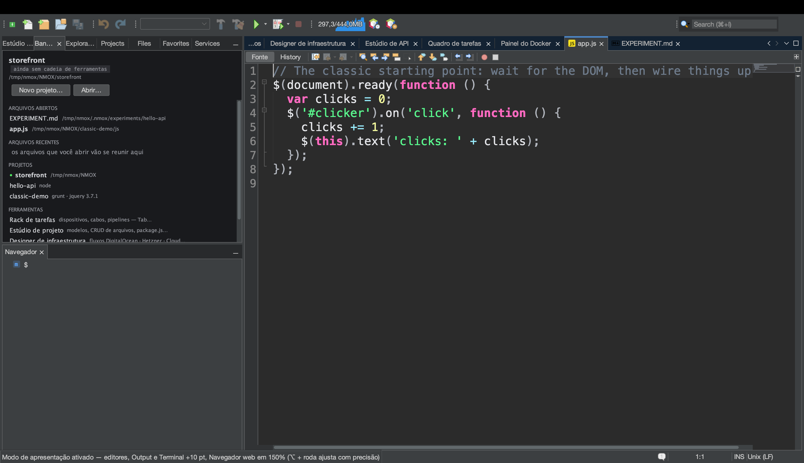
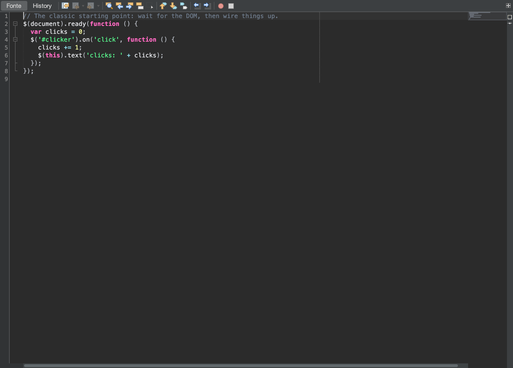

# Tutorial: mostre para uma sala

<!-- languages -->
[English](show-it-to-a-room.md) · [Español](show-it-to-a-room.es.md) · [Français](show-it-to-a-room.fr.md) · [Deutsch](show-it-to-a-room.de.md) · [Русский](show-it-to-a-room.ru.md) · [Українська](show-it-to-a-room.uk.md) · [Polski](show-it-to-a-room.pl.md) · **Português (Brasil)** · [Bahasa Indonesia](show-it-to-a-room.id.md) · [Filipino](show-it-to-a-room.tl.md) · [Tiếng Việt](show-it-to-a-room.vi.md) · [简体中文](show-it-to-a-room.zh.md) · [हिन्दी](show-it-to-a-room.hi.md) · [עברית](show-it-to-a-room.he.md) · [العربية](show-it-to-a-room.ar.md)
<!-- /languages -->

Tem dia em que a entrega não é o código — é *mostrar*: um projetor, um
README, um comentário numa issue, um slide. O NMOX Studio tem um pequeno
kit de apresentação exatamente para essa pessoa, e cada peça dele usa algo
que a IDE já tinha, em vez de um acessório pendurado: o zoom de texto do
próprio editor, o único vocabulário de linguagens que dá nome aos blocos
de código, a pintura da própria forja de documentação. Este tutorial
percorre tudo numa sentada só, da última fileira à área de transferência.





## Antes de começar

Abra um projeto que more num repositório do GitHub (o gesto do link
precisa de um `origin` no GitHub — qualquer outra coisa é recusada em voz
alta, não adivinhada) e abra um dos arquivos de código dele. Salve: o
gesto do link também recusa um buffer com alterações não salvas, porque
um bloco que não bate com o próprio link é uma mentira. Para o passo 2,
execute o projeto também (o ▶ da barra ou o rack), para que haja uma
página no Navegador web embutido e saída na janela Output.

## Passos

1. **Deixe a sala conseguir ler.** `Exibir ▸ Modo de apresentação`.
   Todo editor aberto cresce dez pontos, ao vivo, e o mesmo vale para
   qualquer editor que você abrir com o modo ligado. O item do menu ganha
   uma marca e a linha de status informa o aumento. Nada é gravado nas
   suas configurações — desligue (ou reinicie) e a fonte volta exatamente
   ao que era, incluindo qualquer ajuste fino com ⌥ + roda que você tenha
   feito por cima.

2. **Veja o resto da IDE acompanhar.** Com o modo ligado, a página do
   Navegador web embutido vai para 150% do zoom que você tinha, o texto da
   janela Output cresce os mesmos dez pontos e todo Terminal aberto
   também aumenta — cada um volta ao seu próprio tamanho na saída. Uma
   demonstração do aplicativo rodando, da saída dele e do shell em que
   você digita fica legível da última fileira, não só o código.

3. **Mostre as mãos.** `Exibir ▸ Mostrar teclas`, e então aperte `⌘S`.
   Uma pílula escura com `⌘S` aparece grande na parte de baixo da janela
   por um instante (uma repetição aparece como `⌘Z ×3`). Agora digite uma
   palavra: nada aparece. Só atalhos com ⌘, ⌃ ou ⌥, as teclas de função e
   o Escape são mostrados — a digitação comum nunca é, então uma senha
   digitada num terminal não vai parar no projetor.

4. **Compartilhe o código.** Selecione algumas linhas e escolha
   `Editar ▸ Copiar como Markdown` (ou clique com o botão direito no
   editor). Cole num README, numa issue ou num chat: um bloco cercado com
   a etiqueta da linguagem do arquivo (` ```html `, ` ```typescript `,
   ` ```bash `…), terminando em exatamente uma quebra de linha, com uma
   cerca mais longa se o próprio trecho tiver três crases, para que ele
   seja exibido inteiro. Sem nada selecionado, o arquivo inteiro é
   copiado. A linha de status diz quantas linhas e qual etiqueta.

5. **Diga onde ele mora.** Mesma seleção,
   `Editar ▸ Copiar como Markdown com link` (ou botão direito). O que se
   cola é o mesmo bloco seguido de
   `[src/app/app.ts#L3-L12](https://github.com/you/repo/blob/main/src/app/app.ts#L3-L12)`
   — o branch que você tem ativo (um HEAD destacado aponta para o commit),
   porque um commit local que nunca foi enviado seria um 404 fantasiado de
   permalink. Um arquivo fora de um repositório, um repositório sem
   `origin`, um origin que não é do GitHub, ou alterações não salvas: a
   linha de status recusa e nada é copiado.

6. **Pegue a imagem.** `Ferramentas ▸ Copiar captura de tela do editor`
   põe a aba selecionada da área do editor — barra, margem, código, barras
   laterais, sem o resto da IDE — na área de transferência como imagem 2x;
   cole direto num chat ou num slide. Ela pega a aba que você está vendo
   mesmo quando o foco está no Navegador (⌘7), e sem nada aberto na área
   do editor ela diz isso em vez de copiar um vazio.
   `Ferramentas ▸ Salvar captura de tela do editor…` salva a mesma imagem
   como PNG com o nome do documento (`app.ts-<stamp>.png`), e
   `Ferramentas ▸ Salvar captura de tela…` salva a janela inteira da IDE
   (`nmox-studio-<stamp>.png`, em Imagens por padrão). Como a IDE pinta a
   si mesma, não há permissão de gravação de tela para conceder, nem área
   de trabalho no quadro, nem nada para recortar.

7. **Cole a árvore.** `Ferramentas ▸ Copiar árvore do projeto como Markdown`.
   A estrutura do projeto apontado vira a árvore cercada, desenhada com
   caracteres de caixa, que um README mostra: diretórios primeiro,
   `node_modules/ …` e seus irmãos pesados citados mas nunca percorridos,
   árvores profundas ou enormes cortadas com o restante contado em vez de
   descartado em silêncio, e os arquivos `.nmox*.json` da própria IDE
   deixados de fora, porque são do produto, não do projeto.

8. **Saia do palco.** `Exibir ▸ Modo de apresentação` de novo. Editores,
   Navegador web, Output e cada terminal voltam exatamente ao que eram;
   `Exibir ▸ Mostrar teclas` desligado, e a pílula some.

## O que você acabou de aprender

- **Apresentar é um estado, não uma configuração.** O Modo de apresentação
  é ao vivo e nunca é gravado — um reinício volta ao normal — e é um único
  estado do produto inteiro, que o editor liga e qualquer janela pode
  acompanhar.
- **A sobreposição é estreita de propósito.** Mostrar teclas ecoa apenas
  atalhos e teclas de função; o que você digita nunca aparece.
- **Uma cópia que não pode garantir a si mesma não copia nada.** Copiar
  como Markdown com link recusa cada degrau que não consegue verificar —
  sem origin, fora do GitHub, buffer não salvo — na linha de status, em vez
  de colar um link que mente.
- **Todo compartilhamento é limitado e simples.** A árvore nunca segue um
  link simbólico, nunca entra num diretório pesado, limita o que lista e
  conta o resto; a captura do editor é uma imagem e só uma imagem.

## Próximos passos

- Mostre também o aplicativo rodando da última fileira: [Do Navegador web à
  origem](browser-to-source.pt.md) percorre o Navegador web embutido e o
  DevTools dele.
- O Standup que você cola num chat vem de [O Quadro de tarefas e os
  sprints](task-board.pt.md).
- As notas de versão para um post começam em `Ajuda ▸ Novidades…` e no
  botão **Copiar como Markdown** de lá; a seção inteira sobre apresentar
  está no [Guia do usuário](../user-guide.pt.md).
