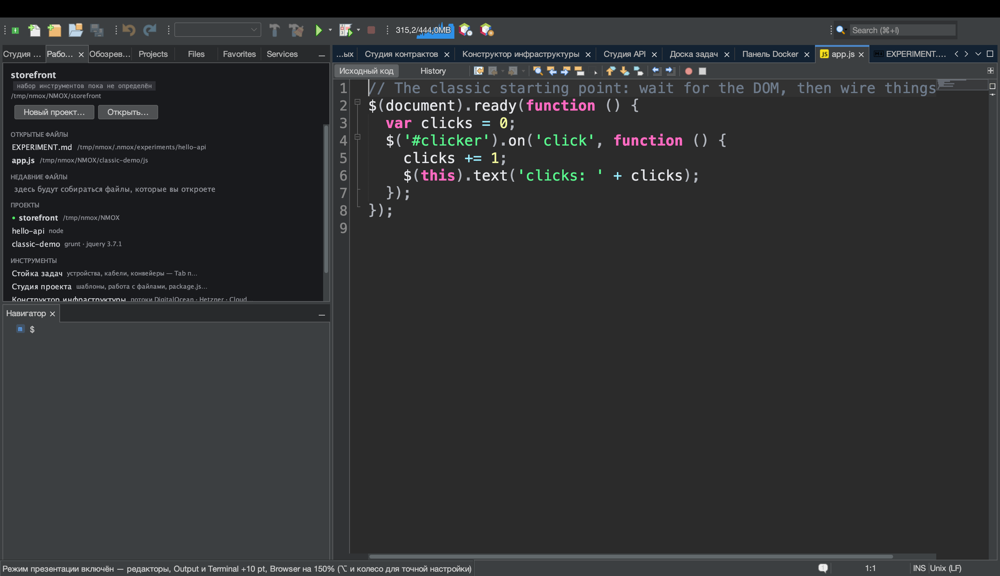
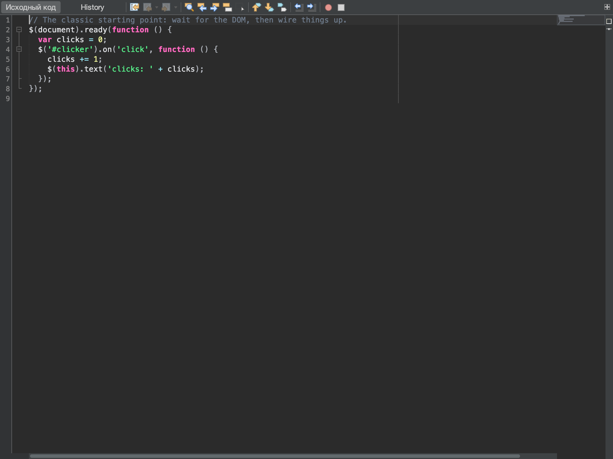

# Урок: покажите это залу

<!-- languages -->
[English](show-it-to-a-room.md) · [Español](show-it-to-a-room.es.md) · [Français](show-it-to-a-room.fr.md) · [Deutsch](show-it-to-a-room.de.md) · **Русский** · [Українська](show-it-to-a-room.uk.md) · [Polski](show-it-to-a-room.pl.md) · [Português (Brasil)](show-it-to-a-room.pt.md) · [Bahasa Indonesia](show-it-to-a-room.id.md) · [Filipino](show-it-to-a-room.tl.md) · [Tiếng Việt](show-it-to-a-room.vi.md) · [简体中文](show-it-to-a-room.zh.md) · [हिन्दी](show-it-to-a-room.hi.md) · [עברית](show-it-to-a-room.he.md) · [العربية](show-it-to-a-room.ar.md)
<!-- /languages -->

Бывают дни, когда результат работы — не код, а *показ*: проектор,
README, комментарий в задаче, слайд. У NMOX Studio есть небольшой набор
для презентаций как раз для такого случая, и каждая его часть опирается
на то, что в IDE уже было, а не прикручена сбоку: собственное
масштабирование текста редактора, единый словарь языков, которым
помечаются блоки кода, собственная отрисовка генератора снимков для
документации. Урок проходит всё это за один присест — от последнего
ряда до буфера обмена.





## Прежде чем начать

Откройте проект, который лежит в репозитории GitHub (жесту со ссылкой
нужен `origin` на GitHub — всё прочее получает отказ вслух, а не
догадку), и откройте один из его исходных файлов. Сохраните его: жест со
ссылкой отказывает и буферу с несохранёнными изменениями, потому что
блок, не совпадающий со своей ссылкой, — это ложь. Для шага 2 ещё и
запустите проект (▶ на панели или стойка), чтобы во встроенном браузере
была страница, а в окне Output — вывод.

## Шаги

1. **Сделайте так, чтобы зал мог прочитать.** `Вид ▸ Режим презентации`.
   Каждый открытый редактор увеличивается на десять пунктов, прямо на
   ходу, как и любой редактор, открытый при включённом режиме. Пункт меню
   отмечается галочкой, а строка состояния называет прибавку. В ваши
   настройки ничего не записывается: выключите режим (или перезапустите
   IDE) — и шрифт будет ровно таким, каким был, включая тонкую подстройку
   ⌥-колёсиком, которую вы добавили сверху.

2. **Смотрите, как за ним следует остальная IDE.** При включённом режиме
   страница во встроенном браузере масштабируется до 150% от вашего
   масштаба, текст окна Output растёт на те же десять пунктов, и каждый
   открытый терминал тоже увеличивается — и каждый возвращается к своему
   размеру при выходе. Демонстрацию запущенного приложения, его вывода и
   оболочки, в которой вы печатаете, читают с последнего ряда — а не
   только код.

3. **Покажите руки.** `Вид ▸ Показывать нажатия клавиш`, затем нажмите
   `⌘S`. Внизу окна на мгновение крупно появится тёмная плашка с
   надписью `⌘S` (повтор читается как `⌘Z ×3`). Теперь наберите слово:
   ничего не появится. Показываются только сочетания с ⌘, ⌃ или ⌥,
   функциональные клавиши и Escape — обычный набор никогда, так что
   пароль, набранный в терминале, не окажется на проекторе.

4. **Поделитесь кодом.** Выделите несколько строк и выберите
   `Правка ▸ Копировать как Markdown` (или щёлкните правой кнопкой в
   редакторе). Вставьте в README, задачу или чат: получится огороженный
   блок с пометкой языка файла (` ```html `, ` ```typescript `,
   ` ```bash `…), который заканчивается ровно одним переводом строки, а
   если во фрагменте есть три обратных апострофа, ограждение длиннее —
   чтобы блок отрисовался целиком. Если ничего не выделено, копируется
   весь файл. Строка состояния говорит, сколько строк и какая пометка.

5. **Скажите, где это лежит.** То же выделение,
   `Правка ▸ Копировать как Markdown со ссылкой` (или правая кнопка).
   Вставка — тот же блок, а за ним
   `[src/app/app.ts#L3-L12](https://github.com/you/repo/blob/main/src/app/app.ts#L3-L12)`
   — ветка, которая у вас выбрана (при отсоединённом HEAD ссылка ведёт на
   коммит), потому что локальный коммит, который никогда не отправлялся,
   был бы ошибкой 404 под видом постоянной ссылки. Файл вне репозитория,
   репозиторий без `origin`, origin не на GitHub или несохранённые
   изменения: строка состояния отказывает, и ничего не копируется.

6. **Снимите картинку.** `Сервис ▸ Копировать снимок редактора` кладёт
   выбранную вкладку области редактора — панель инструментов, поле,
   код, боковые полосы, без обвязки IDE — в буфер обмена изображением в
   двойном размере; вставляйте прямо в чат или слайд. Берётся та
   вкладка, на которую вы смотрите, даже если фокус в Навигаторе, а если
   в области редактора ничего не открыто, так и говорится вместо
   копирования пустоты. `Сервис ▸ Сохранить снимок редактора…`
   сохраняет тот же снимок в PNG с именем документа
   (`app.ts-<stamp>.png`), а `Сервис ▸ Сохранить снимок экрана…`
   сохраняет всё окно IDE (`nmox-studio-<stamp>.png`, по умолчанию в
   «Изображения»). Поскольку IDE рисует себя сама, не нужно выдавать
   разрешение на запись экрана, в кадр не попадает рабочий стол и
   ничего не надо обрезать.

7. **Вставьте дерево.**
   `Сервис ▸ Копировать дерево проекта как Markdown`. Структура наведённого проекта ложится огороженным деревом
   из псевдографики, какое показывают в README: сначала каталоги,
   `node_modules/ …` и его тяжёлые соседи названы, но не раскрыты,
   глубокие или огромные деревья обрезаются, а остаток подсчитывается,
   а не молча выбрасывается; собственные файлы IDE `.nmox*.json` не
   попадают в список, потому что они принадлежат продукту, а не
   проекту.

8. **Уйдите со сцены.** Снова `Вид ▸ Режим презентации`. Редакторы,
   браузер, Output и каждый терминал возвращаются ровно туда, где были;
   выключите `Вид ▸ Показывать нажатия клавиш` — и плашка исчезнет.

## Что вы узнали

- **Показ — это состояние, а не настройка.** Режим презентации
  действует на ходу и никогда не сохраняется — после перезапуска всё
  как обычно, — и это одно состояние на весь продукт: редактор его
  переключает, а любое окно может за ним следовать.
- **Наложение нарочно узкое.** «Показывать нажатия клавиш» отображает
  только сочетания и функциональные клавиши; то, что вы набираете, не
  показывается никогда.
- **Копия, которая не может за себя поручиться, не копирует ничего.**
  «Копировать как Markdown со ссылкой» отказывает на каждой ступени,
  которую не может проверить — нет origin, не GitHub, несохранённый
  буфер, — сообщая об этом в строке состояния, а не вставляя лживую
  ссылку.
- **Всё, чем вы делитесь, ограничено и просто.** Дерево никогда не идёт
  по символической ссылке, не заходит в тяжёлый каталог, ограничивает
  то, что перечисляет, и подсчитывает остальное; снимок редактора — это
  изображение и только изображение.

## Дальше

- Покажите и работающее приложение с последнего ряда: урок [От браузера
  к исходнику](browser-to-source.ru.md) проходит встроенный браузер и
  его DevTools.
- Стендап, который вы вставляете в чат, берётся из урока [Доска задач и
  спринты](task-board.ru.md).
- Заметки о выпуске для поста начинаются в `Справка ▸ Что нового…` с
  кнопки **Копировать как Markdown**; весь раздел о показе — в
  [Руководстве пользователя](../user-guide.ru.md).
