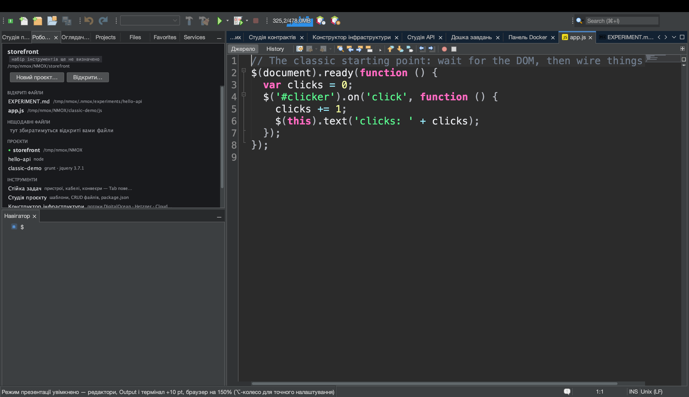
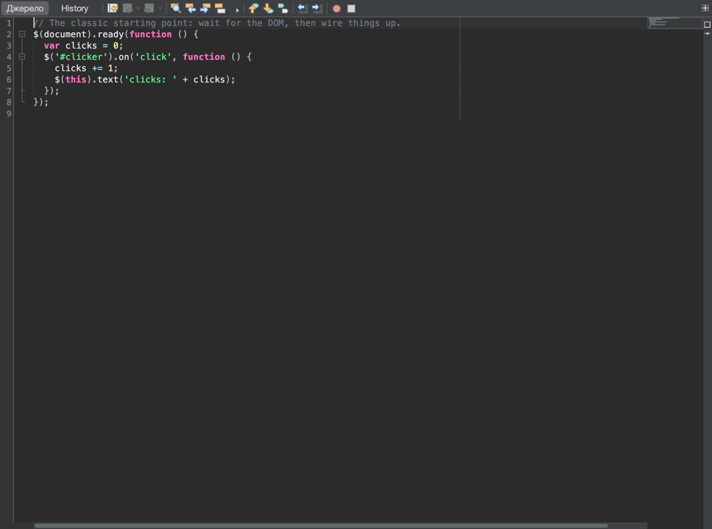

# Посібник: покажіть це аудиторії

<!-- languages -->
[English](show-it-to-a-room.md) · [Español](show-it-to-a-room.es.md) · [Français](show-it-to-a-room.fr.md) · [Deutsch](show-it-to-a-room.de.md) · [Русский](show-it-to-a-room.ru.md) · **Українська** · [Polski](show-it-to-a-room.pl.md) · [Português (Brasil)](show-it-to-a-room.pt.md) · [Bahasa Indonesia](show-it-to-a-room.id.md) · [Filipino](show-it-to-a-room.tl.md) · [Tiếng Việt](show-it-to-a-room.vi.md) · [简体中文](show-it-to-a-room.zh.md) · [हिन्दी](show-it-to-a-room.hi.md) · [עברית](show-it-to-a-room.he.md) · [العربية](show-it-to-a-room.ar.md)
<!-- /languages -->

Бувають дні, коли результат роботи — не код, а *показ*: проєктор, README,
коментар до issue, слайд. NMOX Studio має невеликий набір для презентацій
саме для такої людини, і кожна його частина спирається на те, що в IDE вже
було, а не прикручена збоку: власне масштабування тексту в редакторі,
єдиний словник мов, яким позначаються огороджені блоки коду, власне
малювання кузні документації. Цей посібник проходить усе це за один
присід — від заднього ряду до буфера обміну.





## Перш ніж почати

Відкрийте проєкт, що живе в репозиторії GitHub (жесту з посиланням
потрібен `origin` на GitHub — усе інше відхиляється вголос, а не
вгадується), і відкрийте один із його вихідних файлів. Збережіть його:
жест із посиланням також відхиляє буфер із незбереженими змінами, бо блок,
що не відповідає своєму посиланню, — це неправда. Для кроку 2 ще й
запустіть проєкт (▶ на панелі інструментів або стійка), щоб у вбудованому
Браузері була сторінка, а у вікні Output — вивід.

## Кроки

1. **Зробіть так, щоб аудиторія змогла прочитати.** `Вигляд ▸ Режим
   презентації`. Кожен відкритий редактор одразу збільшується на десять
   пунктів, як і будь-який редактор, відкритий, поки режим увімкнено.
   Пункт меню показує позначку, а рядок стану називає приріст. У ваші
   налаштування нічого не записується — вимкніть режим (або перезапустіть
   IDE), і шрифт стане точно таким, як був, разом із будь-яким
   підлаштуванням колесом миші з ⌥, яке ви додали поверх.

2. **Подивіться, як за ним іде решта IDE.** Коли режим увімкнено, сторінка
   у вбудованому Браузері масштабується до 150% від вашого поточного
   масштабу, текст у вікні Output зростає на ті самі десять пунктів, а
   кожен відкритий термінал теж збільшується — і кожен повертає власний
   розмір при виході. Демонстрацію запущеного застосунку, його виводу й
   оболонки, в якій ви набираєте, видно із заднього ряду, а не лише код.

3. **Покажіть свої руки.** `Вигляд ▸ Показувати натискання клавіш`, потім
   натисніть `⌘S`. Темна плашка з написом `⌘S` на мить з’являється великою
   внизу вікна (повтор виглядає як `⌘Z ×3`). Тепер наберіть слово: нічого
   не з’являється. Показуються лише сполучення з ⌘, ⌃ або ⌥, а також
   функційні клавіші та Escape — звичайний набір ніколи, тож пароль,
   набраний у терміналі, не потрапить на проєктор.

4. **Поділіться кодом.** Виділіть кілька рядків і оберіть `Редагування ▸
   Копіювати як Markdown` (або клацніть правою кнопкою в редакторі).
   Вставте в README, issue чи чат: це огороджений блок із позначкою мови
   файлу (` ```html `, ` ```typescript `, ` ```bash `…), що закінчується
   рівно одним переведенням рядка, з довшою огорожею, якщо сам фрагмент
   містить три зворотні лапки, — щоб він відобразився цілим. Якщо нічого не
   виділено, копіюється весь файл. Рядок стану каже, скільки рядків і яка
   позначка.

5. **Скажіть, де це живе.** Те саме виділення, `Редагування ▸ Копіювати як
   Markdown із посиланням` (або правий клік). Вставляється той самий блок,
   а за ним
   `[src/app/app.ts#L3-L12](https://github.com/you/repo/blob/main/src/app/app.ts#L3-L12)`
   — на гілку, яку у вас витягнуто (відокремлений HEAD посилається на
   коміт), бо локальний коміт, який ніколи не надсилали, був би 404 під
   виглядом постійного посилання. Файл поза репозиторієм, репозиторій без
   `origin`, origin не на GitHub або незбережені зміни: рядок стану
   відмовляє й нічого не копіює.

6. **Зробіть знімок.** `Інструменти ▸ Копіювати знімок редактора` кладе в
   буфер обміну вибрану вкладку області редактора — панель інструментів,
   поле, код, бічні панелі, без обрамлення IDE — як зображення 2x;
   вставляйте просто в чат чи слайд. Команда бере ту вкладку, на яку ви
   дивитеся, навіть коли фокус у Навігаторі, а коли в області редактора
   нічого не відкрито, так і каже, а не копіює порожнечу. `Інструменти ▸
   Зберегти знімок редактора…` зберігає той самий знімок як PNG з іменем
   документа (`app.ts-<stamp>.png`), а `Інструменти ▸ Зберегти знімок
   екрана…` — усе вікно IDE (`nmox-studio-<stamp>.png`, типово в теку
   «Зображення»). Оскільки IDE малює себе сама, не треба надавати дозвіл
   на запис екрана, у кадрі немає робочого столу й нічого не доведеться
   обрізати.

7. **Вставте дерево.** `Інструменти ▸ Копіювати дерево проєкту як
   Markdown`. Структура націленого проєкту лягає огородженим деревом із
   псевдографіки, яке зазвичай показує README: спершу каталоги,
   `node_modules/ …` і його важкі сусіди названі, але ніколи не
   відкриваються, глибокі або величезні дерева обрізано з підрахунком
   решти, а не мовчки відкинуто, а власні файли IDE `.nmox*.json`
   пропущено, бо вони належать продуктові, а не проєктові.

8. **Зійдіть зі сцени.** Знову `Вигляд ▸ Режим презентації`. Редактори,
   Браузер, Output і кожен термінал повертаються точно туди, де були;
   вимкніть `Вигляд ▸ Показувати натискання клавіш` — і плашка зникне.

## Чого ви щойно навчилися

- **Презентація — це стан, а не налаштування.** Режим презентації діє
  наживо й ніколи не зберігається — після перезапуску все як звичайно — і
  це один стан на весь продукт, який перемикає редактор і за яким може
  йти будь-яке вікно.
- **Накладка навмисно вузька.** «Показувати натискання клавіш» відображає
  лише сполучення та функційні клавіші; те, що ви набираєте, не
  показується ніколи.
- **Копія, яка не може за себе поручитися, нічого не копіює.** «Копіювати
  як Markdown із посиланням» відмовляє на кожному щаблі, який не може
  перевірити — немає origin, не GitHub, незбережений буфер, — і каже про
  це в рядку стану, а не вставляє посилання, яке вводить в оману.
- **Кожне поширення обмежене й просте.** Дерево ніколи не йде за
  символьним посиланням, ніколи не заходить у важкий каталог, обмежує
  перелік і рахує решту; знімок редактора — це зображення, і лише
  зображення.

## Далі

- Покажіть із заднього ряду й запущений застосунок: [Від браузера до
  джерела](browser-to-source.uk.md) проводить вбудованим Браузером і
  його DevTools.
- Стендап, який ви вставляєте в чат, походить із [Дошки завдань і
  спринтів](task-board.uk.md).
- Примітки до випуску для допису починаються з `Довідка ▸ Що нового…`, а
  далі кнопка **Копіювати як Markdown**; увесь розділ про презентації — у
  [Посібнику користувача](../user-guide.uk.md).
