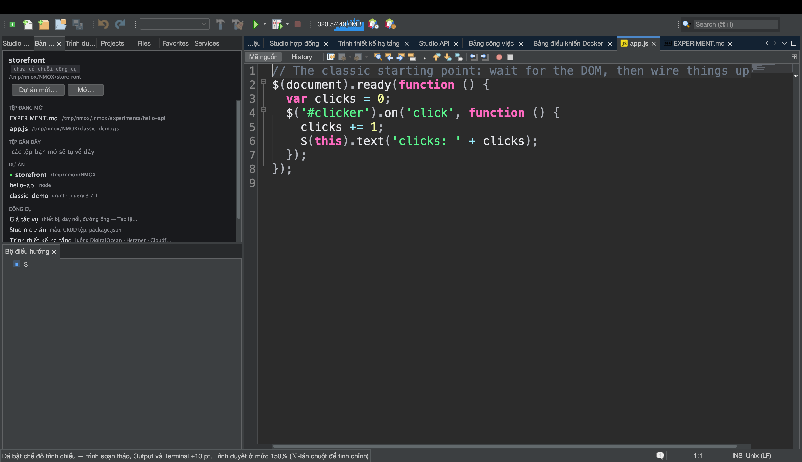
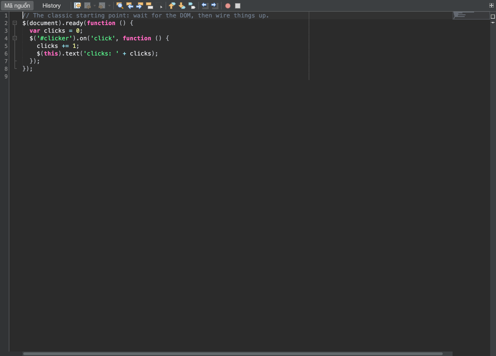

# Hướng dẫn: Trình bày trước cả phòng

<!-- languages -->
[English](show-it-to-a-room.md) · [Español](show-it-to-a-room.es.md) · [Français](show-it-to-a-room.fr.md) · [Deutsch](show-it-to-a-room.de.md) · [Русский](show-it-to-a-room.ru.md) · [Українська](show-it-to-a-room.uk.md) · [Polski](show-it-to-a-room.pl.md) · [Português (Brasil)](show-it-to-a-room.pt.md) · [Bahasa Indonesia](show-it-to-a-room.id.md) · [Filipino](show-it-to-a-room.tl.md) · **Tiếng Việt** · [简体中文](show-it-to-a-room.zh.md) · [हिन्दी](show-it-to-a-room.hi.md) · [עברית](show-it-to-a-room.he.md) · [العربية](show-it-to-a-room.ar.md)
<!-- /languages -->

Có những ngày mã không phải là thứ cần giao — *việc trình bày* mới là: một
máy chiếu, một README, một bình luận trong issue, một trang slide. NMOX
Studio có một bộ công cụ trình bày nhỏ dành đúng cho người đó, và mỗi mảnh
của nó đều dựa trên thứ IDE vốn đã có chứ không phải gắn thêm vào: chức năng
phóng chữ của chính trình soạn thảo, bộ từ vựng ngôn ngữ duy nhất dùng để
gắn nhãn khối mã có rào, và cách tự vẽ mà công cụ chụp ảnh tài liệu vẫn
dùng. Bài hướng dẫn này đi qua tất cả trong một buổi, từ hàng ghế cuối tới
bảng nhớ tạm.





## Trước khi bắt đầu

Mở một dự án nằm trong một kho GitHub (thao tác tạo liên kết cần một
`origin` trên GitHub — mọi thứ khác đều bị từ chối rõ ràng, không đoán mò)
và mở một tệp mã nguồn của nó. Lưu tệp lại: thao tác tạo liên kết cũng từ
chối một bộ đệm còn thay đổi chưa lưu, vì một khối mã không khớp với liên
kết của nó là một lời nói dối. Cho bước 2, hãy chạy cả dự án (nút ▶ trên
thanh công cụ hoặc từ giá) để có một trang trong Trình duyệt tích hợp và kết
quả trong cửa sổ Output.

## Các bước

1. **Làm cho cả phòng đọc được.** `Xem ▸ Chế độ trình chiếu`. Mọi trình
   soạn thảo đang mở lớn thêm mười point, ngay lập tức, và mọi trình soạn
   thảo bạn mở trong lúc chế độ đang bật cũng vậy. Mục trình đơn hiện dấu
   kiểm và thanh trạng thái nêu mức tăng. Không có gì được ghi vào cài đặt
   của bạn — tắt nó đi (hoặc khởi động lại) và phông chữ trở về đúng như
   trước, kể cả phần tinh chỉnh bằng ⌥-lăn chuột mà bạn đã thêm vào.

2. **Xem phần còn lại của IDE làm theo.** Khi chế độ đang bật, trang trong
   Trình duyệt tích hợp phóng lên 150% mức phóng bạn đang dùng, chữ trong
   cửa sổ Output lớn thêm đúng mười point ấy, và mọi Terminal đang mở cũng
   được tăng theo — mỗi thứ trở về đúng cỡ của nó khi thoát chế độ. Một buổi
   demo ứng dụng đang chạy, kết quả của nó và shell bạn gõ vào đều đọc được
   từ hàng ghế cuối, chứ không chỉ riêng mã.

3. **Cho mọi người thấy tay bạn.** `Xem ▸ Hiện phím bấm`, rồi nhấn `⌘S`.
   Một viên nhãn tối màu ghi `⌘S` hiện thật lớn ở cuối cửa sổ trong chốc
   lát (nhấn lặp lại thì ghi `⌘Z ×3`). Giờ gõ một từ: không có gì hiện lên.
   Chỉ những tổ hợp có ⌘, ⌃ hoặc ⌥ cùng các phím chức năng và Escape mới
   hiện — gõ chữ thường thì không bao giờ, nên một mật khẩu gõ vào terminal
   không thể lên tới máy chiếu.

4. **Chia sẻ mã.** Chọn vài dòng rồi chọn `Chỉnh sửa ▸ Sao chép dưới dạng
   Markdown` (hoặc nhấp chuột phải trong trình soạn thảo). Dán vào một
   README, một issue hay một cuộc trò chuyện: một khối có rào gắn nhãn theo
   ngôn ngữ của tệp (` ```html `, ` ```typescript `, ` ```bash `…), kết thúc
   bằng đúng một dòng mới, với rào dài hơn nếu chính đoạn mã có chứa ba dấu
   backtick để nó hiển thị trọn vẹn. Khi không chọn gì, cả tệp được sao
   chép. Thanh trạng thái cho biết bao nhiêu dòng và nhãn nào.

5. **Nói rõ nó nằm ở đâu.** Vẫn phần chọn đó, `Chỉnh sửa ▸ Sao chép dưới
   dạng Markdown kèm liên kết` (hoặc nhấp chuột phải). Nội dung dán ra là
   cùng khối đó, theo sau là
   `[src/app/app.ts#L3-L12](https://github.com/you/repo/blob/main/src/app/app.ts#L3-L12)`
   — nhánh bạn đang checkout (với HEAD tách rời thì liên kết theo commit),
   vì một commit cục bộ chưa từng được push sẽ là một lỗi 404 đội lốt liên
   kết cố định. Một tệp nằm ngoài kho, một kho không có `origin`, một origin
   không phải GitHub, hoặc thay đổi chưa lưu: thanh trạng thái từ chối và
   không sao chép gì.

6. **Chụp lấy hình.** `Công cụ ▸ Sao chép ảnh chụp bộ soạn thảo` đặt thẻ
   đang chọn của vùng soạn thảo — thanh công cụ, lề, mã, các thanh bên,
   không có khung của IDE — vào bảng nhớ tạm dưới dạng ảnh 2x; dán thẳng vào
   một cuộc trò chuyện hay một slide. Nó lấy thẻ bạn đang nhìn kể cả khi
   tiêu điểm đang ở Bộ điều hướng, và khi vùng soạn thảo không mở gì thì nó
   nói vậy thay vì sao chép một ảnh trống. `Công cụ ▸ Lưu ảnh chụp bộ soạn
   thảo…` lưu cùng ảnh đó thành PNG đặt tên theo tài liệu
   (`app.ts-<stamp>.png`), còn `Công cụ ▸ Lưu ảnh chụp màn hình…` lưu toàn
   bộ cửa sổ IDE (`nmox-studio-<stamp>.png`, mặc định vào thư mục Pictures).
   Vì IDE tự vẽ chính nó, không có quyền ghi màn hình nào phải cấp, không có
   màn hình nền lọt vào khung hình, và không có gì phải cắt xén.

7. **Dán cây thư mục.** `Công cụ ▸ Sao chép cây dự án dưới dạng Markdown`.
   Bố cục của dự án đang được nhắm tới hiện ra thành cây vẽ bằng ký tự khung
   trong khối có rào, đúng kiểu một README vẫn trình bày: thư mục đứng
   trước, `node_modules/ …` và những thư mục nặng cùng loại được nêu tên
   nhưng không bao giờ đi vào, cây quá sâu hoặc quá lớn bị giới hạn kèm số
   phần còn lại được đếm thay vì lặng lẽ bỏ đi, và các tệp `.nmox*.json`
   của chính IDE bị để ra ngoài vì chúng thuộc về sản phẩm, không thuộc về
   dự án.

8. **Rời sân khấu.** `Xem ▸ Chế độ trình chiếu` lần nữa. Trình soạn thảo,
   Trình duyệt, Output và mọi terminal trở về đúng như cũ; tắt
   `Xem ▸ Hiện phím bấm`, và viên nhãn biến mất.

## Bạn vừa học được gì

- **Trình bày là một trạng thái, không phải một cài đặt.** Chế độ trình
  chiếu có hiệu lực ngay và không bao giờ được lưu lại — khởi động lại là về
  như thường — và đó là một trạng thái chung cho cả sản phẩm, do trình soạn
  thảo bật tắt và cửa sổ nào cũng có thể làm theo.
- **Lớp phủ được cố ý giữ hẹp.** Hiện phím bấm chỉ lặp lại các tổ hợp phím
  và phím chức năng; thứ bạn gõ không bao giờ được hiện ra.
- **Một bản sao không tự bảo chứng được thì không sao chép gì.** Sao chép
  dưới dạng Markdown kèm liên kết từ chối ở mọi nấc nó không kiểm chứng
  được — không có origin, không phải GitHub, bộ đệm chưa lưu — ngay trên
  thanh trạng thái, thay vì dán một liên kết nói dối.
- **Mọi thứ chia sẻ đều có giới hạn và thuần túy.** Cây thư mục không bao
  giờ đi theo symlink, không bao giờ đi vào thư mục nặng, giới hạn những gì
  nó liệt kê và đếm phần còn lại; ảnh chụp trình soạn thảo là một ảnh và chỉ
  là một ảnh.

## Tiếp theo

- Cũng đưa ứng dụng đang chạy tới tận hàng ghế cuối: [Từ Trình duyệt tới
  mã nguồn](browser-to-source.vi.md) đi qua Trình duyệt tích hợp và
  DevTools của nó.
- Bản Standup bạn dán vào cuộc trò chuyện đến từ [Bảng công việc và
  sprint](task-board.vi.md).
- Ghi chú phát hành cho một bài đăng bắt đầu từ `Trợ giúp ▸ Có gì mới…`,
  rồi nút **Sao chép dưới dạng Markdown** của nó; toàn bộ phần trình bày
  nằm trong [Hướng dẫn sử dụng](../user-guide.vi.md).
