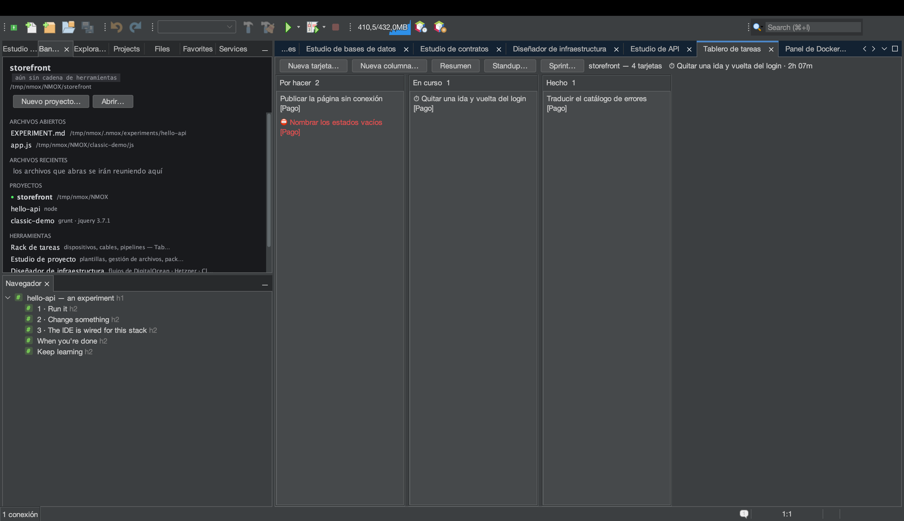
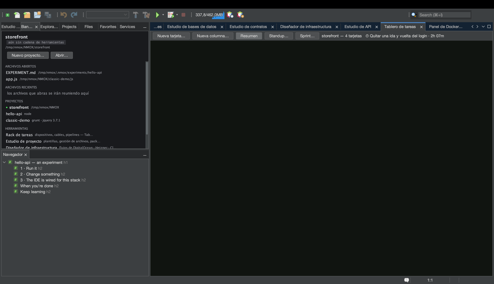
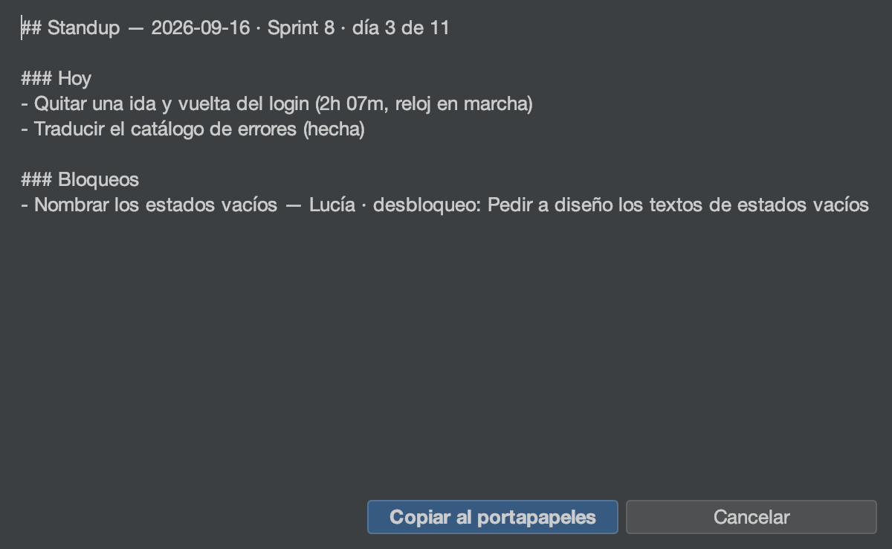

# Tutorial: el Tablero de tareas y los sprints

<!-- languages -->
[English](task-board.md) · **Español** · [Français](task-board.fr.md) · [Deutsch](task-board.de.md) · [Русский](task-board.ru.md) · [Українська](task-board.uk.md) · [Polski](task-board.pl.md) · [Português (Brasil)](task-board.pt.md) · [Bahasa Indonesia](task-board.id.md) · [Filipino](task-board.tl.md) · [Tiếng Việt](task-board.vi.md) · [简体中文](task-board.zh.md) · [हिन्दी](task-board.hi.md) · [עברית](task-board.he.md) · [العربية](task-board.ar.md)
<!-- /languages -->

El Tablero de tareas es un kanban por proyecto que vive en un solo
archivo — `.nmoxtasks.json`, junto a tu código — y todo lo demás que hace
el tablero se deriva de ese archivo: un panel, un reloj de tiempo, un
standup diario y un burndown del sprint. Nada es contabilidad que lleves a
mano; las marcas de las propias tarjetas son el registro. Este tutorial
lleva un tablero de tres tarjetas a un sprint cerrado en una sola sesión.

## Antes de empezar

Abre un proyecto (cualquiera — al tablero no le importa la cadena de
herramientas). Si el proyecto es un repositorio git, el Standup también
puede leer tus commits; si no, esa sección simplemente no aparece.

## Pasos

1. **Abre el tablero.** `⌥⌘1` (o `Ventana ▸ Tablero de tareas`). Pulsa
   **Nueva tarjeta…** tres veces y ponle un título a cada una. Las tarjetas
   se mueven arrastrando, o con el teclado: con una tarjeta seleccionada,
   **⌘←/⌘→** la pasa a la columna de al lado y **⌘↑/⌘↓** la reordena;
   **Entrar** la edita, **Suprimir** la elimina (tras preguntar, con No
   como opción por omisión), **N** empieza una tarjeta nueva en esa
   columna. El menú de la cabecera de cada columna le cambia el nombre,
   fija un **límite WIP orientativo** (la cabecera se pone roja al
   superarlo — nunca impide un movimiento), la reordena o la elimina.

2. **Ficha la entrada.** Arrastra una tarjeta a la columna del medio, haz
   clic derecho → **Fichar entrada**. Aparece un ⏱ en la tarjeta y la
   cabecera del tablero muestra el tiempo que lleva. Solo corre un reloj a
   la vez — fichar la entrada en otra tarjeta cierra esta sesión — y una
   sesión de menos de un minuto se descarta entera, así que un clic
   perdido nunca cuenta como trabajo. **Fichar salida** lo detiene.

3. **Añade los detalles que necesita un standup.** Clic derecho en una
   tarjeta → **Poner etiqueta…** para asignarle una épica, y en otra
   tarjeta **Marcar como bloqueada…** — un responsable y la acción que la
   desbloquea (la acción es obligatoria: un bloqueo sin acción es una
   queja, no un plan). La tarjeta lleva ⛔; **Desbloquear** lo quita, y
   también terminar la tarjeta.

4. **Lee el Resumen.** Pulsa **Resumen** en la barra de herramientas. El
   mismo archivo se convierte en un panel: tarjetas en el tablero, **WIP
   AHORA** (solo las columnas intermedias), hechas hoy y esta semana, un
   registro de WIP por columna con veredictos en rojo cuando se supera, una
   **franja de flujo** de 14 días, las tarjetas sin terminar más antiguas
   con su edad, la leyenda de **ÉPICAS** derivada de las etiquetas en uso,
   el **registro de bloqueos** (primero lo que más tiempo lleva atascado),
   las notas de **RETRO** del tablero (**Editar retro…**) y el informe de
   **TIEMPO** — lo fichado hoy y en los últimos siete días, y luego una fila
   por tarjeta, primero la que más lleva hoy. Una sesión que cruza la
   medianoche se recorta por día natural, así que la cifra de hoy es el
   trabajo de hoy.

5. **Termina algo.** Desactiva **Resumen** y mueve una tarjeta a la última
   columna. Ese momento queda marcado como la hora en que se terminó la
   tarjeta (sacarla de nuevo la deja sin terminar y el historial la
   olvida). Cada cifra de hechas del Resumen sale de estas marcas.

6. **Empieza un sprint.** Pulsa **Sprint… ▸ Empezar sprint…**, ponle
   nombre y acepta la ventana de dos semanas (las fechas son `YYYY-MM-DD`;
   una ventana al revés o algo que no es una fecha se rechaza en voz alta
   y no cambia nada). Pasa al **Resumen**: gana una cabecera de sprint y un
   **burndown** reconstruido a partir de las marcas de hechas de las
   tarjetas — la línea tenue es la ideal, la brillante es lo que pasó, y el
   futuro se queda sin dibujar.

7. **Escribe el standup.** Pulsa **Standup…**. El informe se abre como
   markdown con un botón **Copiar al portapapeles**: **Ayer** y
   **Hoy** a partir de las marcas de hechas y de las sesiones recortadas
   por día (un reloj en marcha se lee «reloj en marcha»), **Bloqueos** a
   partir del registro, **Commits (desde ayer)** a partir de
   `git log`. Las secciones sin nada que decir se omiten, nunca se muestran
   vacías, y la cabecera abre con el sprint y su recuento de días («Sprint
   8 · día 3 de 14»).

   

8. **Cierra el sprint.** **Sprint… ▸ Informe del sprint…** es el hermano de
   revisión del Standup — hechas, abiertas al cierre, todavía bloqueadas,
   tiempo fichado dentro de la ventana, notas de retro — y **Sprint… ▸
   Cerrar sprint…** archiva la ventana, el recuento de hechas y la retro
   para la velocidad. Las tarjetas se quedan exactamente donde están:
   cerrar es contabilidad, no limpieza. Después, el cierre ofrece el
   siguiente sprint ya rellenado (nombre incrementado, ventana de la misma
   duración que empieza al día siguiente), totalmente editable, y Cancelar
   no empieza nada. En cuanto hay historial, el diálogo del sprint muestra
   la cifra para planificar — «Velocidad — últimos 3 sprints: …» — y el
   informe gana su línea de velocidad.

## Lo que acabas de aprender

- **Un archivo es todo el registro.** Haz commit de `.nmoxtasks.json` y el
  equipo comparte el tablero, la retro y el historial de sprints; ignóralo
  y se queda como algo personal. Los títulos de las tarjetas siempre se
  muestran como caracteres simples, así que un tablero versionado no puede
  colar marcado.
- **El tablero sigue al archivo en los dos sentidos.** Edítalo a mano,
  trae lo que ha subido un compañero o cambia de rama, y el tablero visible
  se actualiza en un segundo y medio más o menos — una edición externa gana
  a un gesto obsoleto, y la barra de estado lo dice.
- **Los riesgos de las fusiones se curan al cargar.** Los id de tarjeta
  duplicados, las sesiones de reloj abiertas sueltas y una ventana de
  sprint estropeada se reparan al leer el archivo, así que una fusión que
  conserva ambos lados no puede inflar un informe ni envenenar las
  ceremonias.
- **Todo lo derivado está definido.** El WIP, las ventanas de hechas, el
  burndown y el recorte de TIEMPO son definiciones que puedes leer en la
  Guía de usuario, no heurísticas.

## Siguiente

- Los títulos de las tarjetas, las etiquetas de épica y la consulta
  literal `blocked` se alcanzan desde `⌘I` — mira el [tutorial del Banco de
  trabajo](workbench.es.md) para la costumbre de buscarlo todo.
- Pega el Standup en un chat y sigue: [Enséñalo en una
  sala](show-it-to-a-room.es.md) cubre Copiar como Markdown y la familia de
  capturas.
- Las definiciones completas están en la [sección del Tablero de tareas de
  la Guía de usuario](../user-guide.es.md).
